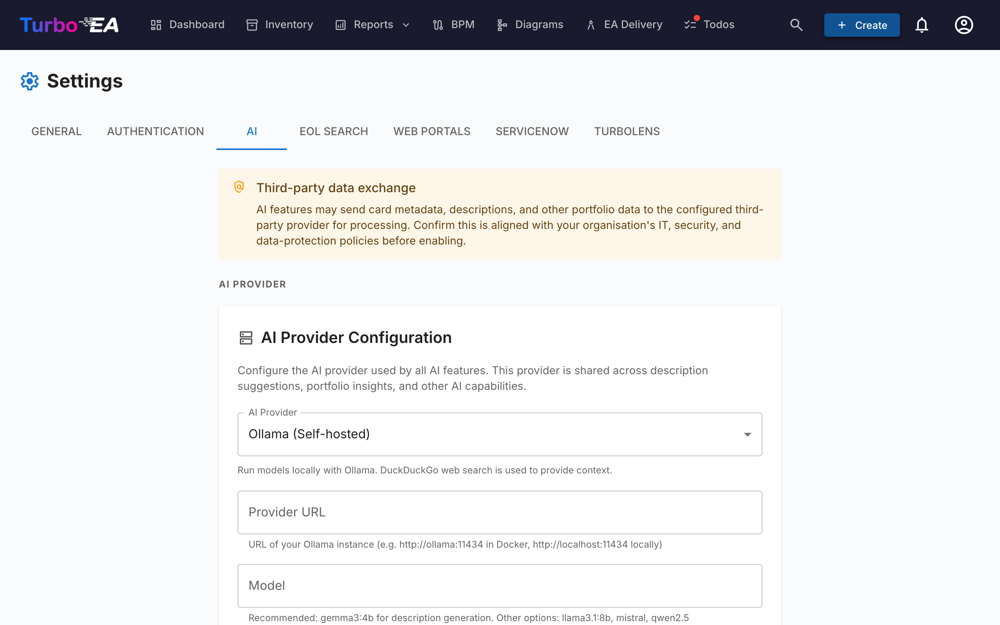
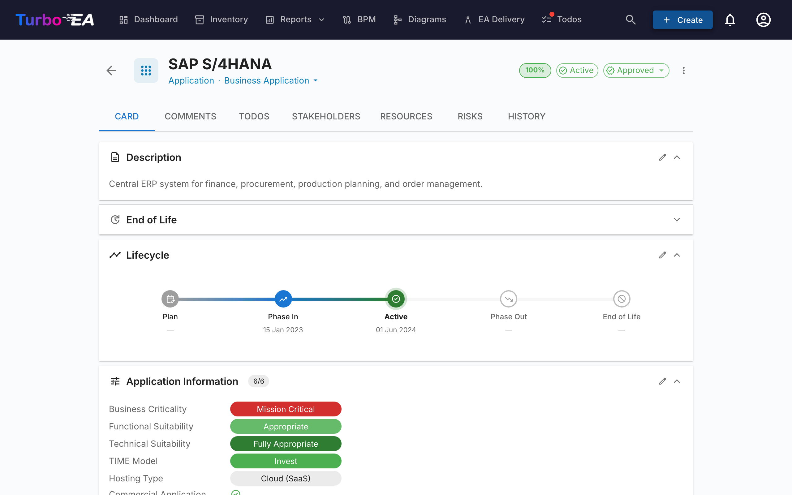

# Suggestions de description par IA



Turbo EA peut generer automatiquement des descriptions de fiches en combinant la **recherche web** et un **grand modele de langage (LLM)**. Lorsqu'un utilisateur clique sur le bouton de suggestion IA sur une fiche, le systeme recherche sur le web des informations pertinentes sur le composant, puis utilise un LLM pour produire une description concise et adaptee au type -- complete avec un score de confiance et des liens vers les sources cliquables.

Cette fonctionnalite est **optionnelle** et **entierement controlee par l'administrateur**. Elle peut s'executer entierement sur votre propre infrastructure en utilisant une instance Ollama locale, ou se connecter a des fournisseurs LLM commerciaux.

---

## Comment ca marche

Le pipeline de suggestion IA comporte deux etapes :

1. **Recherche web** -- Turbo EA interroge un fournisseur de recherche (DuckDuckGo, Google Custom Search ou SearXNG) en utilisant le nom et le type de la fiche comme contexte. Par exemple, une fiche Application nommee « SAP S/4HANA » genere une recherche pour « SAP S/4HANA software application ».

2. **Extraction LLM** -- Les resultats de recherche sont envoyes au LLM configure avec un prompt systeme adapte au type. Le modele produit une description, un score de confiance (0-100%) et liste les sources utilisees.

Le resultat est affiche a l'utilisateur avec :

- Une **description modifiable** qu'il peut examiner et modifier avant de l'appliquer
- Un **badge de confiance** montrant la fiabilite de la suggestion
- Des **liens vers les sources** pour que l'utilisateur puisse verifier les informations

---

## Fournisseurs LLM pris en charge

| Fournisseur | Type | Configuration |
|-------------|------|---------------|
| **Ollama** | Auto-heberge | URL du fournisseur (par ex. `http://ollama:11434`) + nom du modele |
| **OpenAI** | Commercial | Cle API + nom du modele (par ex. `gpt-4o`) |
| **Google Gemini** | Commercial | Cle API + nom du modele |
| **Azure OpenAI** | Commercial | Cle API + URL de deploiement |
| **OpenRouter** | Commercial | Cle API + nom du modele |
| **Anthropic Claude** | Commercial | Cle API + nom du modele |

Les fournisseurs commerciaux necessitent une cle API, qui est stockee chiffree dans la base de donnees en utilisant le chiffrement symetrique Fernet.

---

## Fournisseurs de recherche

| Fournisseur | Configuration | Notes |
|-------------|---------------|-------|
| **DuckDuckGo** | Aucune configuration necessaire | Par defaut. Extraction HTML sans dependance. Aucune cle API requise. |
| **Google Custom Search** | Necessite une cle API et un ID de moteur de recherche personnalise | Entrez au format `API_KEY:CX` dans le champ URL de recherche. Resultats de meilleure qualite. |
| **SearXNG** | Necessite une URL d'instance SearXNG auto-hebergee | Moteur de meta-recherche axe sur la confidentialite. API JSON. |

---

## Installation

### Option A : Ollama integre (Docker Compose)

La maniere la plus simple de commencer. Turbo EA inclut un conteneur Ollama optionnel dans sa configuration Docker Compose.

**1. Demarrez avec le profil AI :**

```bash
docker compose --profile ai up --build -d
```

**2. Activez la configuration automatique** en ajoutant ces variables a votre `.env` :

```dotenv
AI_AUTO_CONFIGURE=true
AI_MODEL=gemma3:4b          # ou mistral, llama3:8b, etc.
```

Au demarrage, le backend va :

- Detecter le conteneur Ollama
- Sauvegarder les parametres de connexion dans la base de donnees
- Telecharger le modele configure s'il n'est pas deja present (s'execute en arriere-plan, peut prendre quelques minutes)

**3. Verifiez** dans l'interface d'administration : allez dans **Parametres > Suggestions IA** et confirmez que le statut indique connecte.

### Option B : Instance Ollama externe

Si vous executez deja Ollama sur un serveur separe :

1. Allez dans **Parametres > Suggestions IA** dans l'interface d'administration.
2. Selectionnez **Ollama** comme type de fournisseur.
3. Entrez l'**URL du fournisseur** (par ex. `http://votre-serveur:11434`).
4. Cliquez sur **Tester la connexion** -- le systeme affichera les modeles disponibles.
5. Selectionnez un **modele** dans la liste deroulante.
6. Cliquez sur **Sauvegarder**.

### Option C : Fournisseur LLM commercial

1. Allez dans **Parametres > Suggestions IA** dans l'interface d'administration.
2. Selectionnez votre fournisseur (OpenAI, Google Gemini, Azure OpenAI, OpenRouter ou Anthropic Claude).
3. Entrez votre **cle API** -- elle sera chiffree avant le stockage.
4. Entrez le **nom du modele** (par ex. `gpt-4o`, `gemini-pro`, `claude-sonnet-4-20250514`).
5. Cliquez sur **Tester la connexion** pour verifier.
6. Cliquez sur **Sauvegarder**.

---

## Options de configuration

Une fois connecte, vous pouvez affiner la fonctionnalite dans **Parametres > Suggestions IA** :

### Activer/desactiver par type de fiche

Tous les types de fiches ne beneficient pas egalement des suggestions IA. Vous pouvez activer ou desactiver l'IA pour chaque type individuellement. Par exemple, vous pourriez l'activer pour les fiches Application et Composant IT mais la desactiver pour les fiches Organisation ou les descriptions sont specifiques a l'entreprise.

### Fournisseur de recherche

Choisissez quel fournisseur de recherche web utiliser pour collecter le contexte avant l'envoi au LLM. DuckDuckGo fonctionne immediatement sans configuration. Google Custom Search et SearXNG necessitent une configuration supplementaire (voir le tableau des fournisseurs de recherche ci-dessus).

### Selection du modele

Pour Ollama, l'interface d'administration affiche tous les modeles actuellement telecharges sur l'instance Ollama. Pour les fournisseurs commerciaux, entrez directement l'identifiant du modele.

---

## Utilisation des suggestions IA



Une fois configure par un administrateur, les utilisateurs disposant de la permission `ai.suggest` (accordee par defaut aux roles Admin, Admin BPM et Membre) verront un bouton etincelle sur les pages de detail des fiches et dans le dialogue de creation de fiche.

### Sur une fiche existante

1. Ouvrez la vue detail de n'importe quelle fiche.
2. Cliquez sur le **bouton etincelle** (visible a cote de la section description lorsque l'IA est activee pour ce type de fiche).
3. Attendez quelques secondes pour la recherche web et le traitement LLM.
4. Examinez la suggestion : lisez la description generee, verifiez le score de confiance et les liens vers les sources.
5. **Modifiez** le texte si necessaire -- la suggestion est entierement modifiable avant l'application.
6. Cliquez sur **Appliquer** pour definir la description, ou **Ignorer** pour la rejeter.

### Lors de la creation d'une nouvelle fiche

1. Ouvrez le dialogue **Creer une fiche**.
2. Apres avoir entre le nom de la fiche, le bouton de suggestion IA devient disponible.
3. Cliquez dessus pour pre-remplir la description avant la sauvegarde.

!!! note
    Les suggestions IA ne generent que le champ **description**. Elles ne remplissent pas d'autres attributs comme le cycle de vie, le cout ou les champs personnalises.

---

## Permissions

| Role | Acces |
|------|-------|
| **Admin** | Acces complet : configurer les parametres IA et utiliser les suggestions |
| **Admin BPM** | Utiliser les suggestions |
| **Membre** | Utiliser les suggestions |
| **Lecteur** | Pas d'acces aux suggestions IA |

La cle de permission est `ai.suggest`. Les roles personnalises peuvent recevoir cette permission via la page d'administration des Roles.

---

## Confidentialite et securite

- **Option auto-hebergee** : Lorsque vous utilisez Ollama, tout le traitement IA s'effectue sur votre propre infrastructure. Aucune donnee ne quitte votre reseau.
- **Cles API chiffrees** : Les cles API des fournisseurs commerciaux sont chiffrees avec le chiffrement symetrique Fernet avant d'etre stockees dans la base de donnees.
- **Contexte de recherche uniquement** : Le LLM recoit les resultats de recherche web et le nom/type de la fiche -- pas vos donnees internes de fiches, relations ou autres metadonnees sensibles.
- **Controle utilisateur** : Chaque suggestion doit etre examinee et explicitement appliquee par un utilisateur. L'IA ne modifie jamais les fiches automatiquement.

---

## Depannage

| Probleme | Solution |
|----------|----------|
| Le bouton de suggestion IA n'est pas visible | Verifiez que l'IA est activee pour le type de fiche dans Parametres > Suggestions IA, et que l'utilisateur a la permission `ai.suggest`. |
| Statut « IA non configuree » | Allez dans Parametres > Suggestions IA et completez la configuration du fournisseur. Cliquez sur Tester la connexion pour verifier. |
| Le modele n'apparait pas dans la liste deroulante | Pour Ollama : assurez-vous que le modele est telecharge (`ollama pull nom-du-modele`). Pour les fournisseurs commerciaux : entrez le nom du modele manuellement. |
| Suggestions lentes | La vitesse d'inference LLM depend du materiel (pour Ollama) ou de la latence reseau (pour les fournisseurs commerciaux). Les modeles plus petits comme `gemma3:4b` sont plus rapides que les plus grands. |
| Scores de confiance faibles | Le LLM peut ne pas trouver suffisamment d'informations pertinentes via la recherche web. Essayez un nom de fiche plus specifique, ou envisagez d'utiliser Google Custom Search pour de meilleurs resultats. |
| Le test de connexion echoue | Verifiez que l'URL du fournisseur est accessible depuis le conteneur backend. Pour les configurations Docker, assurez-vous que les deux conteneurs sont sur le meme reseau. |

---

## Variables d'environnement

Ces variables d'environnement fournissent la configuration initiale de l'IA. Une fois sauvegardees via l'interface d'administration, les parametres de la base de donnees prennent le dessus.

| Variable | Defaut | Description |
|----------|--------|-------------|
| `AI_PROVIDER_URL` | *(vide)* | URL du fournisseur LLM compatible Ollama |
| `AI_MODEL` | *(vide)* | Nom du modele LLM (par ex. `gemma3:4b`, `mistral`) |
| `AI_SEARCH_PROVIDER` | `duckduckgo` | Fournisseur de recherche web : `duckduckgo`, `google` ou `searxng` |
| `AI_SEARCH_URL` | *(vide)* | URL du fournisseur de recherche ou identifiants API |
| `AI_AUTO_CONFIGURE` | `false` | Activer automatiquement l'IA au demarrage si le fournisseur est accessible |
