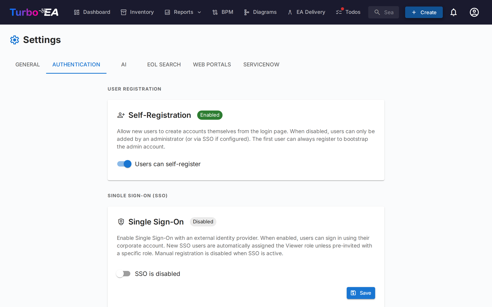

# Authentification et SSO

L'onglet **Authentification** dans les Parametres permet aux administrateurs de configurer la maniere dont les utilisateurs se connectent a la plateforme.

#### Auto-inscription

- **Autoriser l'auto-inscription** : Lorsque cette option est activee, les nouveaux utilisateurs peuvent creer des comptes en cliquant sur « S'inscrire » sur la page de connexion. Lorsqu'elle est desactivee, seuls les administrateurs peuvent creer des comptes via le flux d'invitation.

#### Configuration SSO (Single Sign-On)

Le SSO permet aux utilisateurs de se connecter en utilisant leur fournisseur d'identite d'entreprise au lieu d'un mot de passe local. Turbo EA prend en charge quatre fournisseurs SSO :

| Fournisseur | Description |
|-------------|-------------|
| **Microsoft Entra ID** | Pour les organisations utilisant Microsoft 365 / Azure AD |
| **Google Workspace** | Pour les organisations utilisant Google Workspace |
| **Okta** | Pour les organisations utilisant Okta comme plateforme d'identite |
| **OIDC generique** | Pour tout fournisseur compatible OpenID Connect (par ex. Authentik, Keycloak, Auth0) |

**Etapes pour configurer le SSO :**

1. Allez dans **Admin > Parametres > Authentification**
2. Activez **Activer le SSO**
3. Selectionnez votre **Fournisseur SSO** dans la liste deroulante
4. Entrez les identifiants requis de votre fournisseur d'identite :
   - **Client ID** : L'identifiant d'application/client de votre fournisseur d'identite
   - **Client Secret** : Le secret de l'application (stocke chiffre dans la base de donnees)
   - Champs specifiques au fournisseur :
     - **Microsoft** : Tenant ID (par ex. `votre-tenant-id` ou `common` pour multi-tenant)
     - **Google** : Domaine heberge (optionnel, restreint la connexion a un domaine Google Workspace specifique)
     - **Okta** : Domaine Okta (par ex. `votre-org.okta.com`)
     - **OIDC generique** : URL de l'emetteur (par ex. `https://auth.example.com/application/o/my-app/`). Pour l'OIDC generique, le systeme tente la decouverte automatique via le point de terminaison `.well-known/openid-configuration`
5. Cliquez sur **Sauvegarder**

**Points de terminaison OIDC manuels (avance) :**

Si le backend ne peut pas atteindre le document de decouverte de votre fournisseur d'identite (par ex. en raison du reseau Docker ou de certificats auto-signes), vous pouvez specifier manuellement les points de terminaison OIDC :

- **Point de terminaison d'autorisation** : L'URL ou les utilisateurs sont rediriges pour s'authentifier
- **Point de terminaison de jeton** : L'URL utilisee pour echanger le code d'autorisation contre des jetons
- **URI JWKS** : L'URL du jeu de cles web JSON utilise pour verifier les signatures des jetons

Ces champs sont optionnels. S'ils sont laisses vides, le systeme utilise la decouverte automatique. Lorsqu'ils sont remplis, ils remplacent les valeurs decouvertes automatiquement.

**Tester le SSO :**

Apres avoir sauvegarde, ouvrez un nouvel onglet de navigateur (ou une fenetre de navigation privee) et verifiez que le bouton de connexion SSO apparait sur la page de connexion et que l'authentification fonctionne de bout en bout.

**Notes importantes :**
- Le **Client Secret** est stocke chiffre dans la base de donnees et n'est jamais expose dans les reponses API
- Lorsque le SSO est active, la connexion par mot de passe local reste disponible comme solution de secours
- Vous pouvez configurer l'URI de redirection dans votre fournisseur d'identite comme suit : `https://votre-domaine-turbo-ea/auth/callback`
