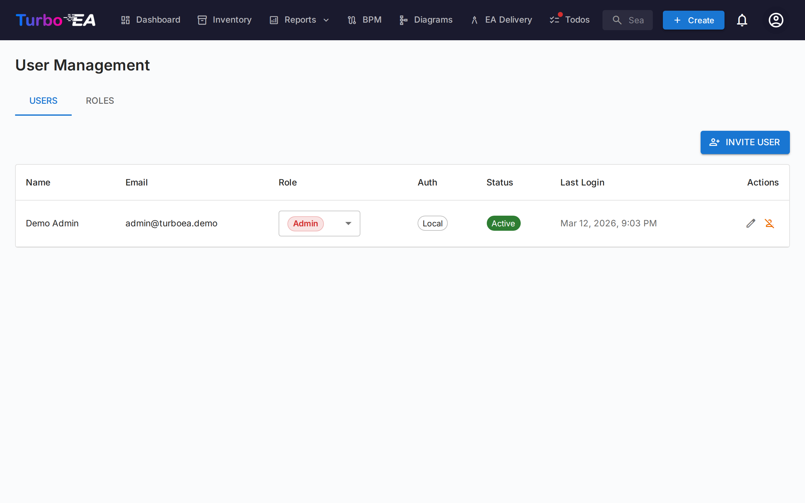

# Utilisateurs et roles

La page **Utilisateurs et roles** comporte deux onglets : **Utilisateurs** (gestion des comptes) et **Roles** (gestion des permissions).

#### Tableau des utilisateurs

La liste des utilisateurs affiche tous les comptes enregistres avec les colonnes suivantes :

| Colonne | Description |
|---------|-------------|
| **Nom** | Nom d'affichage de l'utilisateur |
| **E-mail** | Adresse e-mail (utilisee pour la connexion) |
| **Role** | Role attribue (selectionnable en ligne via une liste deroulante) |
| **Auth** | Methode d'authentification : « Local », « SSO », « SSO + Mot de passe » ou « Configuration en attente » |
| **Statut** | Actif ou Desactive |
| **Actions** | Modifier, activer/desactiver ou supprimer l'utilisateur |

#### Inviter un nouvel utilisateur

1. Cliquez sur le bouton **Inviter un utilisateur** (en haut a droite)
2. Remplissez le formulaire :
   - **Nom d'affichage** (obligatoire) : Le nom complet de l'utilisateur
   - **E-mail** (obligatoire) : L'adresse e-mail qu'il utilisera pour se connecter
   - **Mot de passe** (optionnel) : Si laisse vide et que le SSO est desactive, l'utilisateur recoit un e-mail avec un lien de configuration du mot de passe. Si le SSO est active, l'utilisateur peut se connecter via son fournisseur SSO sans mot de passe
   - **Role** : Selectionnez le role a attribuer (Admin, Membre, Lecteur, ou tout role personnalise)
   - **Envoyer un e-mail d'invitation** : Cochez cette case pour envoyer une notification par e-mail a l'utilisateur avec les instructions de connexion
3. Cliquez sur **Inviter l'utilisateur** pour creer le compte

**Ce qui se passe en arriere-plan :**
- Un compte utilisateur est cree dans le systeme
- Un enregistrement d'invitation SSO est egalement cree, de sorte que si l'utilisateur se connecte via SSO, il recoit automatiquement le role pre-attribue
- Si aucun mot de passe n'est defini et que le SSO est desactive, un jeton de configuration de mot de passe est genere. L'utilisateur peut definir son mot de passe en suivant le lien dans l'e-mail d'invitation

#### Modifier un utilisateur

Cliquez sur l'**icone de modification** sur n'importe quelle ligne d'utilisateur pour ouvrir le dialogue de modification. Vous pouvez modifier :

- **Nom d'affichage** et **E-mail**
- **Methode d'authentification** (visible uniquement lorsque le SSO est active) : Basculer entre « Local » et « SSO ». Cela permet aux administrateurs de convertir un compte local existant en SSO, ou inversement. Lors du passage a SSO, le compte sera automatiquement lie lorsque l'utilisateur se connectera ensuite via son fournisseur SSO
- **Mot de passe** (uniquement pour les utilisateurs locaux) : Definir un nouveau mot de passe. Laissez vide pour conserver le mot de passe actuel
- **Role** : Modifier le role au niveau de l'application de l'utilisateur

#### Lier un compte local existant au SSO

Si un utilisateur possede deja un compte local et que votre organisation active le SSO, l'utilisateur verra l'erreur « Un compte local avec cet e-mail existe deja » lorsqu'il tentera de se connecter via SSO. Pour resoudre ce probleme :

1. Allez dans **Admin > Utilisateurs**
2. Cliquez sur l'**icone de modification** a cote de l'utilisateur
3. Changez la **Methode d'authentification** de « Local » a « SSO »
4. Cliquez sur **Sauvegarder les modifications**
5. L'utilisateur peut maintenant se connecter via SSO. Son compte sera automatiquement lie lors de la premiere connexion SSO

#### Invitations en attente

Sous le tableau des utilisateurs, une section **Invitations en attente** affiche toutes les invitations qui n'ont pas encore ete acceptees. Chaque invitation montre l'e-mail, le role pre-attribue et la date d'invitation. Vous pouvez revoquer une invitation en cliquant sur l'icone de suppression.

#### Roles

L'onglet **Roles** permet de gerer les roles au niveau de l'application. Chaque role definit un ensemble de permissions qui controlent ce que les utilisateurs avec ce role peuvent faire. Roles par defaut :

| Role | Description |
|------|-------------|
| **Admin** | Acces complet a toutes les fonctionnalites et a l'administration |
| **Admin BPM** | Toutes les permissions BPM plus l'acces a l'inventaire, sans parametres d'administration |
| **Membre** | Creer, modifier et gerer les fiches, relations et commentaires. Pas d'acces administrateur |
| **Lecteur** | Acces en lecture seule dans tous les domaines |

Des roles personnalises peuvent etre crees avec un controle granulaire des permissions sur l'inventaire, les relations, les parties prenantes, les commentaires, les documents, les diagrammes, le BPM, les rapports, et plus encore.

#### Desactiver un utilisateur

Cliquez sur l'**icone de bascule** dans la colonne Actions pour activer ou desactiver un utilisateur. Les utilisateurs desactives :

- Ne peuvent pas se connecter
- Conservent leurs donnees (fiches, commentaires, historique) a des fins d'audit
- Peuvent etre reactives a tout moment
