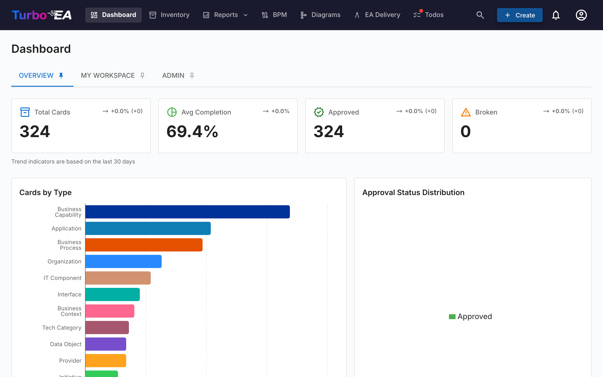

# Acces a la plateforme

## Connexion

Lors de l'acces a la plateforme, l'ecran de connexion s'affiche et vous devez saisir votre adresse e-mail et votre mot de passe.

**Etapes pour se connecter :**

1. Ouvrez votre navigateur web et saisissez l'URL de la plateforme
2. Dans le champ **E-mail**, entrez votre adresse e-mail enregistree
3. Dans le champ **Mot de passe**, entrez votre mot de passe
4. Cliquez sur le bouton **Se connecter**

**Note importante :** Le premier utilisateur a s'inscrire sur la plateforme recoit automatiquement le role **Administrateur**, ce qui lui permet de configurer l'ensemble du systeme.

## Connexion avec SSO (Single Sign-On)

Si votre organisation a configure le SSO, un bouton **Se connecter avec [Fournisseur]** apparait sur la page de connexion sous le formulaire de mot de passe. Le libelle du bouton affiche le nom du fournisseur configure (par ex. « Se connecter avec Microsoft », « Se connecter avec Okta », « Se connecter avec SSO »).

**Etapes pour se connecter avec SSO :**

1. Ouvrez votre navigateur web et saisissez l'URL de la plateforme
2. Cliquez sur le bouton **Se connecter avec [Fournisseur]**
3. Vous serez redirige vers la page de connexion de votre fournisseur d'identite (par ex. Microsoft Entra ID, Google Workspace, Okta, ou le fournisseur OIDC de votre organisation)
4. Authentifiez-vous avec vos identifiants d'entreprise
5. Apres une authentification reussie, vous etes redirige vers Turbo EA et connecte automatiquement

**Notes :**

- Si votre compte n'existe pas encore dans Turbo EA, il sera cree automatiquement lors de la premiere connexion SSO (si l'auto-inscription est activee) ou associe a une invitation precreee
- Si un administrateur vous a deja invite par e-mail, votre connexion SSO sera liee a ce compte et vous heriterez du role pre-attribue
- Les utilisateurs SSO peuvent toujours avoir un mot de passe local defini comme solution de secours, si configure par l'administrateur

## Inscription de nouveaux utilisateurs

Si c'est votre premiere visite sur la plateforme, vous pouvez vous inscrire en cliquant sur « S'inscrire ». Les administrateurs peuvent egalement inviter des utilisateurs depuis le panneau d'administration (voir [Utilisateurs et roles](../admin/users.md)).

## Changement de langue

La plateforme prend en charge sept langues. Pour changer la langue :

1. Cliquez sur votre icone de profil (coin superieur droit)
2. Selectionnez **Langue**
3. Choisissez la langue souhaitee :
   - English
   - Espanol
   - Francais
   - Deutsch
   - Italiano
   - Portugues
   - 中文 (Chinois)
