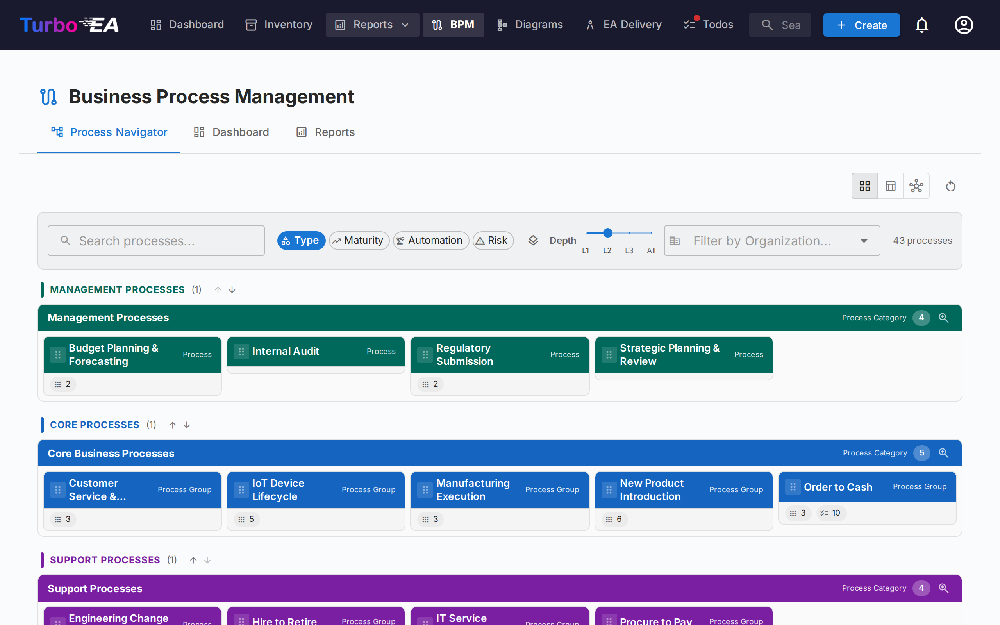
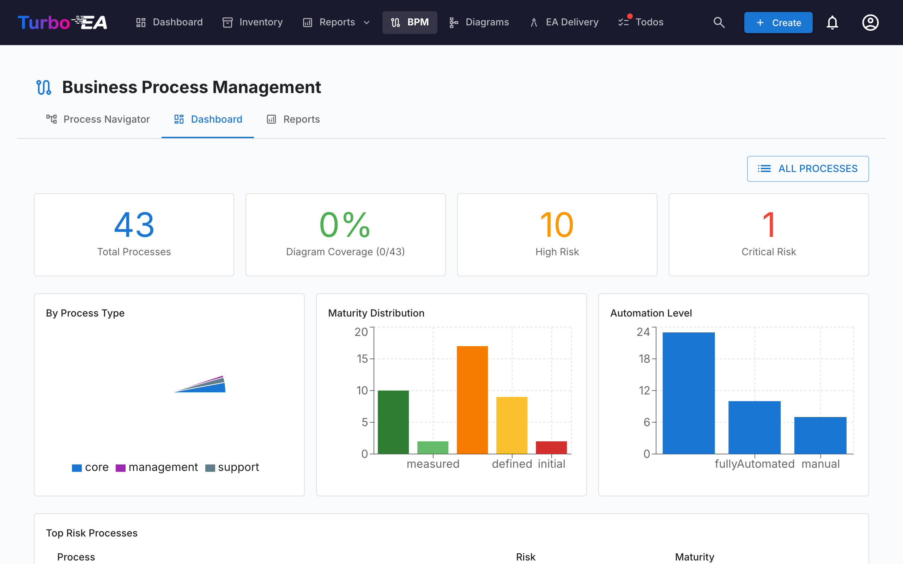

# Gestion des processus metier (BPM)

Le module **BPM** permet de documenter, modeliser et analyser les **processus metier** de l'organisation. Il combine des diagrammes visuels BPMN 2.0 avec des evaluations de maturite et des rapports.

!!! note
    Le module BPM peut etre active ou desactive par un administrateur dans les [Parametres](../admin/settings.md). Lorsqu'il est desactive, la navigation et les fonctionnalites BPM sont masquees.

## Navigateur de processus

Le **Navigateur de processus** organise les processus en trois categories principales :

- **Processus de management** -- Planification, gouvernance et controle
- **Processus metier principaux** -- Activites principales de creation de valeur
- **Processus de support** -- Activites qui soutiennent les operations metier principales

**Filtres :** Type, Maturite (Initial / Defini / Gere / Optimise), Niveau d'automatisation, Risque (Faible / Moyen / Eleve / Critique), Profondeur (L1 / L2 / L3).

## Tableau de bord BPM

Le **Tableau de bord BPM** fournit une vue executif de l'etat des processus :

| Indicateur | Description |
|------------|-------------|
| **Total des processus** | Nombre total de processus metier documentes |
| **Couverture des diagrammes** | Pourcentage de processus avec un diagramme BPMN associe |
| **Risque eleve** | Nombre de processus avec un niveau de risque eleve |
| **Risque critique** | Nombre de processus avec un niveau de risque critique |

Les graphiques montrent la repartition par type de processus, niveau de maturite et niveau d'automatisation. Un tableau des **processus a risque eleve** aide a prioriser les investissements.

## Editeur de flux de processus

Chaque fiche Processus Metier peut avoir un **diagramme de flux de processus BPMN 2.0**. L'editeur utilise [bpmn-js](https://bpmn.io/) et offre :

- **Modelisation visuelle** -- Glisser-deposer des elements BPMN : taches, evenements, passerelles, couloirs et sous-processus
- **Modeles de demarrage** -- Choisir parmi 6 modeles BPMN preconstruits pour des schemas de processus courants (ou commencer a partir d'un canevas vierge)
- **Extraction d'elements** -- Lorsque vous sauvegardez un diagramme, le systeme extrait automatiquement toutes les taches, evenements, passerelles et couloirs pour analyse

### Liaison d'elements

Les elements BPMN peuvent etre **lies a des fiches EA**. Par exemple, lier une tache dans votre diagramme de processus a l'Application qui la supporte. Cela cree une connexion tracable entre votre modele de processus et votre paysage d'architecture :

- Selectionnez n'importe quelle tache, evenement ou passerelle dans le diagramme BPMN
- Le panneau **Liaison d'elements** affiche les fiches correspondantes (Application, Objet de Donnees, Composant IT)
- Liez l'element a une fiche -- la connexion est stockee et visible a la fois dans le flux de processus et dans les relations de la fiche

### Workflow d'approbation

Les diagrammes de flux de processus suivent un workflow d'approbation avec controle de version :

| Statut | Description |
|--------|-------------|
| **Brouillon** | En cours d'edition, pas encore soumis pour examen |
| **En attente** | Soumis pour approbation, en attente d'examen |
| **Publie** | Approuve et visible comme version actuelle |
| **Archive** | Version precedemment publiee, conservee pour l'historique |

Soumettre un brouillon cree un instantane de version. Les approbateurs peuvent approuver (publier) ou rejeter (avec commentaires) la soumission.

## Evaluations de processus

Les fiches Processus Metier prennent en charge des **evaluations** qui notent le processus sur :

- **Efficience** -- Dans quelle mesure le processus utilise les ressources
- **Efficacite** -- Dans quelle mesure le processus atteint ses objectifs
- **Conformite** -- Dans quelle mesure le processus respecte les exigences reglementaires

Les donnees d'evaluation alimentent les rapports BPM.

## Rapports BPM

Trois rapports specialises sont disponibles depuis le tableau de bord BPM :

- **Rapport de maturite** -- Repartition des processus par niveau de maturite, tendances dans le temps
- **Rapport de risque** -- Vue d'ensemble de l'evaluation des risques, mettant en evidence les processus qui necessitent une attention
- **Rapport d'automatisation** -- Analyse des niveaux d'automatisation dans le paysage des processus
