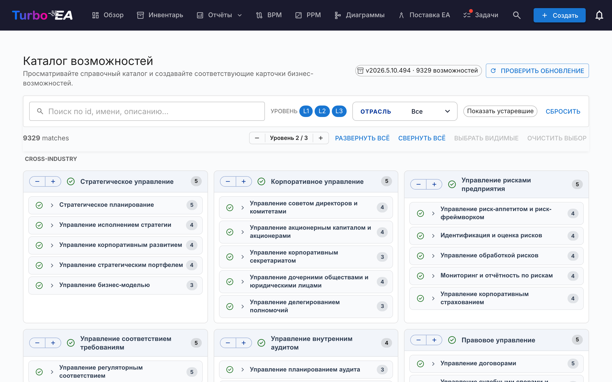

# Каталог возможностей

Turbo EA поставляется с **[Business Capability Reference Catalogue](https://catalog.turbo-ea.org)** — открытым кураторским каталогом бизнес-возможностей, поддерживаемым в [github.com/vincentmakes/turbo-ea-capabilities](https://github.com/vincentmakes/turbo-ea-capabilities). Страница «Каталог возможностей» позволяет просматривать этот справочник и массово создавать соответствующие карты `BusinessCapability` вместо ввода их по одной.

## Открытие страницы

Нажмите на значок пользователя в правом верхнем углу приложения, затем выберите **Каталог возможностей**. Страница доступна любому пользователю с правом `inventory.view`.

## Что вы видите

- **Заголовок** — активная версия каталога, количество возможностей в нём и (для администраторов) элементы управления для проверки и получения обновлений.
- **Панель фильтров** — полнотекстовый поиск по id, имени, описанию и алиасам, плюс чипы уровней (L1 → L4), множественный выбор отрасли и переключатель «Показывать устаревшие». При прокрутке остаётся закреплённой непосредственно под верхней навигацией.
- **Панель действий** — счётчики совпадений, глобальный шаговый переключатель уровня (раскрывает / сворачивает все L1 на один уровень за раз), развернуть/свернуть всё, выбрать видимые, очистить выбор. Закреплена рядом с панелью фильтров, так что элементы управления остаются под рукой даже глубоко внутри поддерева L1.
- **Сетка L1** — по одной карточке на каждую возможность верхнего уровня, **сгруппированных под отраслевыми заголовками**. Возможности **Cross-Industry** всегда закреплены сверху; остальные отрасли следуют по алфавиту; возможности без отраслевой метки попадают в конец в блок **Общее**. Имя L1 размещено в светло-синей полосе заголовка; дочерние возможности перечислены ниже, с отступом и тонкой вертикальной линией для обозначения глубины — это та же иерархическая идиома, что и в остальном приложении, чтобы страница не несла собственной визуальной идентичности. Длинные имена переносятся на несколько строк вместо обрезки. Каждый заголовок L1 также имеет собственный шаговый переключатель `−` / `+`: `+` открывает следующий уровень потомков только для этого L1, `−` закрывает самый глубокий открытый уровень. Обе кнопки всегда видны (недоступное направление становится отключённым), действие ограничено этим одним L1 — остальные ветви остаются на месте — а глобальный шаговый переключатель в верхней части страницы не затрагивается.
- **Кнопка «Наверх»** — как только вы прокручиваете страницу за пределы заголовка, в правом нижнем углу появляется плавающая круглая стрелка. Клик возвращает плавно к началу страницы. Кнопка автоматически сдвигается вверх, когда активна закреплённая полоса **Создать N возможностей**, чтобы они никогда не перекрывались.

## Выбор возможностей

Установите флажок рядом с любой возможностью, чтобы добавить её в выбор. Выбор каскадно распространяется по поддереву в обе стороны, но никогда не затрагивает предков:

- **Установка** флажка у невыбранной возможности добавляет её и каждого выбираемого потомка.
- **Снятие** флажка у выбранной возможности удаляет её вместе с каждым выбираемым потомком.

Поэтому снятие флажка с одного потомка удаляет только этого потомка и всё, что под ним, — родитель и братья остаются выбранными. Снятие флажка с родителя удаляет всё поддерево одним действием. Чтобы собрать выбор «L1 + несколько листьев», выберите L1 (это активирует всё поддерево), а затем снимите флажки с тех L2/L3, которые не нужны — L1 останется выбранным, и его флажок останется установленным.

Страница автоматически следует светлой/тёмной теме приложения — в тёмном режиме отображается та же нейтральная вёрстка на бумаге `#1e1e1e` с лавандовым текстом и акцентами.

Возможности, которые **уже существуют** в вашем инвентаре, отображаются с **зелёной галочкой** вместо флажка. Их нельзя выбрать — вы никогда не создадите одну и ту же Business Capability дважды через каталог. Сопоставление сначала использует метку `attributes.catalogueId`, оставленную предыдущим импортом (так что зелёная галочка переживает изменения отображаемого имени), и при её отсутствии возвращается к сравнению отображаемых имён без учёта регистра — для карточек, созданных вручную.

## Массовое создание карт

Когда выбрана хотя бы одна возможность, в нижней части страницы появляется закреплённая кнопка **Создать N возможностей**. Она использует обычное право `inventory.create` — если ваша роль не позволяет создавать карты, кнопка будет отключена.

После подтверждения Turbo EA:

- Создаёт по одной карте `BusinessCapability` для каждой выбранной записи каталога.
- **Автоматически сохраняет иерархию каталога** — когда родитель и потомок выбраны вместе (или родитель уже существует локально), `parent_id` новой карты-потомка корректно подключается к нужной карте.
- **Молча пропускает существующие совпадения**. Диалог результата показывает, сколько было создано и сколько пропущено.
- Проставляет в `attributes` каждой новой карты `catalogueId`, `catalogueVersion`, `catalogueImportedAt` и `capabilityLevel`, чтобы можно было отследить происхождение.

Повторный запуск того же импорта безопасен — он идемпотентен.

**Двунаправленная связка.** Иерархия восстанавливается в обе стороны, поэтому порядок импорта не важен:

- Если выбрать только потомка, чей **родитель в каталоге уже существует** как карта, новый потомок автоматически прикрепляется к этому существующему родителю.
- Если выбрать только родителя, чьи **потомки в каталоге уже существуют** как карты, эти потомки переносятся под новую карту — независимо от их текущего положения (на верхнем уровне или вложенные вручную под другую карту). При импорте каталог считается источником истины об иерархии; если вы предпочитаете другого родителя для конкретной карты, отредактируйте её после импорта. Диалог результата сообщает количество перепривязанных карт наряду с числами созданных и пропущенных.

## Подробный вид

Щёлкните по имени любой возможности, чтобы открыть диалог подробностей: там показаны хлебные крошки, описание, отрасль, алиасы, ссылки и полностью развёрнутый вид её поддерева. Существующие совпадения в поддереве помечаются зелёной галочкой.

## Обновление каталога (администраторы)

Каталог поставляется **встроенным** в виде Python-зависимости, поэтому страница работает офлайн / в изолированных развёртываниях. Администраторы (`admin.metamodel`) могут получить более новую версию по запросу:

1. Нажмите **Проверить обновления**. Turbo EA запрашивает JSON API PyPI по адресу `https://pypi.org/pypi/turbo-ea-capabilities/json` и сообщает, доступна ли более новая опубликованная версия. PyPI — это источник истины в момент публикации, поэтому wheel, выложенный несколько минут назад, обнаруживается мгновенно.
2. Если да, нажмите появившуюся кнопку **Получить v…**. Turbo EA скачает свежий wheel с PyPI, извлечёт из него полезную нагрузку каталога и сохранит её как серверное переопределение; оно вступит в силу немедленно для всех пользователей.

Активная версия каталога всегда отображается в чипе заголовка. Переопределение преобладает над встроенным пакетом только тогда, когда его версия строго выше — поэтому обновление Turbo EA, поставляющее более новый встроенный каталог, продолжит работать как ожидается.

URL индекса PyPI можно настроить через переменную окружения `CAPABILITY_CATALOGUE_PYPI_URL` — для изолированных развёртываний или частных зеркал.
