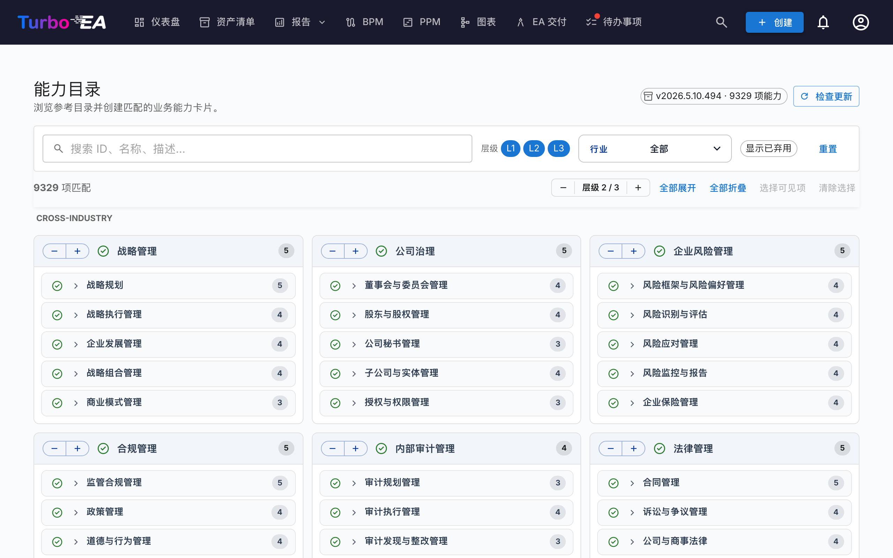

# 能力目录

Turbo EA 自带 **[Business Capability Reference Catalogue](https://catalog.turbo-ea.org)** —— 一个由 [github.com/vincentmakes/turbo-ea-capabilities](https://github.com/vincentmakes/turbo-ea-capabilities) 维护的、经过整理的开放式业务能力目录。能力目录页面让您浏览此参考资料并批量创建对应的 `BusinessCapability` 卡片，而不必逐条录入。

## 打开页面

点击应用右上角的用户图标，然后选择 **能力目录**。所有拥有 `inventory.view` 权限的用户都可以访问此页面。

## 您能看到什么

- **页头** —— 当前生效的目录版本、所含能力数量，以及（管理员可见的）检查并获取更新的控件。
- **筛选栏** —— 对 id、名称、描述和别名的全文搜索，外加层级标签 (L1 → L4)、行业多选器，以及「显示已弃用」开关。页面滚动时会固定在顶部导航栏正下方。
- **操作栏** —— 命中数计数、全局层级步进器（一次将所有 L1 展开/收起一层）、全部展开/收起、选择可见、清空选择。与筛选栏一同保持固定，即使深入到 L1 子树深处，控件也始终在手边。
- **L1 网格** —— 每个顶层能力一张卡片，**按行业分组并加标题**。**Cross-Industry** 能力始终置顶；其他行业按字母顺序依次排列；没有行业标签的能力归入末尾的 **通用** 分组。L1 名称位于浅蓝色页头条；子能力列在下方，以细细的竖线缩进表示层级深度——这是应用其他位置使用的同一种层级表达方式，使本页不带有自己独立的视觉风格。长名称会自动换行而不是被截断。每个 L1 页头还有一个独立的 `−` / `+` 步进器：`+` 仅为该 L1 打开下一层后代，`−` 收起最深的已展开层级。两个按钮始终可见（不可用方向呈禁用态），动作仅作用于该 L1 ——其他分支不动——且页面顶部的全局层级步进器不会被影响。
- **返回顶部按钮** —— 当您向下滚动越过页头后，右下角会浮现一个圆形的浮动箭头。点击即可平滑回到页面顶部。当 **创建 N 项能力** 的固定栏处于激活状态时，按钮会自动上移，二者不会相互重叠。

## 选择能力

勾选任何能力旁的复选框即可加入选择。选择会沿子树双向传播，但永远不会向上波及父代：

- **勾选** 一个尚未选中的能力，会同时加入该能力及其所有可选后代。
- **取消勾选** 一个已选中的能力，会同时移除该能力及其所有可选后代。

因此取消勾选单个子节点只会移除该子节点和其下方内容——它的父节点和兄弟仍保持选中。取消勾选一个父节点会一举移除整棵子树。要组成「L1 + 若干叶子」的选择，请先选择 L1（这会带上整棵子树），然后取消勾选您不需要的 L2/L3 能力——L1 仍保持选中，复选框依然打勾。

页面会自动跟随应用的浅色/深色主题——深色模式下，相同的中性版式呈现在 `#1e1e1e` 纸面上，文字和点缀使用淡紫色调。

清单中**已存在**的能力会显示**绿色勾号图标**而非复选框，无法被选择——您不可能通过目录两次创建同一个 Business Capability。匹配优先使用上次导入留下的 `attributes.catalogueId` 标记（这样即使显示名被改动，绿色勾号也能保留），若卡片是您手工创建的，则回退到不区分大小写的显示名匹配。

## 批量创建卡片

一旦至少选择了一个能力，页面底部会出现一个固定按钮 **创建 N 个能力**。它使用常规的 `inventory.create` 权限——若您的角色不允许创建卡片，按钮会被禁用。

点击确认后，Turbo EA 会：

- 为每个选中的目录条目创建一张 `BusinessCapability` 卡片。
- **自动保留目录层级** —— 当父节点与子节点同时被选中（或父节点本地已存在）时，新子卡片的 `parent_id` 会被正确接到对应卡片上。
- **静默跳过已存在的匹配项**。结果对话框会显示有多少张被创建、多少张被跳过。
- 在每张新卡片的 `attributes` 上盖上 `catalogueId`、`catalogueVersion`、`catalogueImportedAt` 和 `capabilityLevel`，便于追溯来源。

重复执行同一次导入是安全的——它是幂等的。

**双向链接。** 层级会双向修复，因此导入顺序无关紧要：

- 仅选择一个子节点，且其在目录中的**父节点已存在为卡片** 时，会自动把新子节点嫁接到那个已存在的父节点之下。
- 仅选择一个父节点，且其在目录中的**子节点已存在为卡片** 时，会把这些子节点重新挂到新卡片下——无论它们当前位于何处（顶层或被人工嵌入到另一张卡片下）。导入时以目录为层级的真实来源；若您希望某张卡片有不同的父节点，请在导入后再行编辑。结果对话框会在已创建和已跳过计数之外，再报告有多少张卡片被重新链接。

## 详情视图

点击任何能力的名称即可打开详情对话框，里面会展示其面包屑、描述、行业、别名、参考资料以及完全展开的子树视图。子树中已存在的匹配项会用绿色勾号标记。

## 更新目录（管理员）

目录作为 Python 依赖**随版本一起打包**发布，因此即便离线 / 在隔网部署中页面也可使用。管理员（`admin.metamodel`）可按需拉取更新版本：

1. 点击 **检查更新**。Turbo EA 会查询 PyPI 的 JSON API `https://pypi.org/pypi/turbo-ea-capabilities/json` 并告诉您是否有更新的已发布版本。PyPI 是发布时的唯一可信源，因此几分钟前刚上线的 wheel 也能立即被识别。
2. 若有，点击随之出现的 **获取 v…** 按钮。Turbo EA 会从 PyPI 下载最新 wheel，从中提取目录数据，并将其作为服务器端覆盖保存，对所有用户立即生效。

当前生效的目录版本始终显示在页头的 chip 上。只有当覆盖版本严格大于打包版本时，覆盖才会优先于打包包——所以一次带有更新打包目录的 Turbo EA 升级仍会按预期工作。

PyPI 索引 URL 可通过环境变量 `CAPABILITY_CATALOGUE_PYPI_URL` 进行配置，方便隔网部署或私有镜像使用。
