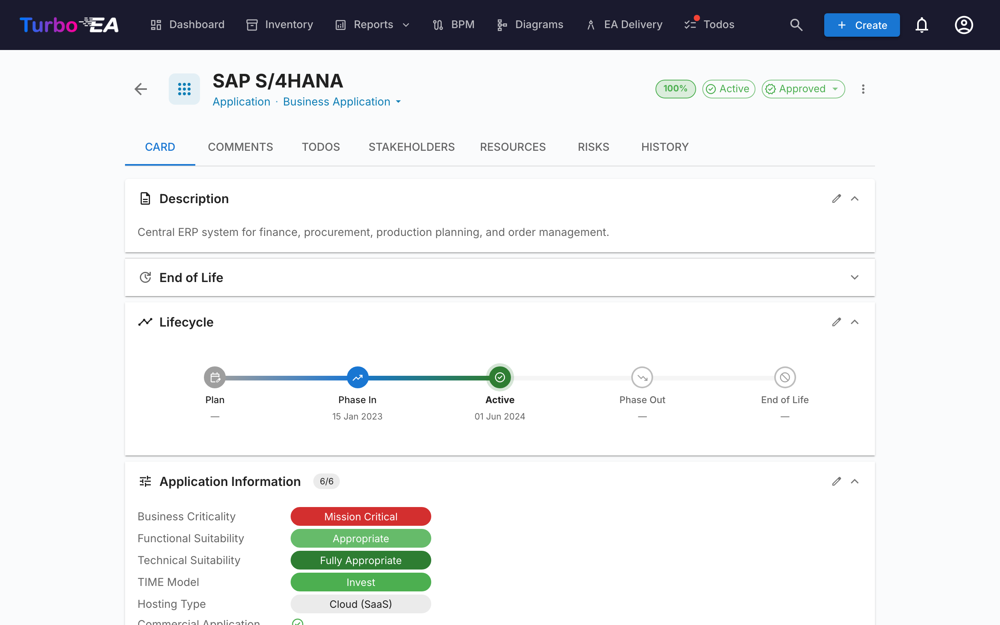
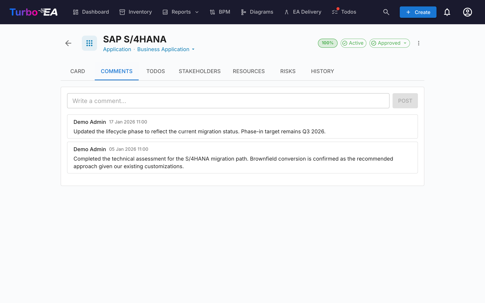
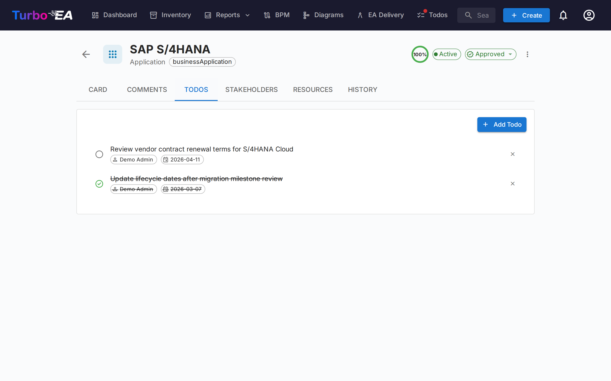
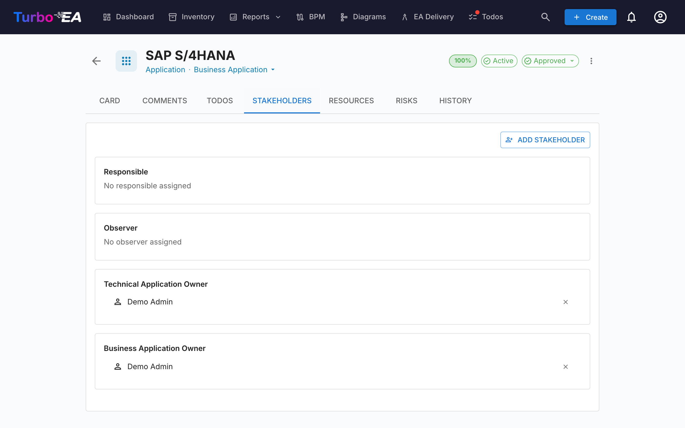
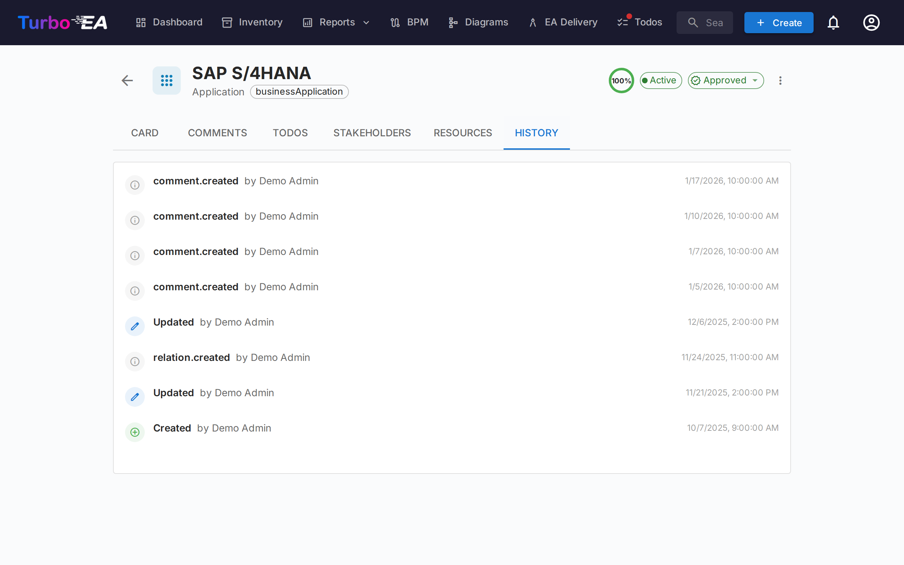

# Detail des fiches

Cliquer sur n'importe quelle fiche dans l'inventaire ouvre la **vue detaillee** ou vous pouvez consulter et modifier toutes les informations sur le composant.

## En-tete de la fiche

Le haut de la fiche affiche :

- **Icone et libelle du type** -- Indicateur du type de fiche code par couleur
- **Nom de la fiche** -- Modifiable en ligne
- **Sous-type** -- Classification secondaire (le cas echeant)
- **Badge de statut d'approbation** -- Brouillon, Approuve, Casse ou Rejete
- **Bouton de suggestion IA** -- Cliquez pour generer une description avec l'IA (visible lorsque l'IA est activee pour ce type de fiche et que l'utilisateur a la permission de modification)
- **Anneau de qualite des donnees** -- Indicateur visuel de completude des informations (0-100%)
- **Menu d'actions** -- Archiver, supprimer et actions d'approbation

### Workflow d'approbation

Les fiches peuvent passer par un cycle d'approbation :

| Statut | Signification |
|--------|---------------|
| **Brouillon** | Etat par defaut, pas encore examine |
| **Approuve** | Examine et accepte par un responsable |
| **Casse** | Etait approuve, mais a ete modifie depuis -- necessite un reexamen |
| **Rejete** | Examine et rejete, necessite des corrections |

Lorsqu'une fiche approuvee est modifiee, son statut passe automatiquement a **Casse** pour indiquer qu'elle necessite un reexamen.

## Onglet Detail (Principal)

L'onglet detail est organise en **sections** qui peuvent etre reorganisees et configurees par un administrateur par type de fiche (voir [Editeur de mise en page des fiches](../admin/metamodel.md#card-layout-editor)).

### Section Description

- **Description** -- Description en texte riche du composant. Prend en charge la fonctionnalite de suggestion IA pour la generation automatique
- **Champs de description supplementaires** -- Certains types de fiches incluent des champs supplementaires dans la section description (par ex. alias, identifiant externe)

### Section Cycle de vie

Le modele de cycle de vie suit un composant a travers cinq phases :

| Phase | Description |
|-------|-------------|
| **Planification** | En cours d'evaluation, pas encore demarre |
| **Mise en service** | En cours d'implementation ou de deploiement |
| **Actif** | Actuellement operationnel |
| **Retrait progressif** | En cours de mise hors service |
| **Fin de vie** | Plus utilise ni supporte |

Chaque phase dispose d'un **selecteur de date** pour enregistrer quand le composant est entre ou entrera dans cette phase. Une barre chronologique visuelle montre la position du composant dans son cycle de vie.

### Sections d'attributs personnalises

Selon le type de fiche, vous verrez des sections supplementaires avec des **champs personnalises** configures dans le metamodele. Les types de champs incluent :

- **Texte** -- Saisie de texte libre
- **Nombre** -- Valeur numerique
- **Cout** -- Valeur numerique affichee avec la devise configuree de la plateforme
- **Booleen** -- Interrupteur marche/arret
- **Date** -- Selecteur de date
- **URL** -- Lien cliquable (valide pour http/https/mailto)
- **Selection unique** -- Liste deroulante avec options predefinies
- **Selection multiple** -- Multi-selection avec affichage en puces

Les champs marques comme **calcules** affichent un badge et ne peuvent pas etre modifies manuellement -- leurs valeurs sont calculees par des [formules definies par l'administrateur](../admin/calculations.md).

### Section Hierarchie

Pour les types de fiches qui prennent en charge la hierarchie (par ex. Organisation, Capacite Metier, Application) :

- **Parent** -- Le parent de la fiche dans la hierarchie (cliquer pour naviguer)
- **Enfants** -- Liste des fiches enfants (cliquer sur l'une d'elles pour naviguer)
- **Fil d'Ariane hierarchique** -- Affiche le chemin complet de la racine a la fiche actuelle

### Section Relations

Affiche toutes les connexions avec d'autres fiches, groupees par type de relation. Pour chaque relation :

- **Nom de la fiche liee** -- Cliquer pour naviguer vers la fiche liee
- **Type de relation** -- La nature de la connexion (par ex. « utilise », « s'execute sur », « depend de »)
- **Ajouter une relation** -- Cliquez sur **+** pour creer une nouvelle relation en recherchant des fiches
- **Supprimer une relation** -- Cliquez sur l'icone de suppression pour retirer une relation

### Section Tags

Appliquez des tags a partir des [groupes de tags](../admin/tags.md) configures. Selon le mode du groupe, vous pouvez selectionner un tag (selection unique) ou plusieurs tags (selection multiple).

### Section Documents

Attachez des liens vers des ressources externes :

- **Ajouter un document** -- Entrez une URL et un libelle optionnel
- **Cliquer pour ouvrir** -- Les liens s'ouvrent dans un nouvel onglet
- **Supprimer** -- Supprimer un lien de document

### Section EOL

Si la fiche est liee a un produit [endoflife.date](https://endoflife.date/) (via [Administration EOL](../admin/eol.md)) :

- **Nom du produit et version**
- **Statut de support** -- Code couleur : Supporte, Approchant la fin de vie, Fin de vie
- **Dates cles** -- Date de sortie, fin du support actif, fin du support securite, date de fin de vie

## Onglet Commentaires

- **Ajouter des commentaires** -- Laissez des notes, questions ou decisions concernant le composant
- **Reponses en fil** -- Repondez a des commentaires specifiques pour creer des fils de conversation
- **Horodatages** -- Voyez quand chaque commentaire a ete publie et par qui

## Onglet Taches

- **Creer des taches** -- Ajoutez des taches liees a cette fiche specifique
- **Assigner** -- Definissez un responsable pour chaque tache
- **Date d'echeance** -- Fixez des delais
- **Statut** -- Basculer entre Ouvert et Termine

## Onglet Parties prenantes

Les parties prenantes sont des personnes ayant un **role** specifique sur cette fiche. Les roles disponibles dependent du type de fiche (configures dans le [metamodele](../admin/metamodel.md)). Les roles courants incluent :

- **Responsable applicatif** -- Responsable des decisions metier
- **Responsable technique** -- Responsable des decisions techniques
- **Roles personnalises** -- Roles supplementaires definis par votre administrateur

Les affectations de parties prenantes affectent les **permissions** : les permissions effectives d'un utilisateur sur une fiche sont la combinaison de son role au niveau de l'application et de tous les roles de parties prenantes qu'il detient sur cette fiche.

## Onglet Historique

Affiche la **piste d'audit complete** des modifications apportees a la fiche : **qui** a effectue la modification, **quand** elle a ete effectuee, et **ce qui** a ete modifie (valeur precedente vs nouvelle valeur). Cela permet une tracabilite complete de toutes les modifications au fil du temps.

## Onglet Flux de processus (fiches Processus Metier uniquement)

Pour les fiches **Processus Metier**, un onglet supplementaire **Flux de processus** apparait avec un visualiseur/editeur de diagramme BPMN integre. Voir [BPM](bpm.md) pour les details sur la gestion des flux de processus.

## Archivage

Les fiches peuvent etre **archivees** (supprimees de maniere logique) via le menu d'actions. Les fiches archivees :

- Sont masquees de la vue d'inventaire par defaut (visibles uniquement avec le filtre « Afficher les archives »)
- Sont automatiquement **supprimees definitivement apres 30 jours**
- Peuvent etre restaurees avant l'expiration du delai de 30 jours
