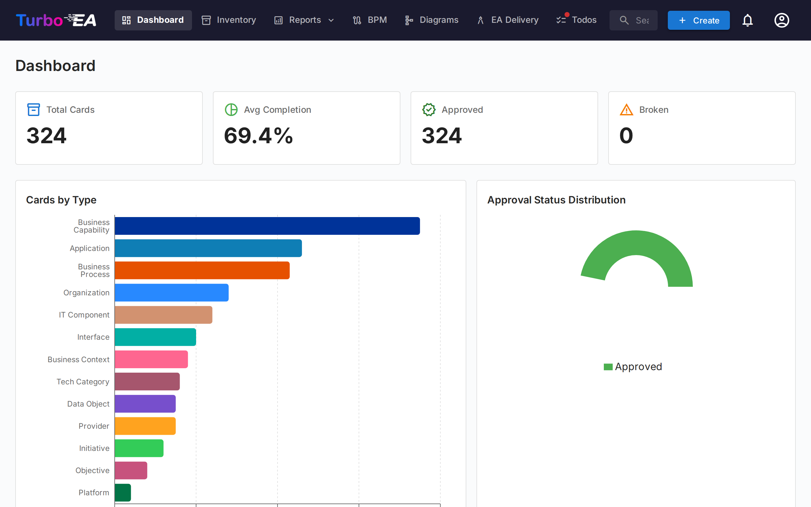
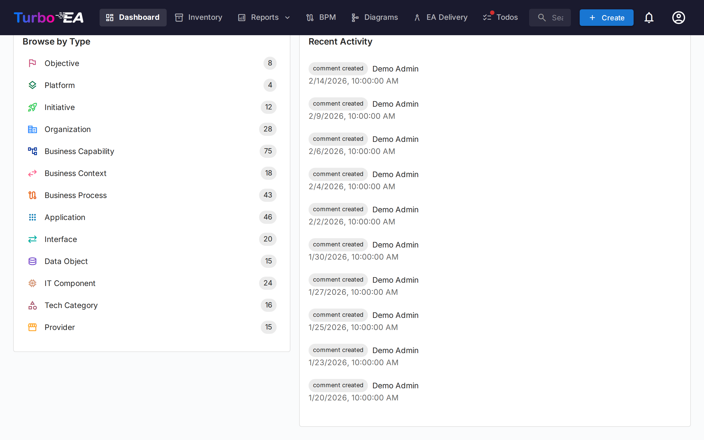

# Tableau de bord

Le tableau de bord est le premier ecran que vous voyez apres la connexion. Il fournit un **apercu rapide** de l'etat global de l'architecture d'entreprise.

## Barre de navigation superieure

En haut de l'ecran, vous trouverez la **barre de navigation principale** avec les elements suivants :

- **Turbo EA** (logo) : Cliquez pour revenir au tableau de bord depuis n'importe quelle section
- **Tableau de bord** : Apercu de l'etat de l'architecture
- **Inventaire** : Liste complete de toutes les fiches
- **Rapports** : Rapports visuels et analytiques
- **BPM** : Gestion des processus metier (si active)
- **Diagrammes** : Editeur visuel de diagrammes d'architecture
- **Delivery** : Gestion des initiatives d'architecture
- **Taches** : Taches en attente et enquetes assignees
- **Rechercher des fiches** : Barre de recherche rapide avec autocompletion
- **+ Creer** : Bouton pour creer rapidement de nouvelles fiches
- **Cloche de notification** : Alertes systeme et [notifications](notifications.md)
- **Icone de profil** : Selection de la langue, bascule de theme, preferences de notification et acces a l'administration

## Fiches recapitulatives

La section principale du tableau de bord affiche des **fiches recapitulatives** indiquant :

- **Nombre total de fiches** : Comptage de tous les composants enregistres dans la plateforme
- **Repartition par type** : Combien d'elements de chaque type existent (Applications, Organisations, Objectifs, Capacites, etc.)
- **Apercu des statuts** : Visualisations rapides de l'etat general

Cliquer sur une fiche de type redirige vers l'[Inventaire](inventory.md) pre-filtre sur ce type.

## Graphiques et statistiques

Dans la section inferieure du tableau de bord, vous trouverez :

- **Graphique de repartition par type** : Montre la proportion de chaque type de fiche dans votre paysage
- **Statut d'approbation** : Indique combien de fiches sont approuvees, en attente, cassees ou rejetees
- **Qualite des donnees** : Pourcentage global de completude des informations sur toutes les fiches
- **Activite recente** : Un fil des derniers changements -- qui a modifie quoi et quand
