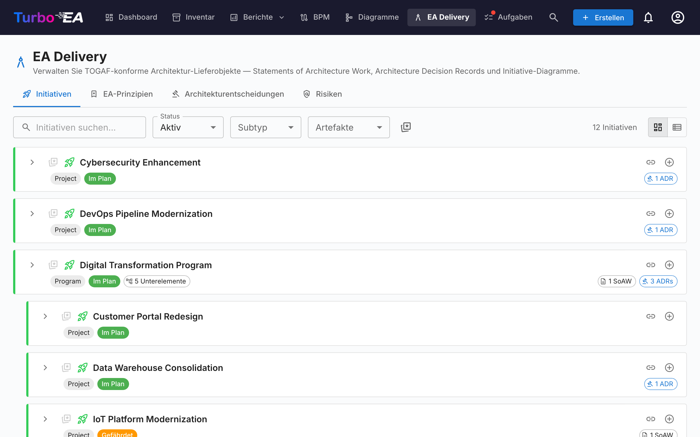
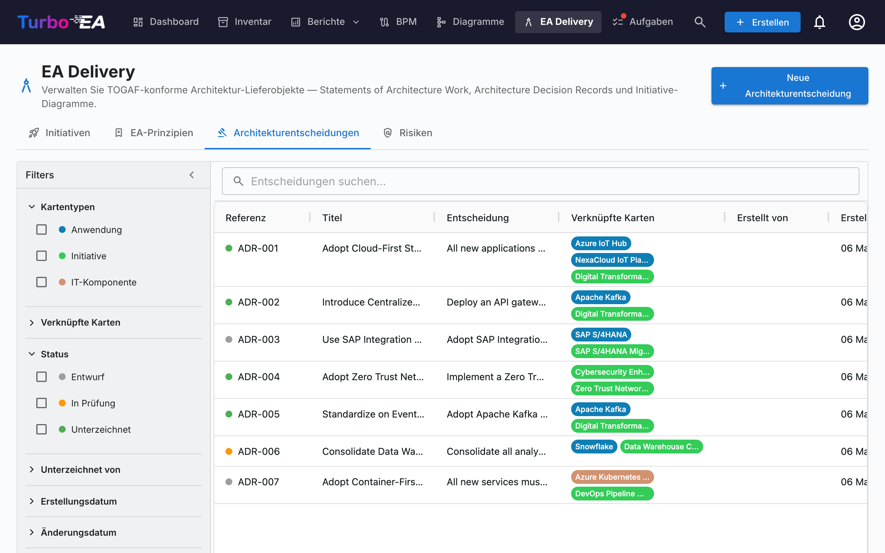
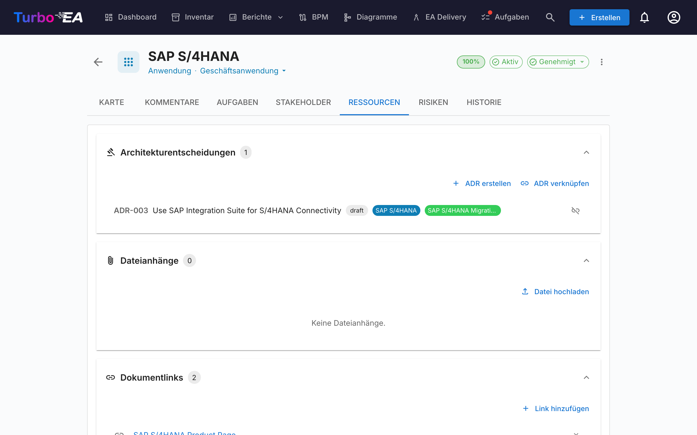

# EA Delivery

Das **EA Delivery**-Modul verwaltet **Architekturinitiativen und deren Artefakte** — Diagramme und Statements of Architecture Work (SoAW). Es bietet eine einheitliche Ansicht aller laufenden Architekturprojekte und ihrer Ergebnisse.

## Initiativenübersicht

Der Reiter "Initiativen" ist ein **Zwei-Spalten-Arbeitsbereich**:

- **Linke Seitenleiste** — ein eingerückter, filterbarer Baum aller Initiativen (mit verschachtelten Unterinitiativen). Suchen Sie nach Namen, filtern Sie nach Status / Subtyp / Artefakten oder markieren Sie Favoriten.
- **Rechter Arbeitsbereich** — die Lieferobjekte, untergeordneten Initiativen und Details der links ausgewählten Initiative. Bei der Auswahl einer anderen Zeile wird der Arbeitsbereich neu aufgebaut.

Die Auswahl ist Teil der URL (`?initiative=<id>`), sodass Sie eine bestimmte Initiative direkt verlinken oder die Seite neu laden können, ohne den Kontext zu verlieren.

Eine zentrale primäre Schaltfläche **+ Neues Artefakt ▾** oben auf der Seite erlaubt es, ein neues SoAW, Diagramm oder ADR anzulegen — automatisch mit der ausgewählten Initiative verknüpft (oder unverknüpft, wenn keine Auswahl getroffen wurde). Leere Lieferobjekt-Gruppen im Arbeitsbereich bieten zudem eine **+ Hinzufügen …**-Schaltfläche, sodass das Anlegen immer nur einen Klick entfernt ist.

Jede Baumzeile zeigt:

| Element | Bedeutung |
|---------|-----------|
| **Name** | Name der Initiative |
| **Anzahl-Chip** | Gesamtzahl verknüpfter Artefakte (SoAW + Diagramme + ADRs) |
| **Status-Punkt** | Farbpunkt für Im Plan / Gefährdet / Aus dem Plan / Pausiert / Abgeschlossen |
| **Stern** | Favoriten-Umschalter — Favoriten erscheinen oben |

Die synthetische Zeile **Nicht verknüpfte Artefakte** oben im Baum erscheint, wenn es SoAWs, Diagramme oder ADRs gibt, die noch keiner Initiative zugeordnet sind. Öffnen Sie sie, um sie wieder zu verknüpfen.

## Statement of Architecture Work (SoAW)

Ein **Statement of Architecture Work (SoAW)** ist ein formales Dokument, das durch den [TOGAF-Standard](https://pubs.opengroup.org/togaf-standard/) (The Open Group Architecture Framework) definiert wird. Es legt den Umfang, Ansatz, die Ergebnisse und die Governance für ein Architekturvorhaben fest. In TOGAF wird das SoAW während der **Vorbereitungsphase** und **Phase A (Architekturvision)** erstellt und dient als Vereinbarung zwischen dem Architekturteam und seinen Stakeholdern.

Turbo EA bietet einen integrierten SoAW-Editor mit TOGAF-konformen Abschnittsvorlagen, Rich-Text-Bearbeitung und Exportfunktionen — so können Sie SoAW-Dokumente direkt neben Ihren Architekturdaten erstellen und verwalten.

### Ein SoAW erstellen

1. Wählen Sie die Initiative links aus (optional — Sie können auch ein nicht verknüpftes SoAW erstellen).
2. Klicken Sie oben auf der Seite auf **+ Neues Artefakt ▾** (oder auf die **+ Hinzufügen**-Schaltfläche im Abschnitt *Lieferobjekte*) und wählen Sie **Neues Statement of Architecture Work**.
3. Geben Sie den Dokumenttitel ein.
4. Der Editor öffnet sich mit **vorgefertigten Abschnittsvorlagen** basierend auf dem TOGAF-Standard.

### Der SoAW-Editor

Der Editor bietet:

- **Rich-Text-Bearbeitung** — Vollständige Formatierungswerkzeugleiste (Überschriften, Fett, Kursiv, Listen, Links) unterstützt durch den TipTap-Editor
- **Abschnittsvorlagen** — Vordefinierte Abschnitte gemäß TOGAF-Standards (z.B. Problembeschreibung, Ziele, Ansatz, Stakeholder, Einschränkungen, Arbeitsplan)
- **Inline bearbeitbare Tabellen** — Tabellen in jedem Abschnitt hinzufügen und bearbeiten
- **Status-Workflow** — Dokumente durchlaufen definierte Phasen:

| Status | Bedeutung |
|--------|-----------|
| **Entwurf** | Wird geschrieben, noch nicht bereit zur Überprüfung |
| **In Überprüfung** | Zur Stakeholder-Überprüfung eingereicht |
| **Genehmigt** | Überprüft und akzeptiert |
| **Unterschrieben** | Formal abgezeichnet |

### Abzeichnungsworkflow

Sobald ein SoAW genehmigt ist, können Sie Abzeichnungen von Stakeholdern anfordern. Klicken Sie auf **Unterschriften anfordern** und verwenden Sie das Suchfeld, um Unterzeichner nach Name oder E-Mail zu finden und hinzuzufügen. Das System verfolgt, wer unterschrieben hat, und sendet Benachrichtigungen an ausstehende Unterzeichner.

### Vorschau und Export

- **Vorschaumodus** — Schreibgeschützte Ansicht des vollständigen SoAW-Dokuments
- **DOCX-Export** — Das SoAW als formatiertes Word-Dokument zum Offline-Teilen oder Drucken herunterladen

## Architecture Decision Records (ADR)

Ein **Architecture Decision Record (ADR)** dokumentiert wichtige Architekturentscheidungen zusammen mit ihrem Kontext, den Konsequenzen und den erwogenen Alternativen. ADRs bieten eine nachvollziehbare Historie, warum zentrale Designentscheidungen getroffen wurden.

### ADR-Übersicht

Die EA Delivery-Seite verfügt über einen eigenen **Entscheidungen**-Tab, der alle ADRs in einer **AG Grid-Tabelle** mit einer dauerhaften Filterseitenleiste anzeigt, ähnlich wie die Inventarseite.

#### Tabellenspalten

Das ADR-Raster zeigt die folgenden Spalten:

| Spalte | Beschreibung |
|--------|-------------|
| **Referenznr.** | Automatisch generierte Referenznummer (ADR-001, ADR-002 usw.) |
| **Titel** | ADR-Titel |
| **Status** | Farbiger Chip mit Entwurf, In Überprüfung oder Unterschrieben |
| **Verknüpfte Karten** | Farbige Pillen, die der Farbe des jeweiligen Kartentyps entsprechen (z.B. Blau für Anwendung, Lila für Datenobjekt) |
| **Erstellt** | Erstellungsdatum |
| **Geändert** | Datum der letzten Änderung |
| **Unterschrieben** | Datum der Unterschrift |
| **Revision** | Revisionsnummer |

#### Filterseitenleiste

Eine dauerhafte Filterseitenleiste auf der linken Seite bietet folgende Filter:

- **Kartentypen** — Kontrollkästchen mit farbigen Punkten, die den Kartentypfarben entsprechen, zum Filtern nach verknüpften Kartentypen
- **Status** — Filtern nach Entwurf, In Überprüfung oder Unterschrieben
- **Erstellungsdatum** — Von/Bis-Datumsbereich
- **Änderungsdatum** — Von/Bis-Datumsbereich
- **Unterschriftsdatum** — Von/Bis-Datumsbereich

#### Schnellfilter und Kontextmenü

Verwenden Sie die **Schnellfilter**-Suchleiste für die Volltextsuche über alle ADRs. Klicken Sie mit der rechten Maustaste auf eine Zeile, um ein Kontextmenü mit den Aktionen **Bearbeiten**, **Vorschau**, **Duplizieren** und **Löschen** aufzurufen.

### Ein ADR erstellen

ADRs können von drei Stellen aus erstellt werden:

1. **EA Delivery → Entscheidungen-Tab**: Klicken Sie auf **+ Neues ADR**, geben Sie den Titel ein und verknüpfen Sie optional Karten (einschließlich Initiativen).
2. **EA Delivery → Initiativen-Tab**: Wählen Sie eine Initiative aus, klicken Sie oben auf **+ Neues Artefakt ▾** (oder auf die **+ Hinzufügen**-Schaltfläche im Abschnitt *Architekturentscheidungen*) und wählen Sie **Neue Architekturentscheidung** — die Initiative wird automatisch als Kartenverknüpfung hinzugefügt.
3. **Karten-Ressourcen-Tab**: Klicken Sie auf **ADR erstellen** — die aktuelle Karte wird automatisch verknüpft.

In allen Fällen können Sie während der Erstellung weitere Karten suchen und verknüpfen. Initiativen werden über denselben Kartenverknüpfungsmechanismus wie jede andere Karte verknüpft, sodass ein ADR mit mehreren Initiativen verknüpft werden kann. Der Editor öffnet sich mit Abschnitten für Kontext, Entscheidung, Konsequenzen und Erwogene Alternativen.

### Der ADR-Editor

Der Editor bietet:

- Rich-Text-Bearbeitung für jeden Abschnitt (Kontext, Entscheidung, Konsequenzen, Erwogene Alternativen)
- Kartenverknüpfung — verbinden Sie das ADR mit relevanten Karten (Anwendungen, IT-Komponenten, Initiativen usw.). Initiativen werden über die Standard-Kartenverknüpfung verknüpft, nicht über ein eigenes Feld, sodass ein ADR mehrere Initiativen referenzieren kann
- Verwandte Entscheidungen — referenzieren Sie andere ADRs

### Abzeichnungsworkflow

ADRs unterstützen einen formalen Abzeichnungsprozess:

1. Erstellen Sie das ADR im Status **Entwurf**
2. Klicken Sie auf **Unterschriften anfordern** und suchen Sie Unterzeichner nach Name oder E-Mail
3. Das ADR wechselt zu **In Überprüfung** — jeder Unterzeichner erhält eine Benachrichtigung und eine Aufgabe
4. Unterzeichner prüfen und klicken auf **Unterschreiben**
5. Wenn alle Unterzeichner unterschrieben haben, wechselt das ADR automatisch zum Status **Unterschrieben**

Unterschriebene ADRs sind gesperrt und können nicht bearbeitet werden. Um Änderungen vorzunehmen, erstellen Sie eine **neue Revision**.

### Revisionen

Unterschriebene ADRs können überarbeitet werden:

1. Öffnen Sie ein unterschriebenes ADR
2. Klicken Sie auf **Überarbeiten**, um einen neuen Entwurf basierend auf der unterschriebenen Version zu erstellen
3. Die neue Revision übernimmt den Inhalt und die Kartenverknüpfungen
4. Jede Revision hat eine fortlaufende Revisionsnummer

### ADR-Vorschau

Klicken Sie auf das Vorschau-Symbol, um eine schreibgeschützte, formatierte Version des ADR anzuzeigen — nützlich zur Überprüfung vor der Unterschrift.

## Registerkarte Ressourcen

Karten enthalten jetzt eine **Ressourcen**-Registerkarte, die Folgendes zusammenfasst:

- **Architekturentscheidungen** — mit dieser Karte verknüpfte ADRs, dargestellt als farbige Pillen, die den Kartentypfarben entsprechen. Sie können bestehende ADRs verknüpfen oder ein neues ADR direkt über die Ressourcen-Registerkarte erstellen — das neue ADR wird automatisch mit der Karte verknüpft.
- **Dateianhänge** — Dateien hochladen und verwalten (PDF, DOCX, XLSX, Bilder, bis zu 10 MB). Beim Hochladen wählen Sie eine **Dokumentenkategorie** aus: Architektur, Sicherheit, Compliance, Betrieb, Besprechungsnotizen, Design oder Sonstiges. Die Kategorie wird als Chip neben jeder Datei angezeigt.
- **Dokumentenlinks** — URL-basierte Dokumentenverweise. Beim Hinzufügen eines Links wählen Sie einen **Linktyp** aus: Dokumentation, Sicherheit, Compliance, Architektur, Betrieb, Support oder Sonstiges. Der Linktyp wird als Chip neben jedem Link angezeigt, und das Symbol ändert sich je nach ausgewähltem Typ.
