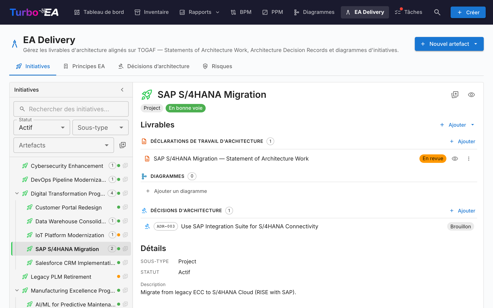
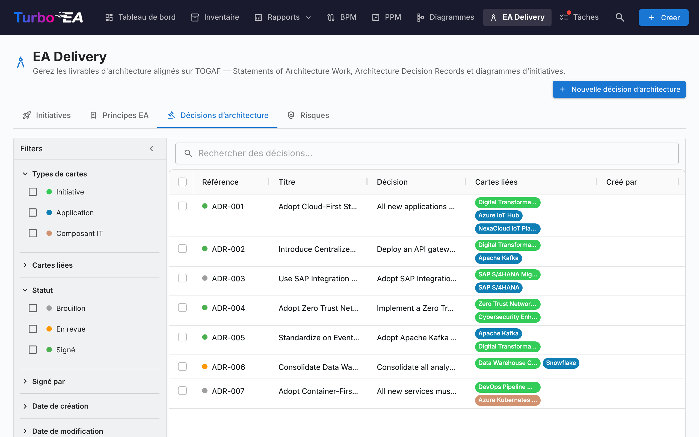
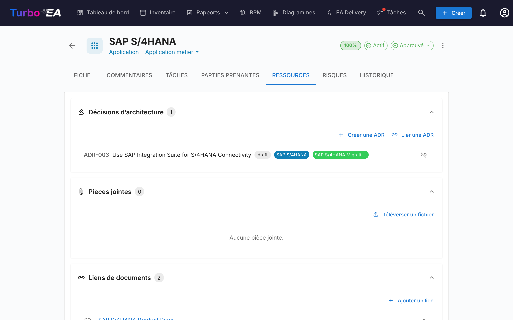

# EA Delivery

Le module **EA Delivery** gère les **initiatives d'architecture et leurs artefacts** — diagrammes, Statements of Architecture Work (SoAW) et Architecture Decision Records (ADR). Il fournit une vue unique de tous les projets d'architecture en cours et de leurs livrables.

EA Delivery vit désormais sous **Rapports → EA Delivery** (`/reports/ea-delivery`). L'ancienne URL `/ea-delivery` continue à fonctionner comme redirection, de sorte que les marque-pages existants restent valides.

## Vue d'ensemble des initiatives

L'onglet "Initiatives" est un **espace de travail à deux volets** :

- **Barre latérale gauche** — un arbre indenté et filtrable de toutes les initiatives (avec les initiatives enfants imbriquées). Recherchez par nom, filtrez par Statut / Sous-type / Artefacts ou marquez vos favoris.
- **Espace de travail à droite** — les livrables, initiatives enfants et détails de l'initiative sélectionnée à gauche. Sélectionner une autre ligne actualise l'espace de travail.

La sélection fait partie de l'URL (`?initiative=<id>`), ce qui permet de partager un lien direct vers une initiative ou de rafraîchir la page sans perdre le contexte.

Un bouton primaire **+ Nouvel artefact ▾** en haut de la page permet de créer un nouveau SoAW, diagramme ou ADR — automatiquement lié à l'initiative sélectionnée (ou non lié si aucune sélection n'est active). Les groupes de livrables vides dans l'espace de travail exposent également un bouton **+ Ajouter …**, pour que la création soit toujours à un clic.

Chaque ligne de l'arbre affiche :

| Élément | Signification |
|---------|---------------|
| **Nom** | Nom de l'initiative |
| **Pastille de comptage** | Nombre total d'artefacts liés (SoAW + diagrammes + ADRs) |
| **Point de statut** | Pastille colorée pour En bonne voie / À risque / Hors piste / En attente / Terminé |
| **Étoile** | Bascule "favori" — les favoris remontent en haut |

La ligne synthétique **Artefacts non liés** en haut de l'arbre apparaît s'il existe des SoAWs, diagrammes ou ADRs qui ne sont pas encore liés à une initiative. Ouvrez-la pour les rattacher.

## Statement of Architecture Work (SoAW)

Un **Statement of Architecture Work (SoAW)** est un document formel défini par le [standard TOGAF](https://pubs.opengroup.org/togaf-standard/) (The Open Group Architecture Framework). Il établit la portée, l'approche, les livrables et la gouvernance d'un engagement d'architecture. Dans TOGAF, le SoAW est produit pendant la **Phase préliminaire** et la **Phase A (Vision de l'architecture)** et sert d'accord entre l'équipe d'architecture et ses parties prenantes.

Turbo EA fournit un éditeur SoAW intégré avec des modèles de sections alignés sur TOGAF, l'édition de texte riche et des capacités d'export -- vous permettant de rédiger et gérer des documents SoAW directement aux côtés de vos données d'architecture.

### Création d'un SoAW

1. Sélectionnez l'initiative à gauche (facultatif — vous pouvez aussi créer un SoAW non lié).
2. Cliquez sur **+ Nouvel artefact ▾** en haut de la page (ou sur **+ Ajouter** dans la section *Livrables*) et choisissez **Nouveau Statement of Architecture Work**.
3. Entrez le titre du document.
4. L'éditeur s'ouvre avec des **modèles de sections préconstruits** basés sur le standard TOGAF.

### L'éditeur SoAW

L'éditeur offre :

- **Édition de texte riche** -- Barre d'outils de mise en forme complète (titres, gras, italique, listes, liens) propulsée par l'éditeur TipTap
- **Modèles de sections** -- Sections prédéfinies suivant les standards TOGAF (par ex. Description du problème, Objectifs, Approche, Parties prenantes, Contraintes, Plan de travail)
- **Tableaux éditables en ligne** -- Ajoutez et éditez des tableaux dans n'importe quelle section
- **Workflow de statut** -- Les documents progressent à travers des étapes définies :

| Statut | Signification |
|--------|---------------|
| **Brouillon** | En cours de rédaction, pas encore prêt pour examen |
| **En revue** | Soumis pour examen par les parties prenantes |
| **Approuvé** | Examiné et accepté |
| **Signé** | Formellement validé |

### Workflow de signature

Une fois qu'un SoAW est approuvé, vous pouvez demander des signatures aux parties prenantes. Cliquez sur **Demander des signatures** puis utilisez le champ de recherche pour trouver et ajouter des signataires par nom ou e-mail. Le système suit qui a signé et envoie des notifications aux signataires en attente.

### Aperçu et export

- **Mode aperçu** -- Vue en lecture seule du document SoAW complet
- **Export DOCX** -- Téléchargez le SoAW sous forme de document Word formaté pour le partage hors ligne ou l'impression

### Onglet SoAW sur les fiches d'initiative

Les initiatives exposent également un onglet **SoAW** dédié directement sur leur page de détail. L'onglet liste chaque SoAW lié à cette initiative (titre, puce de statut, numéro de révision, date de dernière modification) avec un bouton **+ Nouveau SoAW** qui pré-sélectionne l'initiative en cours — vous pouvez ainsi rédiger ou ouvrir un SoAW sans quitter la fiche sur laquelle vous travaillez. La création réutilise le même dialogue que la page EA Delivery, et le nouveau document apparaît aux deux endroits. La visibilité de l'onglet suit les règles de permission standard des fiches.

## Architecture Decision Records (ADR)

Un **Architecture Decision Record (ADR)** documente les décisions d'architecture importantes ainsi que leur contexte, leurs conséquences et les alternatives envisagées. Les ADR fournissent un historique traçable expliquant pourquoi des choix de conception clés ont été faits.

### Vue d'ensemble des ADR

La page EA Delivery dispose d'un onglet **Décisions** dédié qui affiche tous les ADR dans un **tableau AG Grid** avec une barre latérale de filtres persistante, similaire à la page Inventaire.

#### Colonnes du tableau

Le tableau des ADR affiche les colonnes suivantes :

| Colonne | Description |
|---------|-------------|
| **N° de réf.** | Numéro de référence généré automatiquement (ADR-001, ADR-002, etc.) |
| **Titre** | Titre de l'ADR |
| **Statut** | Puce colorée affichant Brouillon, En revue ou Signé |
| **Cartes liées** | Pilules colorées correspondant à la couleur du type de carte (par ex. bleu pour Application, violet pour Objet de données) |
| **Créé** | Date de création |
| **Modifié** | Date de dernière modification |
| **Signé** | Date de signature |
| **Révision** | Numéro de révision |

#### Barre latérale de filtres

Une barre latérale de filtres persistante sur la gauche propose les filtres suivants :

- **Types de carte** -- Cases à cocher avec des points colorés correspondant aux couleurs des types de cartes, pour filtrer par types de cartes liées
- **Statut** -- Filtrer par Brouillon, En revue ou Signé
- **Date de création** -- Plage de dates de/à
- **Date de modification** -- Plage de dates de/à
- **Date de signature** -- Plage de dates de/à

#### Filtre rapide et menu contextuel

Utilisez la barre de **filtre rapide** pour une recherche en texte intégral dans tous les ADR. Faites un clic droit sur n'importe quelle ligne pour accéder à un menu contextuel avec les actions **Modifier**, **Aperçu**, **Dupliquer** et **Supprimer**.

### Créer un ADR

Les ADR peuvent être créés depuis trois endroits :

1. **EA Delivery → onglet Décisions** : Cliquez sur **+ Nouvel ADR**, remplissez le titre et liez optionnellement des cartes (y compris des initiatives).
2. **EA Delivery → Onglet Initiatives** : Sélectionnez une initiative, cliquez sur **+ Nouvel artefact ▾** en haut de la page (ou sur le bouton **+ Ajouter** de la section *Décisions d'Architecture*) et choisissez **Nouvelle Décision d'Architecture** — l'initiative est pré-liée en tant que liaison de carte.
3. **Onglet Ressources de la carte** : Cliquez sur **Créer ADR** — la carte actuelle est pré-liée.

Dans tous les cas, vous pouvez rechercher et lier des cartes supplémentaires lors de la création. Les initiatives sont liées via le même mécanisme de liaison de cartes que toute autre carte, ce qui signifie qu'un ADR peut être lié à plusieurs initiatives. L'éditeur s'ouvre avec des sections pour le Contexte, la Décision, les Conséquences et les Alternatives envisagées.

### L'éditeur ADR

L'éditeur offre :

- Édition de texte riche pour chaque section (Contexte, Décision, Conséquences, Alternatives envisagées)
- Liaison de cartes -- connectez l'ADR aux cartes pertinentes (applications, composants IT, initiatives, etc.). Les initiatives sont liées via la fonctionnalité standard de liaison de cartes, et non via un champ dédié, ce qui permet à un ADR de référencer plusieurs initiatives
- Décisions associées -- référencez d'autres ADR

### Workflow de signature

Les ADR prennent en charge un processus formel de signature :

1. Créez l'ADR avec le statut **Brouillon**
2. Cliquez sur **Demander des signatures** et recherchez des signataires par nom ou e-mail
3. L'ADR passe à **En revue** -- chaque signataire reçoit une notification et une tâche
4. Les signataires examinent et cliquent sur **Signer**
5. Lorsque tous les signataires ont signé, l'ADR passe automatiquement au statut **Signé**

Les ADR signés sont verrouillés et ne peuvent pas être modifiés. Pour apporter des modifications, créez une **nouvelle révision**.

### Révisions

Les ADR signés peuvent être révisés :

1. Ouvrez un ADR signé
2. Cliquez sur **Réviser** pour créer un nouveau brouillon basé sur la version signée
3. La nouvelle révision hérite du contenu et des liens de cartes
4. Chaque révision a un numéro de révision incrémentiel

### Aperçu de l'ADR

Cliquez sur l'icône d'aperçu pour afficher une version en lecture seule et formatée de l'ADR -- utile pour la révision avant la signature.

## Onglet Ressources

Les cartes incluent désormais un onglet **Ressources** qui regroupe :

- **Décisions d'architecture** -- ADR liés à cette carte, affichés sous forme de pilules colorées correspondant aux couleurs du type de carte. Vous pouvez lier des ADR existants ou en créer un nouveau directement depuis l'onglet Ressources -- le nouvel ADR est automatiquement lié à la carte.
- **Pièces jointes** -- Téléchargez et gérez des fichiers (PDF, DOCX, XLSX, images, jusqu'à 10 Mo). Lors du téléchargement, sélectionnez une **catégorie de document** parmi : Architecture, Sécurité, Conformité, Opérations, Notes de réunion, Design ou Autre. La catégorie s'affiche sous forme de puce à côté de chaque fichier.
- **Liens de documents** -- Références de documents basées sur des URL. Lors de l'ajout d'un lien, sélectionnez un **type de lien** parmi : Documentation, Sécurité, Conformité, Architecture, Opérations, Support ou Autre. Le type de lien s'affiche sous forme de puce à côté de chaque lien, et l'icône change en fonction du type sélectionné.
