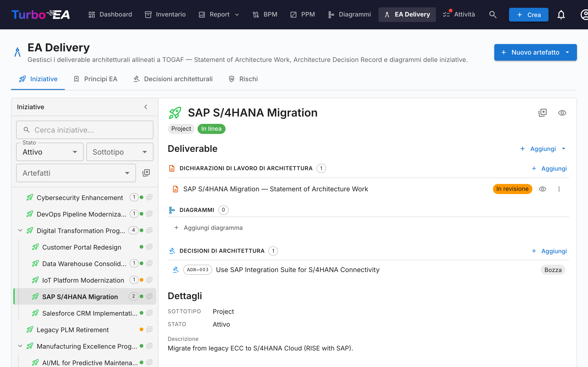
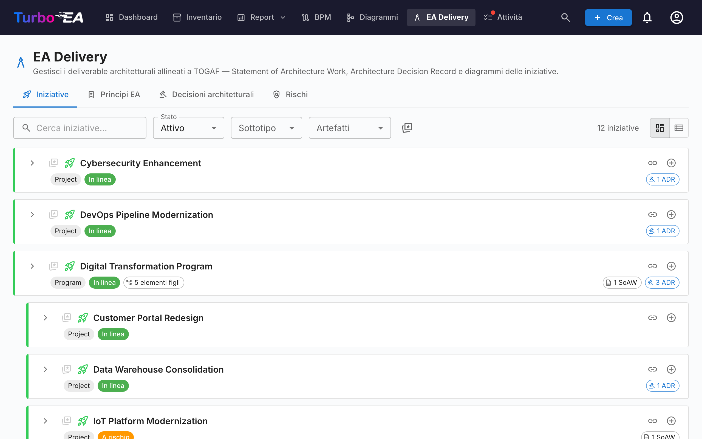
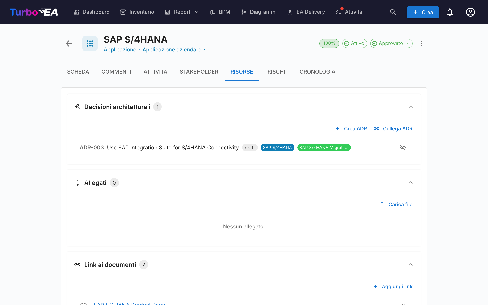

# EA Delivery

Il modulo **EA Delivery** gestisce le **iniziative architetturali e i relativi artefatti** — diagrammi e Statement of Architecture Work (SoAW). Fornisce una vista unica di tutti i progetti architetturali in corso e i loro deliverable.

## Panoramica delle iniziative

La scheda "Iniziative" è uno **spazio di lavoro a due pannelli**:

- **Barra laterale a sinistra** — un albero indentato e filtrabile di tutte le iniziative (con le iniziative figlie nidificate). Cerca per nome, filtra per Stato / Sottotipo / Artefatti o segna i preferiti.
- **Spazio di lavoro a destra** — i deliverable, le iniziative figlie e i dettagli dell'iniziativa selezionata a sinistra. Selezionando un'altra riga, lo spazio di lavoro si aggiorna.

La selezione fa parte dell'URL (`?initiative=<id>`), quindi è possibile condividere un link diretto a un'iniziativa o aggiornare la pagina senza perdere il contesto.

Un pulsante principale **+ Nuovo artefatto ▾** in alto nella pagina permette di creare un nuovo SoAW, diagramma o ADR — automaticamente collegato all'iniziativa selezionata (o non collegato se nessuna selezione è attiva). I gruppi di deliverable vuoti nello spazio di lavoro mostrano anche un pulsante **+ Aggiungi …**, in modo che la creazione sia sempre a un solo clic.

Ogni riga dell'albero mostra:

| Elemento | Significato |
|----------|-------------|
| **Nome** | Nome dell'iniziativa |
| **Chip di conteggio** | Totale degli artefatti collegati (SoAW + diagrammi + ADR) |
| **Punto di stato** | Pallino colorato per On Track / At Risk / Off Track / On Hold / Completed |
| **Stella** | Toggle dei preferiti — i preferiti risalgono in cima |

La riga sintetica **Artefatti non collegati** in cima all'albero compare quando ci sono SoAW, diagrammi o ADR non ancora collegati a un'iniziativa. Aprila per ricollegarli.

## Statement of Architecture Work (SoAW)

Uno **Statement of Architecture Work (SoAW)** è un documento formale definito dallo [standard TOGAF](https://pubs.opengroup.org/togaf-standard/) (The Open Group Architecture Framework). Stabilisce l'ambito, l'approccio, i deliverable e la governance per un impegno architetturale. In TOGAF, il SoAW viene prodotto durante la **Fase preliminare** e la **Fase A (Visione dell'architettura)** e serve come accordo tra il team di architettura e i suoi stakeholder.

Turbo EA fornisce un editor SoAW integrato con template di sezioni allineati a TOGAF, editing di testo ricco e funzionalità di esportazione — così potete creare e gestire documenti SoAW direttamente insieme ai vostri dati architetturali.

### Creazione di un SoAW

1. Selezionate l'iniziativa a sinistra (facoltativo — potete anche creare un SoAW non collegato).
2. Cliccate su **+ Nuovo artefatto ▾** in alto nella pagina (oppure sul pulsante **+ Aggiungi** nella sezione *Deliverable*) e scegliete **Nuovo Statement of Architecture Work**.
3. Inserite il titolo del documento.
4. L'editor si apre con **template di sezioni predefiniti** basati sullo standard TOGAF.

### L'editor SoAW

L'editor fornisce:

- **Editing di testo ricco** — Barra degli strumenti di formattazione completa (intestazioni, grassetto, corsivo, elenchi, link) alimentata dall'editor TipTap
- **Template di sezioni** — Sezioni predefinite seguendo gli standard TOGAF (es. Descrizione del problema, Obiettivi, Approccio, Stakeholder, Vincoli, Piano di lavoro)
- **Tabelle modificabili in linea** — Aggiungete e modificate tabelle all'interno di qualsiasi sezione
- **Workflow degli stati** — I documenti progrediscono attraverso fasi definite:

| Stato | Significato |
|-------|-------------|
| **Draft** | In fase di scrittura, non ancora pronto per la revisione |
| **In Review** | Inviato per la revisione degli stakeholder |
| **Approved** | Revisionato e accettato |
| **Signed** | Formalmente firmato |

### Workflow di firma

Una volta approvato un SoAW, potete richiedere le firme dagli stakeholder. Cliccate su **Richiedi firme** e utilizzate il campo di ricerca per trovare e aggiungere firmatari per nome o e-mail. Il sistema traccia chi ha firmato e invia notifiche ai firmatari in attesa.

### Anteprima ed esportazione

- **Modalità anteprima** — Vista di sola lettura del documento SoAW completo
- **Esportazione DOCX** — Scaricate il SoAW come documento Word formattato per la condivisione offline o la stampa

## Architecture Decision Records (ADR)

Un **Architecture Decision Record (ADR)** documenta importanti decisioni architetturali insieme al loro contesto, conseguenze e alternative considerate. Gli ADR forniscono una storia tracciabile del perché sono state prese determinate scelte progettuali.

### Panoramica degli ADR

La pagina EA Delivery ha una scheda dedicata **Decisioni** che visualizza tutti gli ADR in una **tabella AG Grid** con una barra laterale di filtri persistente, simile alla pagina Inventario.

#### Colonne della tabella

La tabella ADR mostra le seguenti colonne:

| Colonna | Descrizione |
|---------|-------------|
| **N. rif.** | Numero di riferimento generato automaticamente (ADR-001, ADR-002, ecc.) |
| **Titolo** | Titolo dell'ADR |
| **Stato** | Chip colorato che mostra Bozza, In Revisione o Firmato |
| **Card collegate** | Pillole colorate corrispondenti al colore del tipo di card (es. blu per Applicazione, viola per Oggetto Dati) |
| **Creato** | Data di creazione |
| **Modificato** | Data di ultima modifica |
| **Firmato** | Data di firma |
| **Revisione** | Numero di revisione |

#### Barra laterale di filtri

Una barra laterale di filtri persistente a sinistra offre i seguenti filtri:

- **Tipi di card** — Caselle di controllo con punti colorati corrispondenti ai colori dei tipi di card, per filtrare per tipi di card collegate
- **Stato** — Filtrare per Bozza, In Revisione o Firmato
- **Data di creazione** — Intervallo di date da/a
- **Data di modifica** — Intervallo di date da/a
- **Data di firma** — Intervallo di date da/a

#### Filtro rapido e menu contestuale

Utilizzate la barra del **filtro rapido** per la ricerca full-text in tutti gli ADR. Fate clic destro su qualsiasi riga per accedere a un menu contestuale con le azioni **Modifica**, **Anteprima**, **Duplica** ed **Elimina**.

### Creare un ADR

Gli ADR possono essere creati da tre punti:

1. **EA Delivery → scheda Decisioni**: Cliccate su **+ Nuovo ADR**, compilate il titolo e opzionalmente collegate card (incluse le iniziative).
2. **EA Delivery → scheda Iniziative**: Selezionate un'iniziativa, cliccate su **+ Nuovo artefatto ▾** in alto (oppure sul pulsante **+ Aggiungi** della sezione *Decisioni di Architettura*) e scegliete **Nuova Decisione di Architettura** — l'iniziativa viene pre-collegata come collegamento di card.
3. **Scheda Risorse della carta**: Cliccate su **Crea ADR** — la carta corrente viene pre-collegata.

In tutti i casi, potete cercare e collegare carte aggiuntive durante la creazione. Le iniziative vengono collegate attraverso lo stesso meccanismo di collegamento di card utilizzato per qualsiasi altra card, il che significa che un ADR può essere collegato a più iniziative. L'editor si apre con sezioni per Contesto, Decisione, Conseguenze e Alternative considerate.

### L'editor ADR

L'editor fornisce:

- Editing di testo ricco per ogni sezione (Contesto, Decisione, Conseguenze, Alternative considerate)
- Collegamento di card — collegate l'ADR alle card pertinenti (applicazioni, componenti IT, iniziative, ecc.). Le iniziative vengono collegate tramite la funzionalità standard di collegamento di card, non tramite un campo dedicato, consentendo a un ADR di fare riferimento a più iniziative
- Decisioni correlate — fate riferimento ad altri ADR

### Workflow di firma

Gli ADR supportano un processo formale di firma:

1. Create l'ADR con stato **Bozza**
2. Cliccate su **Richiedi firme** e cercate i firmatari per nome o e-mail
3. L'ADR passa a **In Revisione** — ogni firmatario riceve una notifica e un compito
4. I firmatari esaminano e cliccano su **Firma**
5. Quando tutti i firmatari hanno firmato, l'ADR passa automaticamente allo stato **Firmato**

Gli ADR firmati sono bloccati e non possono essere modificati. Per apportare modifiche, create una **nuova revisione**.

### Revisioni

Gli ADR firmati possono essere revisionati:

1. Aprite un ADR firmato
2. Cliccate su **Revisiona** per creare una nuova bozza basata sulla versione firmata
3. La nuova revisione eredita il contenuto e i collegamenti delle card
4. Ogni revisione ha un numero di revisione incrementale

### Anteprima dell'ADR

Cliccate sull'icona di anteprima per visualizzare una versione di sola lettura e formattata dell'ADR — utile per la revisione prima della firma.

## Scheda Risorse

Le card ora includono una scheda **Risorse** che consolida:

- **Decisioni architetturali** — ADR collegati a questa card, visualizzati come pillole colorate corrispondenti ai colori del tipo di card. È possibile collegare ADR esistenti o crearne uno nuovo direttamente dalla scheda Risorse — il nuovo ADR viene collegato automaticamente alla card.
- **Allegati file** — Caricate e gestite file (PDF, DOCX, XLSX, immagini, fino a 10 MB). Durante il caricamento, selezionate una **categoria documento** tra: Architettura, Sicurezza, Conformità, Operazioni, Note di riunione, Design o Altro. La categoria viene visualizzata come chip accanto a ogni file.
- **Link ai documenti** — Riferimenti a documenti basati su URL. Quando aggiungete un link, selezionate un **tipo di link** tra: Documentazione, Sicurezza, Conformità, Architettura, Operazioni, Supporto o Altro. Il tipo di link viene visualizzato come chip accanto a ogni link e l'icona cambia in base al tipo selezionato.
