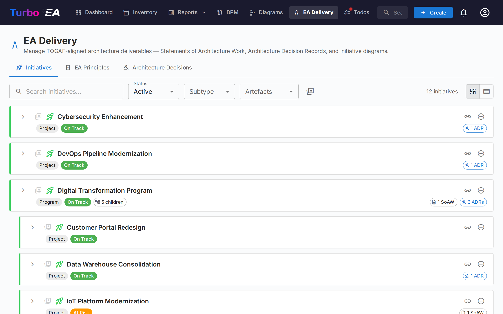
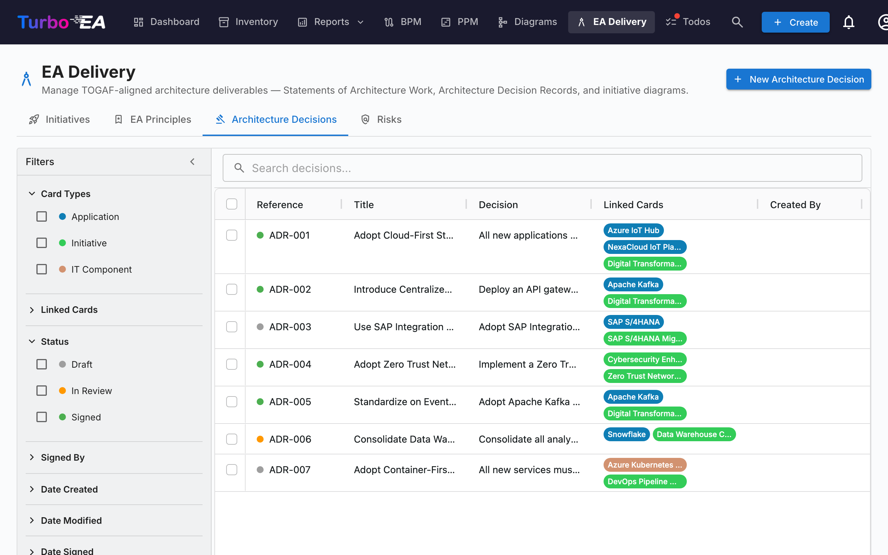
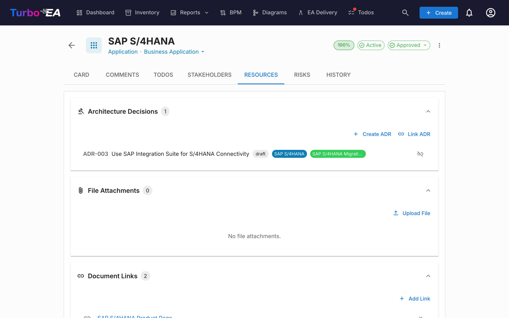

# EA Delivery

The **EA Delivery** module manages **architecture initiatives and their artifacts** — diagrams and Statements of Architecture Work (SoAW). It provides a single view of all ongoing architecture projects and their deliverables.

## Initiative Overview

The Initiatives tab is a **two-pane workspace**:

- **Left sidebar** — an indented, filterable tree of every initiative (with their child initiatives nested below). Search by name, filter by Status / Subtype / Artefacts, or pin favourites.
- **Right workspace** — the deliverables, child initiatives, and details for the initiative you select on the left. Pick another row, and the workspace re-renders.

The selection is part of the URL (`?initiative=<id>`), so you can deep-link to a specific initiative or refresh the page without losing your place.

A single primary **+ New artefact ▾** button at the top of the page lets you create a new SoAW, Diagram, or ADR — pre-linked to the initiative you have selected (or unlinked if you have no selection yet). Empty deliverable groups inside the workspace also expose a **+ Add …** button so creation is always one click away.

Each tree row shows:

| Element | Meaning |
|---------|---------|
| **Name** | Initiative name |
| **Count chip** | Total number of linked artefacts (SoAW + Diagrams + ADRs) |
| **Status dot** | Coloured dot for On Track / At Risk / Off Track / On Hold / Completed |
| **Star** | Favourite toggle — favourites bubble to the top |

The synthetic **Unlinked artefacts** row at the top of the tree appears when there are SoAWs, diagrams, or ADRs that aren't yet linked to an initiative. Open it to relink them.

## Statement of Architecture Work (SoAW)

A **Statement of Architecture Work (SoAW)** is a formal document defined by the [TOGAF standard](https://pubs.opengroup.org/togaf-standard/) (The Open Group Architecture Framework). It establishes the scope, approach, deliverables, and governance for an architecture engagement. In TOGAF, the SoAW is produced during the **Preliminary Phase** and **Phase A (Architecture Vision)** and serves as an agreement between the architecture team and its stakeholders.

Turbo EA provides a built-in SoAW editor with TOGAF-aligned section templates, rich text editing, and export capabilities — so you can author and manage SoAW documents directly alongside your architecture data.

### Creating a SoAW

1. Select the initiative on the left (optional — you can also create an unlinked SoAW).
2. Click **+ New artefact ▾** at the top of the page (or the **+ Add** button inside the *Deliverables* section) and choose **New Statement of Architecture Work**.
3. Enter the document title.
4. The editor opens with **pre-built section templates** based on the TOGAF standard.

### The SoAW Editor

The editor provides:

- **Rich text editing** — Full formatting toolbar (headings, bold, italic, lists, links) powered by the TipTap editor
- **Section templates** — Pre-defined sections following TOGAF standards (e.g., Problem Description, Objectives, Approach, Stakeholders, Constraints, Work Plan)
- **Inline editable tables** — Add and edit tables within any section
- **Status workflow** — Documents progress through defined stages:

| Status | Meaning |
|--------|---------|
| **Draft** | Being written, not yet ready for review |
| **In Review** | Submitted for stakeholder review |
| **Approved** | Reviewed and accepted |
| **Signed** | Formally signed off |

### Sign-off Workflow

Once a SoAW is approved, you can request sign-offs from stakeholders. Click **Request Signatures**, then use the search field to find and add signatories by name or email. The system tracks who has signed and sends notifications to pending signers.

### Preview and Export

- **Preview mode** — Read-only view of the complete SoAW document
- **DOCX export** — Download the SoAW as a formatted Word document for offline sharing or printing

## Architecture Decision Records (ADR)

An **Architecture Decision Record (ADR)** documents important architecture decisions along with their context, consequences, and alternatives considered. ADRs provide a traceable history of why key design choices were made.

### ADR Overview

The EA Delivery page has a dedicated **Decisions** tab that displays all ADRs in an **AG Grid table** with a persistent filter sidebar, similar to the Inventory page.

#### Grid Columns

The ADR grid shows the following columns:

| Column | Description |
|--------|-------------|
| **Reference #** | Auto-generated reference number (ADR-001, ADR-002, etc.) |
| **Title** | ADR title |
| **Status** | Colored chip showing Draft, In Review, or Signed |
| **Linked Cards** | Colored pills matching each linked card's type color (e.g., blue for Application, purple for Data Object) |
| **Created** | Creation date |
| **Modified** | Last modification date |
| **Signed** | Date when the ADR was signed |
| **Revision** | Revision number |

#### Filter Sidebar

A persistent filter sidebar on the left provides the following filters:

- **Card Types** — Checkboxes with colored dots matching the card type colors, to filter by linked card types
- **Status** — Filter by Draft, In Review, or Signed
- **Date Created** — From/to date range
- **Date Modified** — From/to date range
- **Date Signed** — From/to date range

#### Quick Filter and Context Menu

Use the **quick filter** search bar for full-text search across all ADRs. Right-click any row to access a context menu with **Edit**, **Preview**, **Duplicate**, and **Delete** actions.

### Creating an ADR

ADRs can be created from three places:

1. **EA Delivery → Decisions tab**: Click **+ New ADR**, fill in the title and optionally link cards (including initiatives).
2. **EA Delivery → Initiatives tab**: Select an initiative, then click **+ New artefact ▾** in the page header (or the **+ Add** button on the *Architecture Decisions* deliverable section) and choose **New Architecture Decision** — the initiative is pre-linked as a card link.
3. **Card Resources tab**: Click **Create ADR** — the current card is pre-linked.

In all cases, you can search and link additional cards during creation. Initiatives are linked through the same card linking mechanism as any other card, which means an ADR can be linked to multiple initiatives. The editor opens with sections for Context, Decision, Consequences, and Alternatives Considered.

### The ADR Editor

The editor provides:

- Rich text editing for each section (Context, Decision, Consequences, Alternatives Considered)
- Card linking — connect the ADR to relevant cards (applications, IT components, initiatives, etc.). Initiatives are linked through the standard card linking feature, not a dedicated field, so an ADR can reference multiple initiatives
- Related decisions — reference other ADRs

### Sign-off Workflow

ADRs support a formal sign-off process:

1. Create the ADR in **Draft** status
2. Click **Request Signatures** and search for signatories by name or email
3. The ADR moves to **In Review** — each signatory receives a notification and a task
4. Signatories review and click **Sign**
5. When all signatories have signed, the ADR automatically moves to **Signed** status

Signed ADRs are locked and cannot be edited. To make changes, create a **new revision**.

### Revisions

Signed ADRs can be revised:

1. Open a signed ADR
2. Click **Revise** to create a new draft based on the signed version
3. The new revision inherits the content and card links
4. Each revision has an incrementing revision number

### ADR Preview

Click the preview icon to view a read-only, formatted version of the ADR — useful for reviewing before signing.

## Resources Tab

Cards now include a **Resources** tab that consolidates:

- **Architecture Decisions** — ADRs linked to this card, displayed as colored pills matching their card type colors. You can link existing ADRs or create a new ADR directly from the Resources tab — the new ADR is automatically linked to the card.
- **File Attachments** — Upload and manage files (PDF, DOCX, XLSX, images, up to 10 MB). When uploading, select a **document category** from: Architecture, Security, Compliance, Operations, Meeting Notes, Design, or Other. The category appears as a chip next to each file.
- **Document Links** — URL-based document references. When adding a link, select a **link type** from: Documentation, Security, Compliance, Architecture, Operations, Support, or Other. The link type appears as a chip next to each link, and the icon changes based on the selected type.
