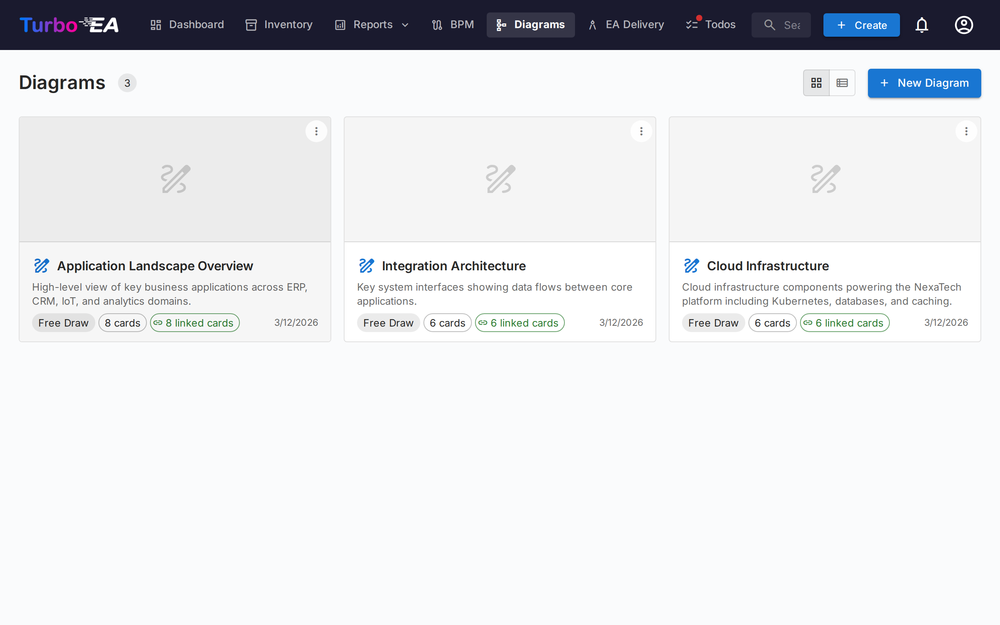

# Diagrammi

Il modulo **Diagrammi** consente di creare **diagrammi architetturali visivi** utilizzando un editor [DrawIO](https://www.drawio.com/) integrato — completamente integrato con il vostro inventario di card. Potete trascinare card sulla tela, connetterle con relazioni e mantenere il diagramma sincronizzato con i dati EA.

## Galleria dei diagrammi

La galleria mostra tutti i diagrammi come **schede con miniatura** o in una **vista elenco** (alternabile tramite l'icona vista nella barra degli strumenti). Ogni diagramma mostra il nome, il tipo e un'anteprima visiva del contenuto.

**Azioni dalla galleria:**

- **Crea** — Cliccate su **+ Nuovo diagramma** per creare un diagramma con un nome, una descrizione opzionale e un collegamento opzionale a una card Initiative
- **Apri** — Cliccate su qualsiasi diagramma per avviare l'editor
- **Modifica dettagli** — Rinominate, aggiornate la descrizione o riassegnate l'iniziativa collegata
- **Elimina** — Rimuovete un diagramma (con conferma)

## L'editor di diagrammi

Aprendo un diagramma si avvia un editor **DrawIO** a schermo intero in un iframe same-origin. La barra degli strumenti standard DrawIO e disponibile per forme, connettori, testo, formattazione e layout.

### Inserimento di card

Utilizzate la **Barra laterale card** (attivabile tramite l'icona della barra laterale) per sfogliare il vostro inventario. Potete:

- **Cercare** card per nome
- **Filtrare** per tipo di card
- **Trascinare una card** sulla tela — appare come una forma stilizzata con il nome e l'icona del tipo della card
- Utilizzare la **Finestra di selezione card** per ricerca avanzata e selezione multipla

### Creazione di card dal diagramma

Se disegnate una forma che non corrisponde a una card esistente, potete crearne una direttamente:

1. Selezionate la forma non collegata
2. Cliccate su **Crea card** nel pannello di sincronizzazione
3. Compilate il tipo, il nome e i campi opzionali
4. La forma viene automaticamente collegata alla nuova card

### Creazione di relazioni dagli archi

Quando disegnate un connettore tra due forme card:

1. Selezionate l'arco
2. Appare la finestra di dialogo **Selettore relazione**
3. Scegliete il tipo di relazione (vengono mostrati solo i tipi validi per i tipi di card collegati)
4. La relazione viene creata nell'inventario e l'arco viene contrassegnato come sincronizzato

### Sincronizzazione delle card

Il **Pannello di sincronizzazione** mantiene il diagramma e l'inventario sincronizzati:

- **Card sincronizzate** — Le forme collegate alle card dell'inventario mostrano un indicatore verde di sincronizzazione
- **Forme non sincronizzate** — Le forme non ancora collegate a card sono segnalate per l'intervento
- **Espandi/comprimi gruppi** — Navigate i gruppi gerarchici di card direttamente sulla tela

### Collegamento alle iniziative

I diagrammi possono essere collegati a card **Initiative**, facendoli apparire nel modulo [EA Delivery](delivery.md) insieme ai documenti SoAW. Questo fornisce una vista completa di tutti gli artefatti architetturali per una data iniziativa.
