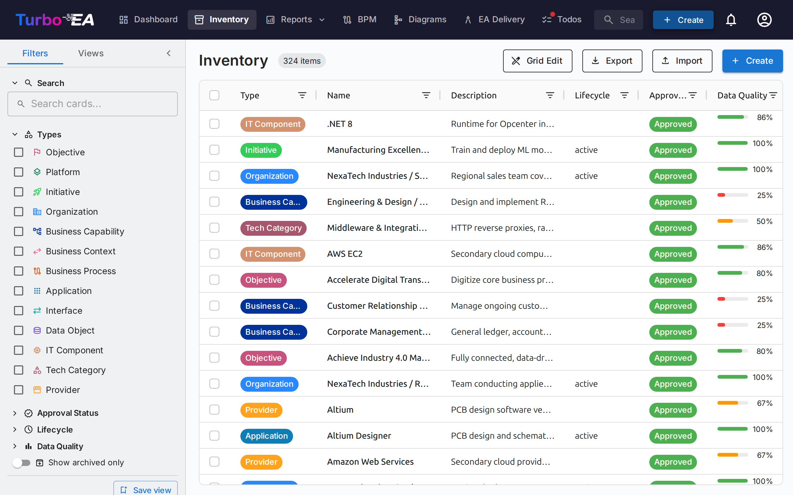
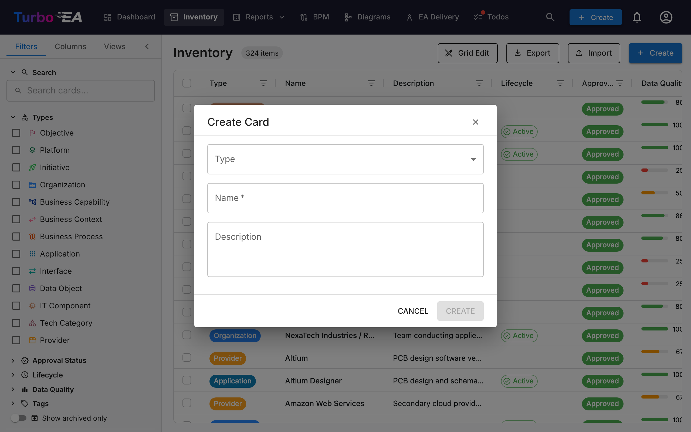

# Inventaire

L'**Inventaire** est le coeur de Turbo EA. Toutes les **fiches** (composants) de l'architecture d'entreprise y sont listees : applications, processus, capacites metier, organisations, fournisseurs, interfaces, et plus encore.

## Structure de l'ecran d'inventaire

### Panneau de filtres a gauche

Le panneau lateral gauche permet de **filtrer** les fiches selon differents criteres :

- **Recherche** -- Recherche en texte libre sur les noms de fiches
- **Types** -- Filtrer par un ou plusieurs types de fiches : Objectif, Plateforme, Initiative, Organisation, Capacite Metier, Contexte Metier, Processus Metier, Application, Interface, Objet de Donnees, Composant IT, Categorie Technique, Fournisseur, Systeme
- **Sous-types** -- Lorsqu'un type est selectionne, filtrer davantage par sous-type (par ex. Application -> Application Metier, Microservice, Agent IA, Deploiement)
- **Statut d'approbation** -- Brouillon, Approuve, Casse ou Rejete
- **Cycle de vie** -- Filtrer par phase du cycle de vie : Planification, Mise en service, Actif, Retrait progressif, Fin de vie
- **Qualite des donnees** -- Filtrage par seuil : Bonne (80%+), Moyenne (50-79%), Faible (inferieure a 50%)
- **Tags** -- Filtrer par tags de n'importe quel groupe de tags
- **Relations** -- Filtrer par fiches liees a travers les types de relations
- **Attributs personnalises** -- Filtrer par valeurs dans les champs personnalises (recherche textuelle, options de selection)
- **Afficher uniquement les archives** -- Basculer pour voir les fiches archivees (supprimees de maniere logique)
- **Tout effacer** -- Reinitialiser tous les filtres actifs d'un coup

Un **badge de nombre de filtres actifs** indique combien de filtres sont actuellement appliques.

### Tableau principal

L'inventaire utilise un tableau de donnees **AG Grid** avec des fonctionnalites puissantes :

| Colonne | Description |
|---------|-------------|
| **Type** | Type de fiche avec icone coloree |
| **Nom** | Nom du composant (cliquer pour ouvrir le detail de la fiche) |
| **Description** | Description breve |
| **Cycle de vie** | Etat actuel du cycle de vie |
| **Statut d'approbation** | Badge de statut de revision |
| **Qualite des donnees** | Pourcentage de completude avec anneau visuel |
| **Relations** | Nombre de relations avec popover cliquable affichant les fiches liees |

**Fonctionnalites du tableau :**

- **Tri** -- Cliquer sur l'en-tete de n'importe quelle colonne pour trier par ordre croissant/decroissant
- **Edition en ligne** -- En mode edition grille, modifiez les valeurs des champs directement dans le tableau
- **Selection multiple** -- Selectionnez plusieurs lignes pour des operations en masse
- **Affichage hierarchique** -- Les relations parent/enfant sont affichees sous forme de chemins de navigation
- **Configuration des colonnes** -- Afficher, masquer et reorganiser les colonnes

### Barre d'outils

- **Edition grille** -- Basculer le mode d'edition en ligne pour modifier plusieurs fiches dans le tableau
- **Exporter** -- Telecharger les donnees sous forme de fichier Excel (.xlsx)
- **Importer** -- Chargement en masse de donnees depuis des fichiers Excel
- **+ Creer** -- Creer une nouvelle fiche

## Comment creer une nouvelle fiche

1. Cliquez sur le bouton **+ Creer** (bleu, coin superieur droit)
2. Dans la boite de dialogue qui apparait :
   - Selectionnez le **Type** de fiche (Application, Processus, Objectif, etc.)
   - Entrez le **Nom** du composant
   - Optionnellement, ajoutez une **Description**
3. Optionnellement, cliquez sur **Suggerer avec l'IA** pour generer automatiquement une description (voir [Suggestions de description par IA](#suggestions-de-description-par-ia) ci-dessous)
4. Cliquez sur **CREER**

## Suggestions de description par IA

Turbo EA peut utiliser l'**IA pour generer une description** pour n'importe quelle fiche. Cela fonctionne aussi bien dans la boite de dialogue de creation de fiche que sur les pages de detail des fiches existantes.

**Comment ca marche :**

1. Entrez un nom de fiche et selectionnez un type
2. Cliquez sur l'**icone etincelle** dans l'en-tete de la fiche, ou le bouton **Suggerer avec l'IA** dans la boite de dialogue de creation de fiche
3. Le systeme effectue une **recherche web** pour le nom de l'element (en utilisant un contexte adapte au type -- par ex. « SAP S/4HANA software application »), puis envoie les resultats a un **LLM** pour generer une description concise et factuelle
4. Un panneau de suggestion apparait avec :
   - **Description modifiable** -- examinez et modifiez le texte avant de l'appliquer
   - **Score de confiance** -- indique le degre de certitude de l'IA (Eleve / Moyen / Faible)
   - **Liens sources cliquables** -- les pages web d'ou provient la description
   - **Nom du modele** -- quel LLM a genere la suggestion
5. Cliquez sur **Appliquer la description** pour sauvegarder, ou **Ignorer** pour rejeter

**Caracteristiques cles :**

- **Adapte au type** : L'IA comprend le contexte du type de fiche. Une recherche « Application » ajoute « software application », une recherche « Fournisseur » ajoute « technology vendor », etc.
- **Confidentialite d'abord** : Lorsque vous utilisez Ollama, le LLM s'execute localement -- vos donnees ne quittent jamais votre infrastructure. Les fournisseurs commerciaux (OpenAI, Google Gemini, Anthropic Claude, etc.) sont egalement pris en charge
- **Controle par l'administrateur** : Les suggestions IA doivent etre activees par un administrateur dans [Parametres > Suggestions IA](../admin/ai.md). Les administrateurs choisissent quels types de fiches affichent le bouton de suggestion, configurent le fournisseur LLM et selectionnent le fournisseur de recherche web
- **Base sur les permissions** : Seuls les utilisateurs disposant de la permission `ai.suggest` peuvent utiliser cette fonctionnalite (activee par defaut pour les roles Admin, Admin BPM et Membre)

## Vues sauvegardees (Signets)

Vous pouvez sauvegarder votre configuration actuelle de filtres, colonnes et tri sous forme de **vue nommee** pour une reutilisation rapide.

### Creer une vue sauvegardee

1. Configurez l'inventaire avec les filtres, colonnes et tri souhaites
2. Cliquez sur l'icone **signet** dans le panneau de filtres
3. Entrez un **nom** pour la vue
4. Choisissez la **visibilite** :
   - **Privee** -- Seul vous pouvez la voir
   - **Partagee** -- Visible par des utilisateurs specifiques (avec des permissions de modification optionnelles)
   - **Publique** -- Visible par tous les utilisateurs

### Utiliser les vues sauvegardees

Les vues sauvegardees apparaissent dans la barre laterale du panneau de filtres. Cliquez sur n'importe quelle vue pour appliquer instantanement sa configuration. Les vues sont organisees en :

- **Mes vues** -- Vues que vous avez creees
- **Partagees avec moi** -- Vues que d'autres ont partagees avec vous
- **Vues publiques** -- Vues disponibles pour tous

## Import Excel

Cliquez sur **Importer** dans la barre d'outils pour creer ou mettre a jour des fiches en masse depuis un fichier Excel.

1. **Selectionnez un fichier** -- Glissez-deposez un fichier `.xlsx` ou cliquez pour parcourir
2. **Choisissez le type de fiche** -- Optionnellement, restreignez l'import a un type specifique
3. **Validation** -- Le systeme analyse le fichier et affiche un rapport de validation :
   - Lignes qui vont creer de nouvelles fiches
   - Lignes qui vont mettre a jour des fiches existantes (correspondance par nom ou ID)
   - Avertissements et erreurs
4. **Importer** -- Cliquez pour continuer. Une barre de progression affiche le statut en temps reel
5. **Resultats** -- Un resume indique combien de fiches ont ete creees, mises a jour ou ont echoue

## Export Excel

Cliquez sur **Exporter** pour telecharger la vue actuelle de l'inventaire sous forme de fichier Excel :

- **Export multi-types** -- Exporte toutes les fiches visibles avec les colonnes principales (nom, type, description, sous-type, cycle de vie, statut d'approbation)
- **Export mono-type** -- Lorsque filtre sur un seul type, l'export inclut les colonnes d'attributs personnalises developpees (une colonne par champ)
- **Developpement du cycle de vie** -- Colonnes separees pour chaque date de phase du cycle de vie (Planification, Mise en service, Actif, Retrait progressif, Fin de vie)
- **Nom de fichier date** -- Le fichier est nomme avec la date d'export pour une organisation facile
