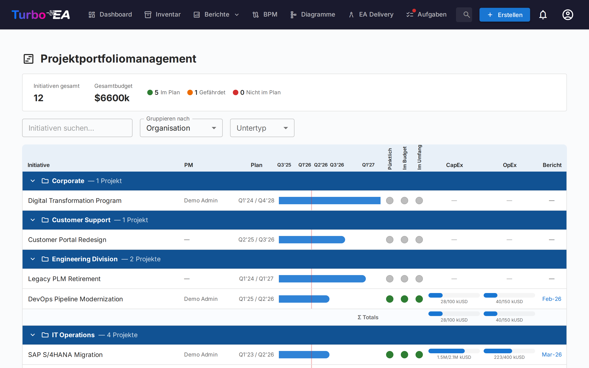
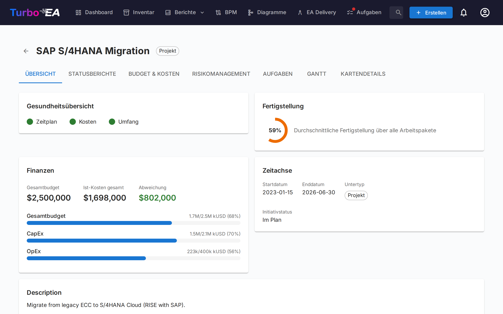
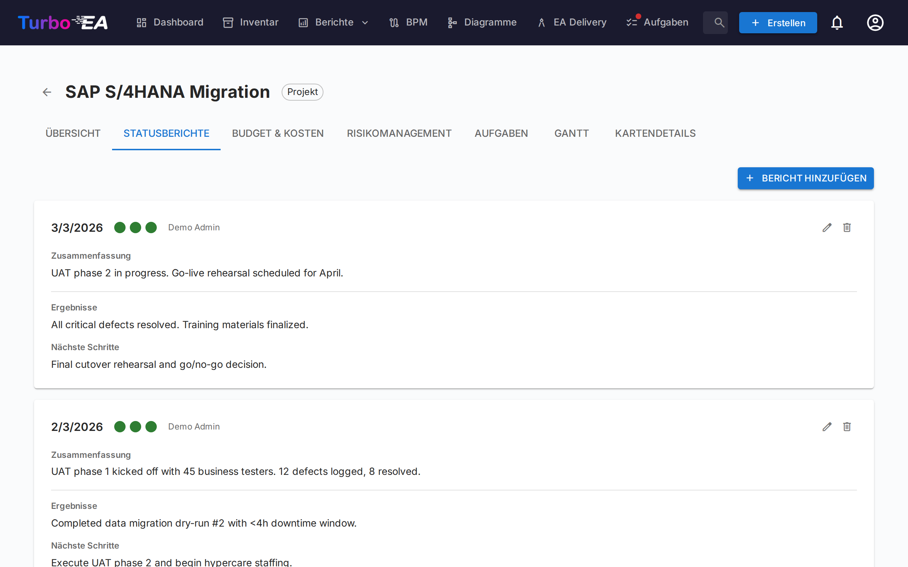
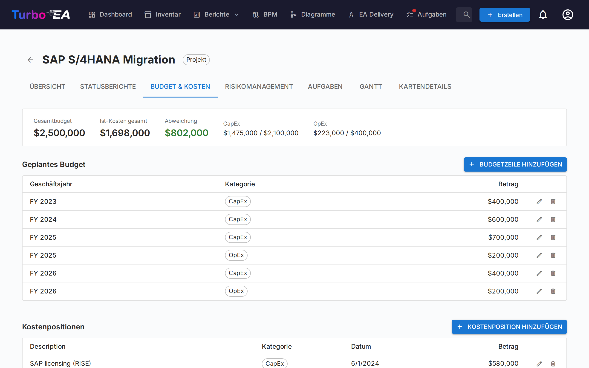
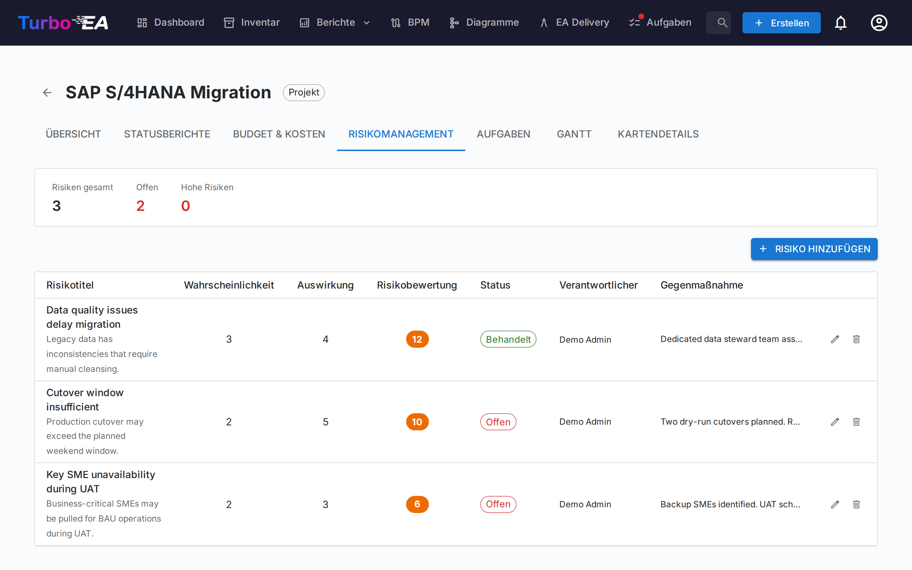
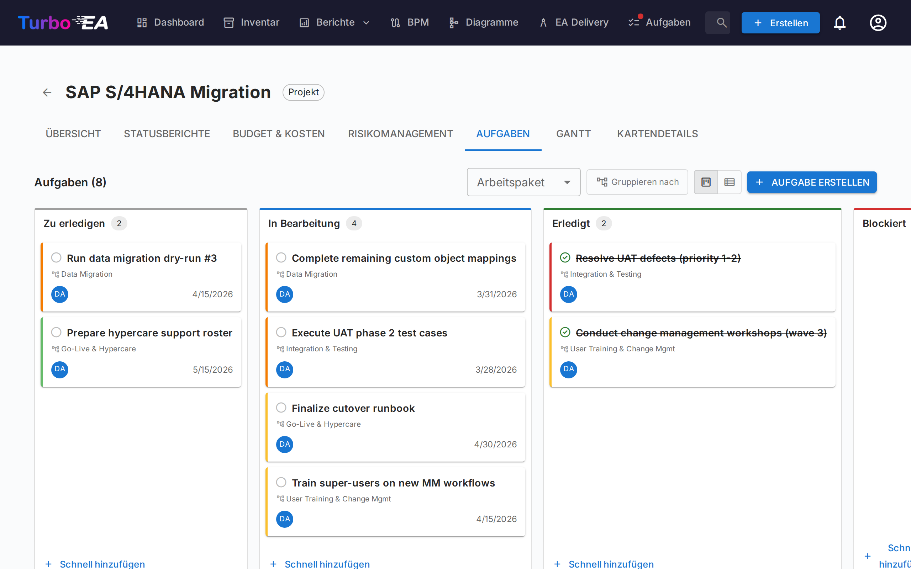
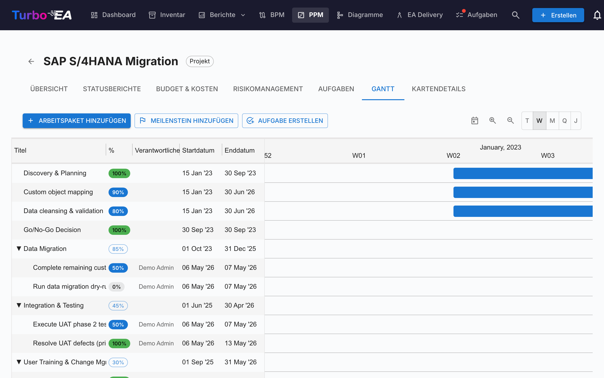

# Projektportfoliomanagement (PPM)

Das **PPM**-Modul bietet eine vollständige Lösung für das Projektportfoliomanagement zur Verfolgung von Initiativen, Budgets, Risiken, Aufgaben und Zeitplänen. Es integriert sich direkt mit dem Kartentyp Initiative, um jedes Projekt mit Statusberichten, Kostenverfolgung und Gantt-Visualisierung anzureichern.

!!! note
    Das PPM-Modul kann von einem Administrator in den [Einstellungen](../admin/settings.md) aktiviert oder deaktiviert werden. Wenn deaktiviert, sind PPM-Navigation und -Funktionen ausgeblendet.

## Portfolio-Dashboard

Das **Portfolio-Dashboard** ist der Haupteinstiegspunkt für PPM. Es bietet:

- **KPI-Karten** — Gesamtzahl der Initiativen, Gesamtbudget, tatsächliche Gesamtkosten und Zusammenfassungen des Gesundheitsstatus
- **Gesundheits-Kreisdiagramme** — Verteilung von Zeitplan-, Kosten- und Umfangsgesundheit (Auf Kurs / Gefährdet / Abweichend)
- **Statusverteilung** — Aufschlüsselung nach Initiativ-Subtyp und Status
- **Gantt-Übersicht** — Zeitbalken mit Start- und Enddaten jeder Initiative und RAG-Gesundheitsindikatoren

### Gruppierung und Filterung

Verwenden Sie die Symbolleiste, um:

- **Gruppieren nach** jedem verknüpften Kartentyp (z. B. Organisation, Plattform)
- **Filtern nach Subtyp** (Idee, Programm, Projekt, Epic)
- **Suchen** nach Initiativname

Diese Filter bleiben in der URL erhalten, sodass eine Seitenaktualisierung Ihre aktuelle Ansicht beibehält.

## Initiativ-Detailansicht

Klicken Sie auf eine Initiative, um deren Detailseite mit sieben Tabs zu öffnen:

### Übersicht-Tab

Die Übersicht zeigt eine Zusammenfassung der Gesundheit und Finanzen der Initiative:

- **Gesundheitsübersicht** — Zeitplan-, Kosten- und Umfangsindikatoren aus dem letzten Statusbericht
- **Budget vs. Ist** — Kombinierte KPI-Karte mit Gesamtbudget und tatsächlichen Ausgaben mit Abweichung
- **Letzte Aktivität** — Zusammenfassung des letzten Statusberichts

### Statusberichte-Tab

Monatliche Statusberichte verfolgen die Projektgesundheit über die Zeit. Jeder Bericht enthält:

| Feld | Beschreibung |
|------|--------------|
| **Berichtsdatum** | Das Datum des Berichtszeitraums |
| **Zeitplan-Gesundheit** | Auf Kurs, Gefährdet oder Abweichend |
| **Kosten-Gesundheit** | Auf Kurs, Gefährdet oder Abweichend |
| **Umfangs-Gesundheit** | Auf Kurs, Gefährdet oder Abweichend |
| **Zusammenfassung** | Zusammenfassung des aktuellen Status |
| **Errungenschaften** | Was in diesem Zeitraum erreicht wurde |
| **Nächste Schritte** | Geplante Aktivitäten für den nächsten Zeitraum |

### Budget & Kosten-Tab

Finanzdaten verfolgen mit zwei Arten von Positionen:

- **Budgetpositionen** — Geplantes Budget nach Geschäftsjahr und Kategorie (CapEx / OpEx). Budgetzeilen werden nach dem **Geschäftsjahresbeginn** gruppiert, der in den [Einstellungen](../admin/settings.md#beginn-des-geschäftsjahres) konfiguriert ist. Wenn das Geschäftsjahr beispielsweise im April beginnt, gehört eine Budgetzeile vom Juni 2026 zum GJ 2026–2027
- **Kostenpositionen** — Tatsächliche Ausgaben mit Datum, Beschreibung und Kategorie

Budget- und Kostensummen werden automatisch in die `costBudget`- und `costActual`-Attribute der Initiativ-Karte hochgerechnet.

### Risikomanagement-Tab

Das Risikoregister verfolgt Projektrisiken mit:

| Feld | Beschreibung |
|------|--------------|
| **Titel** | Kurze Beschreibung des Risikos |
| **Wahrscheinlichkeit** | Wahrscheinlichkeitswert (1–5) |
| **Auswirkung** | Auswirkungswert (1–5) |
| **Risikobewertung** | Automatisch berechnet als Wahrscheinlichkeit x Auswirkung |
| **Status** | Offen, Mindernd, Gemindert, Geschlossen oder Akzeptiert |
| **Minderung** | Geplante Minderungsmaßnahmen |
| **Verantwortlicher** | Benutzer, der für die Risikoverwaltung verantwortlich ist |

### Aufgaben-Tab

Der Aufgabenmanager unterstützt **Kanban-Board** und **Listen**-Ansichten mit vier Statusspalten:

- **Zu erledigen** — Noch nicht begonnene Aufgaben
- **In Bearbeitung** — Aufgaben, an denen gerade gearbeitet wird
- **Erledigt** — Abgeschlossene Aufgaben
- **Blockiert** — Aufgaben, die nicht fortgesetzt werden können

Aufgaben können nach Projektstrukturplan (PSP)-Element gefiltert und gruppiert werden. Ziehen Sie Karten zwischen Spalten, um den Status zu aktualisieren.

Anzeigefilter (Ansichtsmodus, WBS-Filter, Gruppierungs-Umschalter) bleiben in der URL zwischen Seitenaktualisierungen erhalten.

### Gantt-Tab

Das Gantt-Diagramm visualisiert den Projektzeitplan mit:

- **Arbeitspakete (WBS)** — Hierarchische Projektstrukturplanelemente mit Start-/Enddaten
- **Aufgaben** — Einzelne Aufgabenbalken, die mit Arbeitspaketen verknüpft sind
- **Meilensteine** — Wichtige Termine, markiert mit Rautenindikatoren
- **Fortschrittsbalken** — Visueller Fertigstellungsgrad, direkt per Drag verstellbar
- **Quartalstakte** — Zeitraster zur Orientierung

Interaktion mit dem Gantt-Diagramm:

- **Skalenauswahl** — Tag, Woche, Monat, Quartal oder Jahr; die Auswahl wird im Browser gespeichert
- **Zoom-Schaltflächen (+/−)** — Schrittweises Vergrößern bzw. Verkleinern entlang derselben fünf Skalen
- **Punkte an den Balkenenden** — Vom rechten Punkt eines Balkens auf den linken Punkt eines anderen ziehen, um eine Finish-to-Start-Abhängigkeit zu erstellen. Funktioniert zwischen Arbeitspaketen und Aufgaben in jeder Kombination. Zyklen werden automatisch zurückgewiesen. **Pfeil doppelklicken**, um ihn zu entfernen.

### Kartendetails-Tab

Der letzte Tab zeigt die vollständige Kartendetailansicht mit allen Standardabschnitten.

## Projektstrukturplan (PSP / WBS)

Der PSP bietet eine hierarchische Zerlegung des Projektumfangs:

- **Arbeitspakete** — Logische Gruppierungen von Aufgaben mit Start-/Enddaten und Fortschrittsverfolgung
- **Meilensteine** — Bedeutende Ereignisse oder Abschlusspunkte
- **Hierarchie** — Eltern-Kind-Beziehungen zwischen PSP-Elementen
- **Auto-Fertigstellung** — Der Fertigstellungsgrad wird automatisch aus dem Verhältnis erledigter/gesamter Aufgaben berechnet und dann rekursiv durch die WBS-Hierarchie bis zu den übergeordneten Elementen aufgerollt. Der Gesamtfortschritt auf oberster Ebene repräsentiert den Gesamtfortschritt der Initiative

## Kartendetail-Integration

Wenn PPM aktiviert ist, zeigen **Initiativ**-Karten einen **PPM**-Tab als letzten Tab in der [Kartendetailansicht](card-details.md). Ein Klick auf diesen Tab navigiert direkt zur PPM-Initiativ-Detailansicht (Übersicht-Tab). Dies bietet einen schnellen Einstiegspunkt von jeder Initiativ-Karte zu ihrer vollständigen PPM-Projektseite.

Umgekehrt zeigt der **Kartendetails**-Tab innerhalb der PPM-Initiativ-Detailansicht die Standardabschnitte der Kartendetails ohne den PPM-Tab, um zirkuläre Navigation zu vermeiden.

## Berechtigungen

| Berechtigung | Beschreibung |
|-------------|--------------|
| `ppm.view` | PPM-Dashboard, Gantt-Diagramm und Initiativberichte anzeigen. Standardmäßig für alle Rollen gewährt |
| `ppm.manage` | Statusberichte, Aufgaben, Kosten, Risiken und WBS-Elemente erstellen und verwalten. Gewährt für Admin-, BPM-Admin- und Mitglied-Rollen |
| `reports.ppm_dashboard` | PPM-Portfolio-Dashboard anzeigen. Standardmäßig für alle Rollen gewährt |
