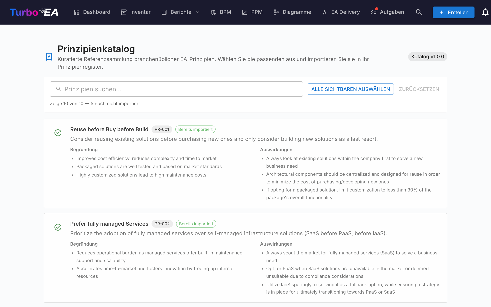

# Prinzipienkatalog

Turbo EA wird mit dem **EA-Prinzipien-Referenzkatalog** ausgeliefert — eine kuratierte Sammlung von Architekturprinzipien aus TOGAF und verwandten Branchenreferenzen, die zusammen mit den Capability-, Prozess- und Wertstrom-Katalogen unter [github.com/vincentmakes/turbo-ea-capabilities](https://github.com/vincentmakes/turbo-ea-capabilities) gepflegt wird. Die Seite Prinzipienkatalog erlaubt es, diese Referenz zu durchstöbern und passende Prinzipien gebündelt in das eigene Metamodell zu importieren, anstatt jede Aussage, Begründung und Auswirkung von Hand einzutippen.

## Seite öffnen

Klicken Sie oben rechts in der App auf das Benutzersymbol, klappen Sie im Menü **Referenzkataloge** auf (der Bereich ist standardmäßig eingeklappt, um das Menü kompakt zu halten) und wählen Sie **Prinzipienkatalog**. Die Seite ist nur für Administratoren zugänglich — sie erfordert die Berechtigung `admin.metamodel`, dieselbe Berechtigung, die nötig ist, um Prinzipien direkt unter Administration → Metamodell zu verwalten.

## Was Sie sehen

- **Kopfzeile** — der Versions-Chip des aktiven Katalogs und der Seitentitel.
- **Filterleiste** — Volltextsuche über Titel, Beschreibung, Begründung und Auswirkungen. Die Schaltfläche **Sichtbare auswählen** fügt mit einem Klick alle importierbaren Treffer zur Auswahl hinzu; **Auswahl löschen** setzt sie zurück. Ein Live-Zähler darunter zeigt, wie viele Einträge sichtbar sind, wie viele insgesamt im Katalog enthalten sind und wie viele noch importierbar sind (also noch nicht im Inventar liegen).
- **Prinzipienliste** — eine Karte je Prinzip mit Titel, kurzer Beschreibung, einer Aufzählung der **Begründung** und einer Aufzählung der **Auswirkungen**. Die Karten sind vertikal gestapelt, damit der lange Fließtext gut lesbar bleibt.

## Prinzipien auswählen

Setzen Sie das Häkchen in einer Prinzipkarte, um sie zur Auswahl hinzuzufügen. Die Auswahl ist flach — es gibt keine Hierarchie, durch die kaskadiert würde, also wird jedes Prinzip einzeln entschieden.

Prinzipien, die **bereits existieren**, erscheinen mit einem **grünen Häkchen** statt einer Checkbox und können nicht ausgewählt werden — Sie können dasselbe Prinzip nie zweimal über den Katalog importieren. Der Abgleich nutzt vorzugsweise den `catalogue_id`-Stempel aus früheren Importen (so überlebt das grüne Häkchen Titeländerungen) und fällt sonst auf einen Titelvergleich (ohne Groß-/Kleinschreibung) für handgepflegte Prinzipien zurück.

## Prinzipien gebündelt importieren

Sobald mindestens ein Prinzip ausgewählt ist, erscheint am unteren Seitenrand eine angeheftete Schaltfläche **N Prinzipien importieren**. Sie nutzt dieselbe Berechtigung `admin.metamodel` wie der Rest der Seite.

Bei der Bestätigung legt Turbo EA:

- pro ausgewähltem Katalogeintrag eine `EAPrinciple`-Zeile an und übernimmt Titel, Beschreibung, Begründung und Auswirkungen wortgetreu.
- jedes neue Prinzip mit `catalogue_id` und `catalogue_version` stempelt, damit die Herkunft nachvollziehbar bleibt und der Häkchen-Abgleich auch nach späteren Bearbeitungen funktioniert.
- bestehende Treffer **stillschweigend überspringt**. Der Ergebnisdialog zeigt, wie viele Prinzipien angelegt und wie viele übersprungen wurden.

Ein erneuter Import desselben Sets ist unbedenklich — der Vorgang ist idempotent.

Nach dem Import lassen sich die Prinzipien unter **Administration → Metamodell → Prinzipien** an die eigene Organisation anpassen. Der importierte Text ist nur ein Ausgangspunkt; die laufende Pflege erfolgt anschließend in dieser Admin-Ansicht.

## Katalog aktualisieren (Administratoren)

Der Katalog wird **gebündelt** als Python-Abhängigkeit ausgeliefert, sodass die Seite offline bzw. in Air-Gap-Umgebungen funktioniert. Administratoren können auf Anforderung eine neuere Version aus den Seiten Capability-, Prozess- oder Wertstrom-Katalog ziehen — derselbe Wheel-Download befüllt den Prinzipien-Cache mit, sodass das Aktualisieren eines der vier Referenzkataloge alle vier auffrischt.

Die PyPI-Index-URL ist über die Umgebungsvariable `CAPABILITY_CATALOGUE_PYPI_URL` konfigurierbar (der Variablenname wird von allen vier Katalogen geteilt — das Wheel deckt alle vier ab).
