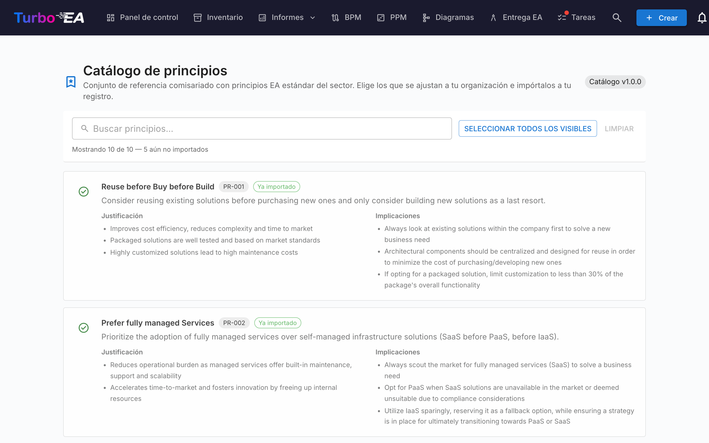

# Catálogo de principios

Turbo EA incluye el **Catálogo de referencia de principios EA** — un conjunto curado de principios de arquitectura inspirados en TOGAF y en referencias sectoriales afines, mantenido junto a los catálogos de capacidades, procesos y cadenas de valor en [github.com/vincentmakes/turbo-ea-capabilities](https://github.com/vincentmakes/turbo-ea-capabilities). La página Catálogo de principios permite recorrer esta referencia e importar de forma masiva los principios deseados al metamodelo propio, en lugar de teclear a mano cada enunciado, justificación e implicaciones.

## Abrir la página

Pulse el icono de usuario en la esquina superior derecha de la aplicación, despliegue **Catálogos de referencia** en el menú (la sección está plegada por defecto para mantener el menú compacto) y pulse **Catálogo de principios**. La página es solo para administradores — requiere el permiso `admin.metamodel`, el mismo que se necesita para gestionar principios directamente desde Administración → Metamodelo.

## Qué se ve

- **Cabecera** — el chip con la versión del catálogo activo y el título de la página.
- **Barra de filtros** — búsqueda libre sobre título, descripción, justificación e implicaciones. El botón **Seleccionar visibles** añade de un clic todas las coincidencias importables; **Limpiar selección** la vacía. Un contador en vivo muestra cuántas entradas están visibles, cuántas contiene el catálogo en total y cuántas siguen siendo importables (es decir, todavía no están en su inventario).
- **Lista de principios** — una tarjeta por principio con el título, una breve descripción, la **Justificación** en viñetas y un conjunto de **Implicaciones** en viñetas. Las tarjetas se apilan verticalmente para que el texto largo se lea con comodidad.

## Seleccionar principios

Marque la casilla de una tarjeta de principio para añadirla a la selección. La selección es plana — no hay jerarquía que cascadear, así que cada principio se decide por sí mismo.

Los principios que **ya existen** en su metamodelo aparecen con un **icono de visto verde** en lugar de casilla y no se pueden seleccionar — nunca importará el mismo principio dos veces desde el catálogo. El cotejo prefiere el sello `catalogue_id` que dejó un import anterior (así el visto verde sobrevive a cambios de título) y, en su defecto, recurre a una comparación de título sin distinguir mayúsculas para los principios introducidos a mano.

## Importar principios en masa

En cuanto haya algún principio seleccionado, aparece un botón anclado al pie de la página: **Importar N principios**. Usa el mismo permiso `admin.metamodel` que el resto de la página.

Al confirmar, Turbo EA:

- crea una fila `EAPrinciple` por cada entrada seleccionada del catálogo, copiando literalmente título, descripción, justificación e implicaciones;
- sella cada principio nuevo con `catalogue_id` y `catalogue_version`, de modo que pueda rastrear su origen y el visto verde siga funcionando aunque se editen más adelante;
- **omite las coincidencias existentes** en silencio. El diálogo de resultado indica cuántos principios se crearon y cuántos se omitieron.

Repetir el mismo import es seguro — la operación es idempotente.

Tras el import, pula los principios desde **Administración → Metamodelo → Principios** para ajustar la redacción o el orden a su organización. El texto importado es un punto de partida; el mantenimiento continuo se lleva a cabo en esa pantalla de administración.

## Actualizar el catálogo (administradores)

El catálogo se entrega **empaquetado** como dependencia de Python, por lo que la página funciona sin conexión / en despliegues aislados. Los administradores pueden traer una versión más reciente bajo demanda desde las páginas Catálogo de capacidades, de procesos o de cadenas de valor — la misma descarga del wheel hidrata la caché de principios al mismo tiempo, así que actualizar uno de los cuatro catálogos de referencia desde cualquiera de sus páginas refresca los cuatro.

La URL del índice PyPI se configura mediante la variable de entorno `CAPABILITY_CATALOGUE_PYPI_URL` (el nombre se comparte entre los cuatro catálogos — el wheel los cubre todos).
