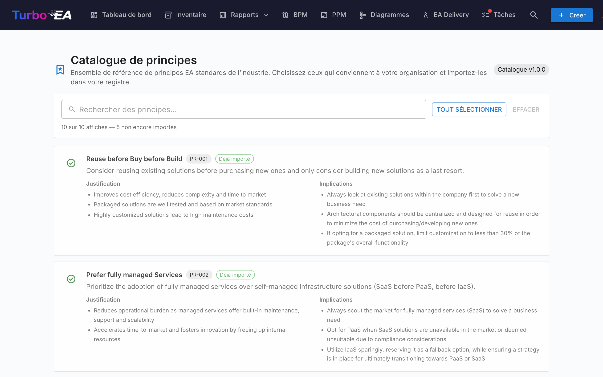

# Catalogue de principes

Turbo EA est livré avec le **Catalogue de référence des principes EA** — un ensemble curé de principes d'architecture issus de TOGAF et de références sectorielles connexes, maintenu aux côtés des catalogues de capacités, de processus et de chaînes de valeur sur [github.com/vincentmakes/turbo-ea-capabilities](https://github.com/vincentmakes/turbo-ea-capabilities). La page Catalogue de principes vous permet de parcourir cette référence et d'importer en masse les principes correspondants dans votre propre métamodèle, plutôt que de saisir à la main chaque énoncé, justification et série d'implications.

## Ouvrir la page

Cliquez sur l'icône utilisateur en haut à droite de l'application, dépliez **Catalogues de référence** dans le menu (la section est repliée par défaut pour garder le menu compact), puis cliquez sur **Catalogue de principes**. La page est réservée aux administrateurs — elle exige la permission `admin.metamodel`, la même qui permet de gérer les principes directement depuis Administration → Métamodèle.

## Ce que vous voyez

- **En-tête** — la pastille de version du catalogue actif et le titre de la page.
- **Barre de filtres** — recherche plein texte sur le titre, la description, la justification et les implications. Le bouton **Sélectionner les visibles** ajoute en un clic toutes les correspondances encore importables ; **Effacer la sélection** la remet à zéro. Un compteur en direct indique combien d'entrées sont visibles, combien le catalogue en compte au total, et combien restent importables (c'est-à-dire absentes de votre inventaire).
- **Liste des principes** — une carte par principe affichant le titre, une brève description, une **Justification** en puces et une série d'**Implications** en puces. Les cartes sont empilées verticalement pour que le texte long reste lisible.

## Sélectionner des principes

Cochez la case d'une carte de principe pour l'ajouter à la sélection. La sélection est plate — il n'y a pas de hiérarchie qui cascade, chaque principe est donc retenu ou écarté individuellement.

Les principes qui **existent déjà** dans votre métamodèle apparaissent avec une **coche verte** au lieu d'une case et ne peuvent pas être sélectionnés — un même principe ne peut jamais être importé deux fois via le catalogue. La correspondance privilégie le tampon `catalogue_id` posé par un précédent import (la coche verte survit donc aux modifications de titre) et retombe sur une comparaison de titre insensible à la casse pour les principes saisis à la main.

## Importer des principes en masse

Dès qu'un principe est sélectionné, un bouton fixé en bas de page **Importer N principes** apparaît. Il utilise la même permission `admin.metamodel` que le reste de la page.

À la confirmation, Turbo EA :

- crée une ligne `EAPrinciple` par entrée sélectionnée du catalogue, en recopiant tels quels le titre, la description, la justification et les implications ;
- estampille chaque nouveau principe avec `catalogue_id` et `catalogue_version`, ce qui permet de tracer son origine et de garder la coche verte fonctionnelle même après des modifications ;
- **ignore silencieusement** les correspondances existantes. La boîte de dialogue de résultat indique combien de principes ont été créés et combien ont été ignorés.

Relancer le même import est sans danger — l'opération est idempotente.

Après l'import, retouchez les principes depuis **Administration → Métamodèle → Principes** pour adapter la formulation ou l'ordre à votre organisation. Le texte importé est un point de départ ; c'est sur cette page d'administration que la maintenance se poursuit ensuite.

## Mettre à jour le catalogue (administrateurs)

Le catalogue est **embarqué** sous forme de dépendance Python, si bien que la page fonctionne hors ligne / dans des déploiements coupés du réseau. Les administrateurs peuvent récupérer à la demande une version plus récente depuis les pages Catalogue de capacités, de processus ou de chaînes de valeur — le même téléchargement de wheel hydrate le cache des principes par la même occasion ; mettre à jour l'un des quatre catalogues de référence depuis n'importe laquelle de ses pages les rafraîchit tous.

L'URL d'index PyPI est configurable via la variable d'environnement `CAPABILITY_CATALOGUE_PYPI_URL` (le nom est partagé entre les quatre catalogues — le wheel les couvre tous).
