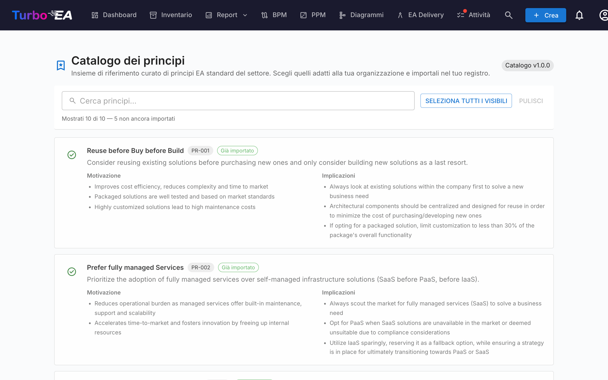

# Catalogo dei principi

Turbo EA include il **Catalogo di riferimento dei principi EA** — un insieme curato di principi di architettura ispirati a TOGAF e a riferimenti di settore affini, mantenuto insieme ai cataloghi di capacità, processi e flussi di valore su [github.com/vincentmakes/turbo-ea-capabilities](https://github.com/vincentmakes/turbo-ea-capabilities). La pagina Catalogo dei principi permette di sfogliare questa raccolta e di importare in massa i principi desiderati nel proprio metamodello, invece di digitare a mano ogni enunciato, motivazione e implicazione.

## Aprire la pagina

Cliccate sull'icona utente in alto a destra nell'app, espandete **Cataloghi di riferimento** nel menu (la sezione è chiusa per impostazione predefinita per mantenere il menu compatto) e poi cliccate su **Catalogo dei principi**. La pagina è riservata agli amministratori — richiede il permesso `admin.metamodel`, lo stesso necessario per gestire i principi direttamente da Amministrazione → Metamodello.

## Cosa vedete

- **Intestazione** — il chip con la versione del catalogo attivo e il titolo della pagina.
- **Barra dei filtri** — ricerca a testo libero su titolo, descrizione, motivazione e implicazioni. Il pulsante **Seleziona i visibili** aggiunge in un clic tutte le voci ancora importabili; **Pulisci selezione** la azzera. Un contatore in tempo reale indica quante voci sono visibili, quante contiene il catalogo in totale e quante restano importabili (cioè non sono ancora presenti nell'inventario).
- **Elenco dei principi** — una scheda per principio con titolo, breve descrizione, una **Motivazione** in elenco puntato e un insieme di **Implicazioni** in elenco puntato. Le schede sono impilate verticalmente per mantenere leggibile il testo lungo.

## Selezionare i principi

Spuntate la casella in una scheda per aggiungere quel principio alla selezione. La selezione è piatta — non c'è gerarchia da espandere a cascata, quindi ogni principio viene scelto o saltato per sé.

I principi che **esistono già** nel metamodello compaiono con un'**icona di spunta verde** al posto della casella e non sono selezionabili — non si può mai importare lo stesso principio due volte dal catalogo. L'abbinamento privilegia il marchio `catalogue_id` lasciato da un import precedente (la spunta verde sopravvive così alle modifiche di titolo) e in subordine ricade su un confronto del titolo senza distinzione maiuscole/minuscole per i principi inseriti a mano.

## Importare in massa

Non appena si seleziona almeno un principio, in fondo alla pagina compare un pulsante fisso **Importa N principi**. Utilizza lo stesso permesso `admin.metamodel` del resto della pagina.

Alla conferma, Turbo EA:

- crea una riga `EAPrinciple` per ogni voce selezionata, ricopiando alla lettera titolo, descrizione, motivazione e implicazioni;
- timbra ogni nuovo principio con `catalogue_id` e `catalogue_version`, così che sia possibile tracciarne l'origine e l'abbinamento con la spunta verde continui a funzionare anche dopo modifiche;
- **salta in silenzio** gli abbinamenti già presenti. Il dialogo di esito indica quanti principi sono stati creati e quanti saltati.

Rilanciare lo stesso import è sicuro — l'operazione è idempotente.

Dopo l'import, rifinite i principi da **Amministrazione → Metamodello → Principi** per adattare formulazione e ordine alla vostra organizzazione. Il testo importato è un punto di partenza; la manutenzione continua avviene poi in quella schermata di amministrazione.

## Aggiornare il catalogo (amministratori)

Il catalogo viene fornito **integrato** come dipendenza Python, perciò la pagina funziona offline / in installazioni isolate dalla rete. Gli amministratori possono prelevare a richiesta una versione più recente dalle pagine Catalogo delle capacità, dei processi o dei flussi di valore — lo stesso download del wheel reidrata anche la cache dei principi, quindi aggiornare uno qualunque dei quattro cataloghi di riferimento da una qualsiasi delle quattro pagine li aggiorna tutti.

L'URL dell'indice PyPI è configurabile tramite la variabile d'ambiente `CAPABILITY_CATALOGUE_PYPI_URL` (il nome è condiviso fra i quattro cataloghi — il wheel li copre tutti).
