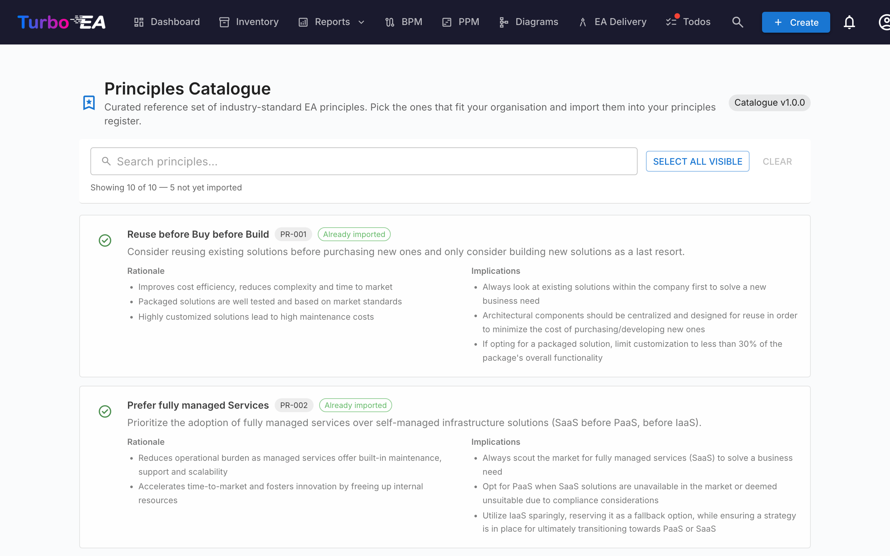

# Principles Catalogue

Turbo EA ships with the **EA Principles Reference Catalogue** — a curated set of architecture principles drawn from TOGAF and adjacent industry references, maintained alongside the capability, process and value-stream catalogues at [github.com/vincentmakes/turbo-ea-capabilities](https://github.com/vincentmakes/turbo-ea-capabilities). The Principles Catalogue page lets you browse this reference and import matching principles into your own metamodel in bulk, instead of typing each statement, rationale and set of implications by hand.

## Opening the page

Click the user icon in the top-right corner of the app, expand **Reference Catalogues** in the menu (the section is collapsed by default to keep the menu compact), then click **Principles Catalogue**. The page is admin-only — it requires the `admin.metamodel` permission, the same permission you need to manage principles directly from Administration → Metamodel.

## What you see

- **Header** — the active catalogue version chip and the page title.
- **Filter bar** — full-text search across title, description, rationale and implications. A **Select visible** button adds every importable match to the selection in one click; **Clear selection** wipes it. A live counter underneath shows how many entries are visible, the total in the catalogue, and how many are still importable (i.e. not already in your inventory).
- **Principle list** — one card per principle, showing the title, a short description, a bulleted **Rationale**, and a bulleted set of **Implications**. Cards are stacked vertically so the long-form text stays readable.

## Selecting principles

Tick the checkbox in a principle card to add it to the selection. Selection is flat — there is no hierarchy to cascade through, so each principle is picked or skipped on its own merits.

Principles that **already exist** in your metamodel appear with a **green check icon** instead of a checkbox and cannot be selected — you can never import the same principle twice through the catalogue. Matching prefers the `catalogue_id` stamp left by a previous import (so the green tick survives title edits) and falls back to a case-insensitive title match for principles you typed in by hand.

## Mass-importing principles

When you have one or more principles selected, a sticky **Import N principles** button appears at the bottom of the page. It uses the same `admin.metamodel` permission as the rest of the page.

On confirmation, Turbo EA:

- Creates one `EAPrinciple` row per selected catalogue entry, copying over the title, description, rationale and implications verbatim.
- Stamps each new principle with `catalogue_id` and `catalogue_version` so you can trace where it came from and so the green-tick matching survives later edits.
- **Skips existing matches** silently. The result dialog shows how many principles were created and how many were skipped.

Re-running the same import is safe — it's idempotent.

After importing, edit the principles from **Administration → Metamodel → Principles** to tailor the wording or sort order to your organisation. The imported text is a starting point; the principles list on that admin page is where you'll continue to maintain the catalogue going forward.

## Updating the catalogue (admins)

The catalogue ships **bundled** as a Python dependency, so the page works offline / in airgapped deployments. Admins can pull a newer version on demand from the Capability, Process or Value Stream Catalogue pages — the same wheel download hydrates the principles cache at the same time, so updating any one of the four reference catalogues from any of the four pages refreshes them all.

The PyPI index URL is configurable via the `CAPABILITY_CATALOGUE_PYPI_URL` environment variable (the variable name is shared across all four catalogues — the wheel covers them all).
