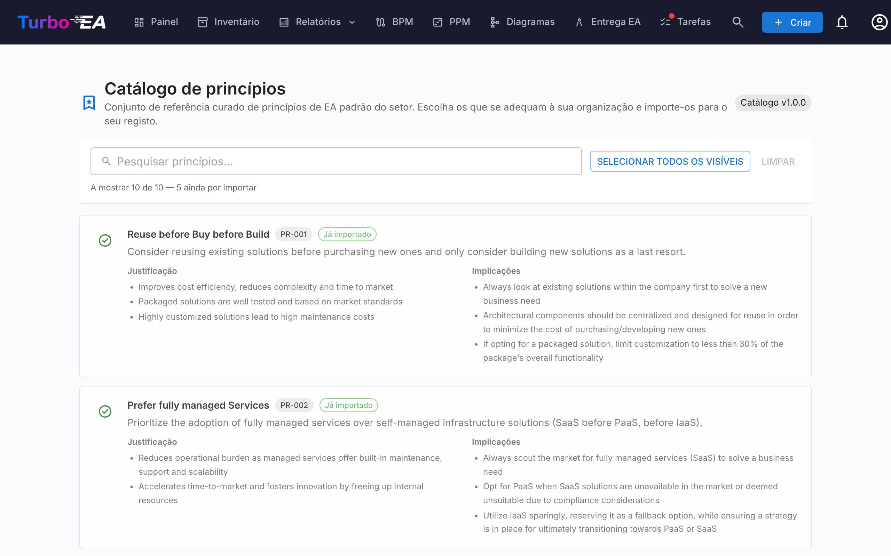

# Catálogo de princípios

O Turbo EA inclui o **Catálogo de referência de princípios EA** — um conjunto curado de princípios de arquitetura inspirados em TOGAF e em referências setoriais correlatas, mantido juntamente com os catálogos de capacidades, processos e cadeias de valor em [github.com/vincentmakes/turbo-ea-capabilities](https://github.com/vincentmakes/turbo-ea-capabilities). A página Catálogo de princípios permite percorrer esta referência e importar em massa os princípios escolhidos para o seu próprio metamodelo, em vez de digitar à mão cada enunciado, justificação e implicações.

## Abrir a página

Clique no ícone de utilizador no canto superior direito da aplicação, expanda **Catálogos de referência** no menu (a secção começa recolhida para manter o menu compacto) e clique em **Catálogo de princípios**. A página destina-se apenas a administradores — exige a permissão `admin.metamodel`, a mesma necessária para gerir princípios diretamente em Administração → Metamodelo.

## O que vê

- **Cabeçalho** — o chip com a versão do catálogo ativo e o título da página.
- **Barra de filtros** — pesquisa em texto livre por título, descrição, justificação e implicações. O botão **Selecionar visíveis** adiciona com um clique todas as correspondências ainda importáveis; **Limpar seleção** repõe a zero. Um contador em tempo real mostra quantas entradas estão visíveis, quantas o catálogo contém no total e quantas continuam importáveis (ou seja, ainda não estão no seu inventário).
- **Lista de princípios** — um cartão por princípio com o título, uma descrição curta, uma **Justificação** em tópicos e um conjunto de **Implicações** em tópicos. Os cartões empilham-se verticalmente para que o texto longo permaneça legível.

## Selecionar princípios

Marque a caixa de um cartão para adicionar esse princípio à seleção. A seleção é plana — não existe hierarquia a propagar, por isso cada princípio é decidido individualmente.

Os princípios que **já existem** no metamodelo aparecem com um **visto verde** em vez de uma caixa e não podem ser selecionados — nunca importará o mesmo princípio duas vezes a partir do catálogo. O cotejo prefere a marca `catalogue_id` deixada por um import anterior (assim o visto verde sobrevive a mudanças de título) e, na ausência dela, recorre a uma comparação de título sem distinguir maiúsculas para princípios introduzidos à mão.

## Importar em massa

Assim que tenha um ou mais princípios selecionados, surge no fundo da página um botão fixo **Importar N princípios**. Utiliza a mesma permissão `admin.metamodel` que o resto da página.

Ao confirmar, o Turbo EA:

- cria uma linha `EAPrinciple` por cada entrada selecionada do catálogo, copiando ipsis verbis título, descrição, justificação e implicações;
- carimba cada novo princípio com `catalogue_id` e `catalogue_version`, para que possa rastrear a origem e o visto verde continue a funcionar mesmo depois de edições;
- **ignora silenciosamente** as correspondências existentes. O diálogo de resultado indica quantos princípios foram criados e quantos foram ignorados.

Repetir o mesmo import é seguro — a operação é idempotente.

Após a importação, refine os princípios em **Administração → Metamodelo → Princípios** para ajustar a redação ou a ordem à sua organização. O texto importado é um ponto de partida; a manutenção contínua decorre nesse ecrã de administração.

## Atualizar o catálogo (administradores)

O catálogo é entregue **embutido** como dependência Python, por isso a página funciona offline / em implementações isoladas da rede. Os administradores podem ir buscar uma versão mais recente a pedido a partir das páginas Catálogo de capacidades, de processos ou de cadeias de valor — o mesmo download do wheel hidrata também a cache dos princípios, pelo que atualizar um dos quatro catálogos de referência a partir de qualquer uma das quatro páginas refresca todos eles.

O URL de índice PyPI é configurável pela variável de ambiente `CAPABILITY_CATALOGUE_PYPI_URL` (o nome é partilhado pelos quatro catálogos — o wheel cobre os quatro).
