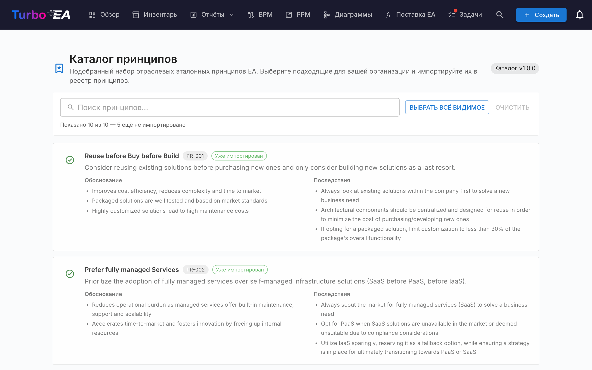

# Каталог принципов

Turbo EA поставляется со **Справочным каталогом принципов EA** — кураторской подборкой архитектурных принципов, сложившейся вокруг TOGAF и смежных отраслевых источников, которая поддерживается вместе с каталогами способностей, процессов и потоков ценности на [github.com/vincentmakes/turbo-ea-capabilities](https://github.com/vincentmakes/turbo-ea-capabilities). Страница «Каталог принципов» позволяет просматривать этот справочник и массово импортировать выбранные принципы в собственную метамодель, не набирая вручную каждое утверждение, обоснование и список последствий.

## Как открыть страницу

Нажмите значок пользователя в правом верхнем углу приложения, разверните в меню пункт «Справочные каталоги» (он свёрнут по умолчанию, чтобы меню оставалось компактным) и выберите «Каталог принципов». Страница доступна только администраторам — требуется разрешение `admin.metamodel`, то же самое, что и для управления принципами через «Администрирование → Метамодель».

## Что вы видите

- **Заголовок** — индикатор активной версии каталога и название страницы.
- **Панель фильтров** — полнотекстовый поиск по названию, описанию, обоснованию и последствиям. Кнопка «Выбрать видимые» одним щелчком добавляет в выбор все ещё импортируемые совпадения; «Очистить выбор» — обнуляет его. Живой счётчик ниже показывает, сколько записей видно, сколько содержит каталог в целом и сколько из них всё ещё доступно к импорту (то есть пока отсутствует в инвентаре).
- **Список принципов** — по карточке на каждый принцип: название, короткое описание, маркированное «Обоснование» и маркированный набор «Последствий». Карточки расположены по вертикали, чтобы длинный текст оставался читаемым.

## Выбор принципов

Поставьте галочку в карточке принципа, чтобы добавить его в выбор. Выбор плоский — иерархии для каскадирования нет, поэтому каждый принцип решается отдельно.

Принципы, **уже существующие** в метамодели, отображаются с **зелёной галочкой** вместо чекбокса и недоступны к выбору — один и тот же принцип нельзя импортировать дважды через каталог. Сопоставление в первую очередь использует метку `catalogue_id`, оставленную предыдущим импортом (поэтому зелёная галочка переживает изменения названия), а при её отсутствии прибегает к сравнению названий без учёта регистра для принципов, добавленных вручную.

## Массовый импорт

Как только выбран хотя бы один принцип, внизу страницы появляется закреплённая кнопка «Импортировать N принципов». Она использует то же разрешение `admin.metamodel`, что и остальная страница.

После подтверждения Turbo EA:

- создаёт по строке `EAPrinciple` на каждую выбранную запись каталога, дословно копируя название, описание, обоснование и последствия;
- ставит на каждом новом принципе метки `catalogue_id` и `catalogue_version`, чтобы можно было отследить происхождение и чтобы зелёная галочка продолжала работать после редактирования;
- **молча пропускает** существующие совпадения. В диалоге результата указано, сколько принципов создано и сколько пропущено.

Повторный запуск того же импорта безопасен — операция идемпотентна.

После импорта доработайте принципы в разделе «Администрирование → Метамодель → Принципы», чтобы привести формулировки или порядок в соответствие с практикой вашей организации. Импортированный текст — это отправная точка; дальнейшее сопровождение ведётся уже на этом административном экране.

## Обновление каталога (администраторы)

Каталог поставляется **встроенным** в виде Python-зависимости, поэтому страница работает офлайн и в изолированных от сети развёртываниях. Администраторы могут по запросу получить более свежую версию из страниц «Каталог способностей», «Каталог процессов» или «Каталог потоков ценности» — одно и то же скачивание wheel-файла одновременно обновляет кэш принципов, поэтому обновление любого из четырёх справочных каталогов с любой из четырёх страниц обновляет их все.

URL индекса PyPI настраивается через переменную окружения `CAPABILITY_CATALOGUE_PYPI_URL` (имя одно и то же для всех четырёх каталогов — wheel покрывает все четыре).
