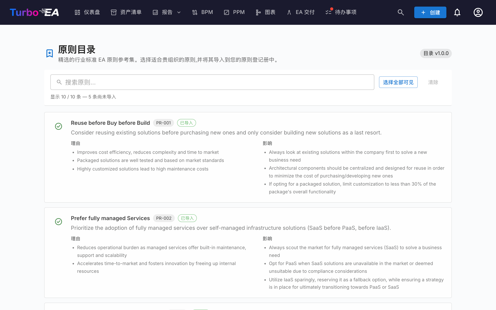

# 原则目录

Turbo EA 内置了「**EA 原则参考目录**」——一套精选的架构原则,源自 TOGAF 及其相关行业参考,与能力目录、流程目录和价值流目录一同维护在 [github.com/vincentmakes/turbo-ea-capabilities](https://github.com/vincentmakes/turbo-ea-capabilities)。原则目录页面可让您浏览这份参考,并将所需的原则批量导入到您自己的元模型中,免去逐条录入声明、依据和影响的繁琐工作。

## 打开页面

点击应用右上角的用户图标,在菜单中展开「参考目录」(该分组默认折叠以保持菜单紧凑),然后点击「原则目录」。该页面仅对管理员开放——需要 `admin.metamodel` 权限,与在「管理 → 元模型」中直接管理原则所需的权限相同。

## 您会看到

- **标题区** — 当前生效的目录版本徽章以及页面标题。
- **过滤栏** — 在标题、描述、依据和影响之间进行全文搜索。按「选择可见项」一键加入所有可导入的匹配项;按「清除选择」即可清空。下方实时计数显示当前可见的条目数、目录总条目数,以及尚可导入的条目数(即您库存中尚未存在的)。
- **原则列表** — 每个原则一张卡片,包含标题、简要描述、要点形式的「依据」和「影响」。卡片纵向堆叠,便于阅读较长的正文。

## 选择原则

勾选原则卡片中的复选框即可加入选择。选择是扁平的——没有可级联的层级,因此每个原则都是独立决定的。

已经存在于元模型中的原则会以「**绿色对勾图标**」代替复选框出现,无法被选中——同一原则永远不会通过目录被重复导入。匹配优先使用以前导入时留下的 `catalogue_id` 印记(因此即便后来修改了标题,绿色对勾仍然有效),否则退回到对手工录入的原则做不区分大小写的标题比对。

## 批量导入原则

只要有原则被选中,页面底部就会出现一个固定的「导入 N 条原则」按钮。它使用与页面其他部分相同的 `admin.metamodel` 权限。

确认后,Turbo EA 会:

- 为每个被选中的目录条目创建一行 `EAPrinciple`,逐字复制其标题、描述、依据与影响;
- 在每条新原则上盖上 `catalogue_id` 和 `catalogue_version`,以便追溯来源,并保证之后即使编辑过,绿色对勾的匹配仍然有效;
- **静默跳过**已存在的匹配项。结果对话框会显示创建了多少条原则、跳过了多少条。

重复执行同一次导入是安全的——该操作是幂等的。

导入完成后,在「管理 → 元模型 → 原则」中继续细化措辞或排序,使之契合贵组织的口径。导入的文本只是起点;后续维护都在该管理页面中进行。

## 更新目录(管理员)

目录以 Python 依赖形式**随版本一同发行**,因此该页面可在离线 / 内网隔离的环境下使用。管理员可以按需从「能力目录」、「流程目录」或「价值流目录」页面拉取更新——同一份 wheel 会一并刷新原则缓存,因此从四个参考目录中的任意一页更新,都会同步刷新四者。

PyPI 索引 URL 可通过环境变量 `CAPABILITY_CATALOGUE_PYPI_URL` 配置(该变量名在四个目录之间共享——wheel 同时覆盖全部四个目录)。
