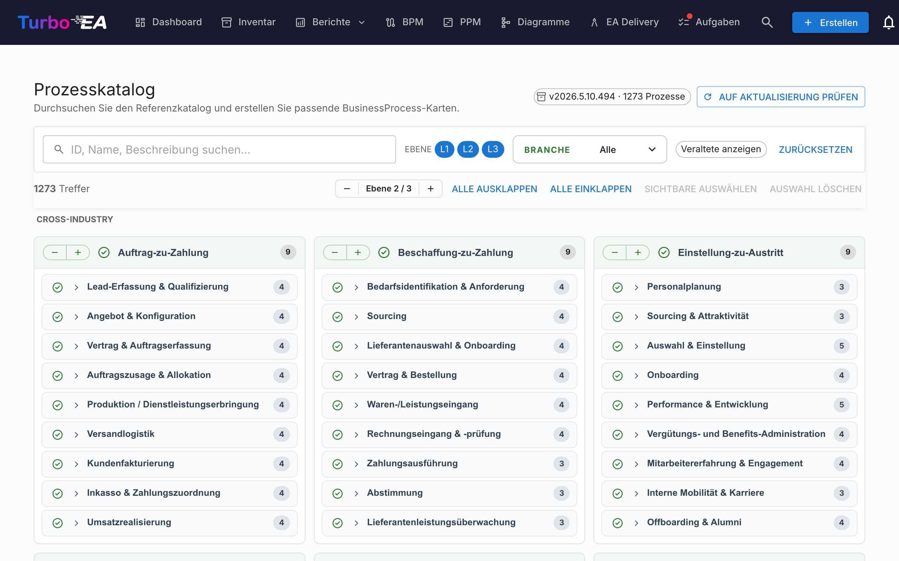

# Prozesskatalog

Turbo EA wird mit dem **Geschäftsprozess-Referenzkatalog** ausgeliefert — einem APQC-PCF-verankerten Prozessbaum, der zusammen mit dem Capability-Katalog unter [github.com/vincentmakes/turbo-ea-capabilities](https://github.com/vincentmakes/turbo-ea-capabilities) gepflegt wird. Die Seite Prozesskatalog erlaubt es, diese Referenz zu durchstöbern und passende `BusinessProcess`-Karten gebündelt anzulegen.

## Seite öffnen

Klicken Sie oben rechts in der App auf das Benutzersymbol, klappen Sie im Menü **Referenzkataloge** auf (der Bereich ist standardmäßig eingeklappt, um das Menü kompakt zu halten) und wählen Sie **Prozesskatalog**. Die Seite ist für alle Nutzer mit der Berechtigung `inventory.view` zugänglich.

## Was Sie sehen

- **Kopfzeile** — die aktive Katalogversion, die Anzahl der enthaltenen Prozesse und (für Administratoren) Schaltflächen, um nach Updates zu suchen und sie zu beziehen.
- **Filterleiste** — Volltextsuche über ID, Name, Beschreibung und Aliase, dazu Ebenen-Chips (L1 → L4 — Kategorie → Prozessgruppe → Prozess → Aktivität, analog zum APQC PCF), eine Mehrfachauswahl Branchen sowie ein Schalter „Veraltete anzeigen".
- **Aktionsleiste** — Trefferzähler, globaler Ebenen-Stepper, alles auf-/zuklappen, Sichtbare auswählen, Auswahl löschen.
- **L1-Raster** — eine Karte pro L1-Prozesskategorie, gruppiert unter Branchen-Überschriften. **Cross-Industry**-Prozesse stehen ganz oben angeheftet; alle weiteren Branchen folgen alphabetisch.

## Prozesse auswählen

Setzen Sie das Häkchen neben einem Prozess, um ihn zur Auswahl hinzuzufügen. Die Auswahl kaskadiert wie im Capability-Katalog nach unten — ein Häkchen fügt den Knoten plus alle auswählbaren Nachfahren hinzu, ein Entfernen entfernt denselben Teilbaum. Vorfahren werden niemals berührt.

Prozesse, die **bereits existieren**, erscheinen mit einem **grünen Häkchen** statt einer Checkbox. Der Abgleich nutzt vorzugsweise den `attributes.catalogueId`-Stempel aus früheren Importen und fällt sonst auf einen Namensvergleich (ohne Groß-/Kleinschreibung) zurück.

## Karten gebündelt anlegen

Sobald mindestens ein Prozess ausgewählt ist, erscheint am unteren Seitenrand eine angeheftete Schaltfläche **N Prozesse anlegen**. Sie nutzt die normale Berechtigung `inventory.create`.

Bei der Bestätigung legt Turbo EA:

- pro ausgewähltem Eintrag eine `BusinessProcess`-Karte an, deren **Subtyp** sich aus der Katalogebene ergibt: L1 → `Process Category`, L2 → `Process Group`, L3 / L4 → `Process`.
- die Katalog-Hierarchie über `parent_id`.
- **Automatisch `relProcessToBC`-Beziehungen (unterstützt)** zu jeder existierenden `BusinessCapability`-Karte aus der Liste `realizes_capability_ids` des Prozesses an. Der Ergebnisdialog meldet, wie viele Beziehungen erstellt wurden; Ziele, die noch nicht im Inventar sind, werden stillschweigend übersprungen. Ein erneuter Import nach dem Anlegen der fehlenden Capabilities ist sicher — die Quell-IDs sind auf der Karte gespeichert, sodass Sie bei Bedarf manuell nachverknüpfen können.
- jede neue Karte mit `catalogueId`, `catalogueVersion`, `catalogueImportedAt`, `processLevel` (`L1`..`L4`) sowie den `frameworkRefs`, `industry`, `references`, `inScope`, `outOfScope`, `realizesCapabilityIds` aus dem Katalog stempelt.

Übersprungene, erstellte und neu verknüpfte Anzahlen werden gleich wie im Capability-Katalog gemeldet. Imports sind idempotent — ein erneutes Ausführen erzeugt keine Duplikate.

## Detailansicht

Klicken Sie auf einen Prozessnamen, um einen Detaildialog mit Breadcrumb, Beschreibung, Branche, Aliasen, Referenzen und einer vollständig aufgeklappten Sicht des Teilbaums zu öffnen. Im Prozesskatalog zeigt das Detailpanel zusätzlich:

- **Framework-Referenzen** — APQC-PCF / BIAN / eTOM / ITIL / SCOR-Kennungen aus den `framework_refs` des Katalogs.
- **Realisiert Capabilities** — die BC-IDs, die der Prozess realisiert (eine Chip-Liste), damit Sie fehlende Capability-Karten auf einen Blick erkennen.

## Katalog aktualisieren (Administratoren)

Der Katalog wird **gebündelt** als Python-Abhängigkeit ausgeliefert, sodass die Seite offline bzw. in Air-Gap-Umgebungen funktioniert. Administratoren (`admin.metamodel`) können auf Anforderung eine neuere Version per **Nach Update suchen** → **v… holen** ziehen. Derselbe Wheel-Download befüllt die Caches des Capability- und Wertstrom-Katalogs gleich mit, sodass das Aktualisieren eines der drei Referenzkataloge alle drei auffrischt.

Die PyPI-Index-URL ist über die Umgebungsvariable `CAPABILITY_CATALOGUE_PYPI_URL` konfigurierbar (der Variablenname wird von allen drei Katalogen geteilt — das Wheel deckt alle drei ab).
