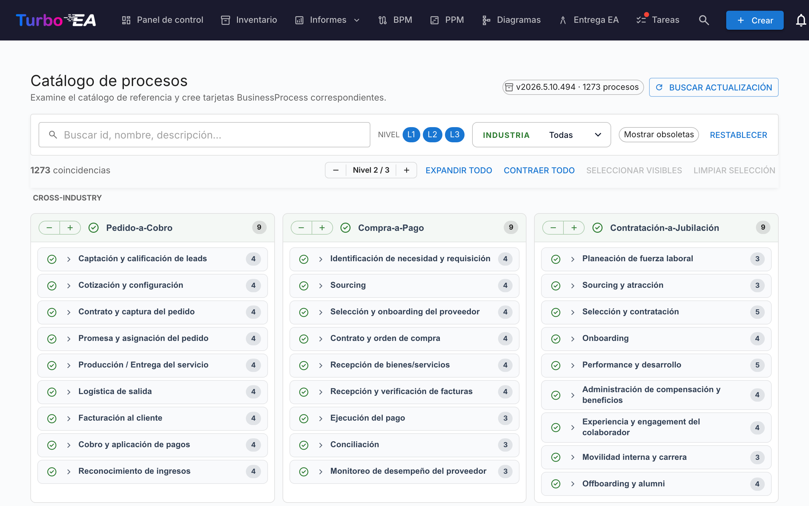

# Catálogo de procesos

Turbo EA incluye el **Catálogo de referencia de procesos de negocio** — un árbol de procesos anclado en APQC-PCF que se mantiene junto al catálogo de capacidades en [github.com/vincentmakes/turbo-ea-capabilities](https://github.com/vincentmakes/turbo-ea-capabilities). La página Catálogo de procesos permite recorrer esta referencia y crear de forma masiva las tarjetas `BusinessProcess` correspondientes.

## Abrir la página

Pulse el icono de usuario en la esquina superior derecha de la aplicación, despliegue **Catálogos de referencia** en el menú (la sección está plegada por defecto para mantener el menú compacto) y pulse **Catálogo de procesos**. La página es accesible para cualquier usuario con el permiso `inventory.view`.

## Qué se ve

- **Cabecera** — la versión activa del catálogo, el número de procesos que contiene y (para administradores) controles para comprobar y descargar actualizaciones.
- **Barra de filtros** — búsqueda libre sobre identificador, nombre, descripción y alias, además de chips de nivel (L1 → L4 — Categoría → Grupo de procesos → Proceso → Actividad, en línea con APQC PCF), un selector múltiple de industria y un interruptor «Mostrar obsoletos».
- **Barra de acciones** — contadores de coincidencias, el selector global de nivel, expandir/colapsar todo, seleccionar visibles, limpiar selección.
- **Cuadrícula L1** — una tarjeta por categoría de proceso L1, agrupadas bajo encabezados de industria. Los procesos **transversales** (Cross-Industry) se anclan arriba; el resto de industrias siguen por orden alfabético.

## Seleccionar procesos

Marque la casilla junto a un proceso para añadirlo a la selección. La selección cascadea por el subárbol igual que en el catálogo de capacidades — marcar un nodo añade ese nodo más todos sus descendientes seleccionables; desmarcarlo elimina ese mismo subárbol. Los ancestros nunca se tocan.

Los procesos que **ya existen** en su inventario aparecen con un **icono de visto verde** en lugar de casilla. La coincidencia prefiere el sello `attributes.catalogueId` que dejó un import anterior y, en su defecto, recurre a una comparación de nombre sin distinguir mayúsculas.

## Crear tarjetas en masa

En cuanto haya uno o más procesos seleccionados, aparece un botón anclado al pie de la página: **Crear N procesos**. Usa el permiso `inventory.create` habitual.

Al confirmar, Turbo EA:

- crea una tarjeta `BusinessProcess` por cada entrada seleccionada, con el **subtipo** derivado del nivel del catálogo: L1 → `Process Category`, L2 → `Process Group`, L3 / L4 → `Process`;
- preserva la jerarquía del catálogo mediante `parent_id`;
- **crea automáticamente relaciones `relProcessToBC` (soporta)** hacia cada tarjeta `BusinessCapability` existente listada en `realizes_capability_ids` del proceso. El diálogo de resultado indica cuántas auto-relaciones se generaron; los destinos que aún no existen en el inventario se omiten en silencio. Volver a ejecutar el import tras añadir las capacidades faltantes es seguro — los IDs de origen quedan guardados en la tarjeta, lo que permite re-vincular manualmente más tarde si hace falta;
- sella cada tarjeta nueva con `catalogueId`, `catalogueVersion`, `catalogueImportedAt`, `processLevel` (`L1`..`L4`) y los `frameworkRefs`, `industry`, `references`, `inScope`, `outOfScope`, `realizesCapabilityIds` del catálogo.

Los recuentos de saltadas, creadas y re-vinculadas se reportan igual que en el catálogo de capacidades. Los imports son idempotentes — repetirlos no crea duplicados.

## Vista detalle

Pulse el nombre de cualquier proceso para abrir un diálogo de detalle con su miga de pan, descripción, industria, alias, referencias y una vista totalmente expandida de su subárbol. En el catálogo de procesos, el panel de detalle muestra además:

- **Referencias de marcos** — identificadores APQC-PCF / BIAN / eTOM / ITIL / SCOR procedentes de `framework_refs` del catálogo.
- **Realiza capacidades** — los IDs de las BC que el proceso realiza (un chip por id), para detectar de un vistazo las tarjetas de capacidad que faltan.

## Actualizar el catálogo (administradores)

El catálogo se entrega **empaquetado** como dependencia de Python, por lo que la página funciona sin conexión / en despliegues aislados. Los administradores (`admin.metamodel`) pueden traer una versión más reciente bajo demanda mediante **Buscar actualización** → **Obtener v…**. La misma descarga del wheel hidrata simultáneamente las cachés de los catálogos de capacidades y de cadenas de valor, por lo que actualizar uno de los tres catálogos de referencia desde cualquiera de sus páginas refresca los tres.

La URL de índice PyPI se configura mediante la variable de entorno `CAPABILITY_CATALOGUE_PYPI_URL` (el nombre se comparte entre los tres catálogos — el wheel los cubre todos).
