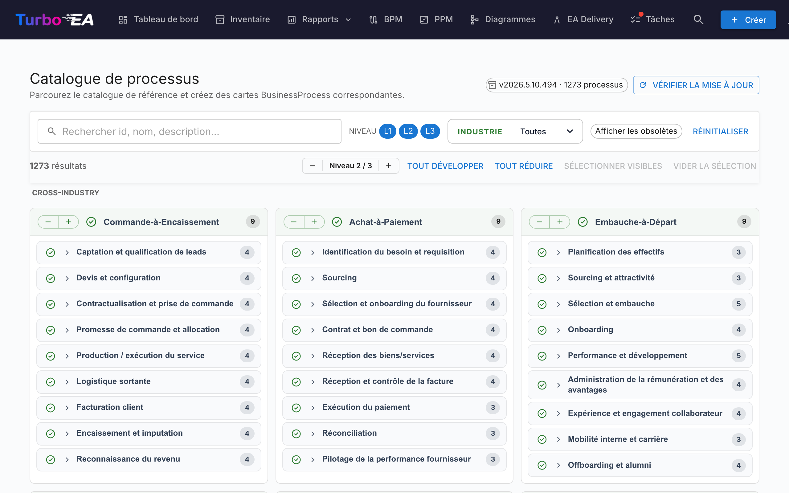

# Catalogue de processus

Turbo EA est livré avec le **Catalogue de référence des processus métier** — une arborescence de processus calée sur APQC-PCF, maintenue aux côtés du catalogue de capacités sur [github.com/vincentmakes/turbo-ea-capabilities](https://github.com/vincentmakes/turbo-ea-capabilities). La page Catalogue de processus permet de parcourir cette référence et de créer en masse les cartes `BusinessProcess` correspondantes.

## Ouvrir la page

Cliquez sur l'icône utilisateur en haut à droite de l'application, dépliez **Catalogues de référence** dans le menu (la section est repliée par défaut pour garder le menu compact), puis cliquez sur **Catalogue de processus**. La page est accessible à toute personne disposant de la permission `inventory.view`.

## Ce que vous voyez

- **En-tête** — la version active du catalogue, le nombre de processus qu'il contient et (pour les administrateurs) les commandes pour vérifier et récupérer les mises à jour.
- **Barre de filtres** — recherche plein texte sur l'identifiant, le nom, la description et les alias, plus des pastilles de niveau (L1 → L4 — Catégorie → Groupe de processus → Processus → Activité, calquées sur APQC PCF), une sélection multiple par secteur, et un interrupteur « Afficher les obsolètes ».
- **Barre d'actions** — compteurs de correspondances, le sélecteur global de niveau, tout déplier/replier, sélectionner les visibles, vider la sélection.
- **Grille L1** — une carte par catégorie de processus L1, regroupée sous des en-têtes de secteur. Les processus **inter-secteurs** sont épinglés en haut ; les autres secteurs suivent par ordre alphabétique.

## Sélectionner des processus

Cochez la case d'un processus pour l'ajouter à la sélection. La sélection cascade dans le sous-arbre comme dans le catalogue de capacités — cocher un nœud ajoute ce nœud plus tous ses descendants sélectionnables ; décocher retire ce même sous-arbre. Les ancêtres ne sont jamais touchés.

Les processus qui **existent déjà** dans votre inventaire apparaissent avec une **coche verte** au lieu d'une case. La correspondance privilégie le tampon `attributes.catalogueId` posé par un précédent import et retombe sur une comparaison de nom insensible à la casse.

## Créer des cartes en masse

Dès qu'un processus est sélectionné, un bouton fixé en bas de page **Créer N processus** apparaît. Il utilise la permission `inventory.create` habituelle.

À la confirmation, Turbo EA :

- crée une carte `BusinessProcess` par entrée sélectionnée, avec le **sous-type** dérivé du niveau du catalogue : L1 → `Process Category`, L2 → `Process Group`, L3 / L4 → `Process` ;
- préserve la hiérarchie du catalogue via `parent_id` ;
- **crée automatiquement des relations `relProcessToBC` (« supporte »)** vers chaque carte `BusinessCapability` existante mentionnée dans `realizes_capability_ids` du processus. La boîte de dialogue de résultat indique combien d'auto-relations ont été créées ; les cibles encore absentes de l'inventaire sont ignorées en silence. Relancer l'import après avoir ajouté les capacités manquantes est sans danger — ces identifiants sources sont conservés sur la carte pour un re-link manuel ultérieur ;
- estampille chaque nouvelle carte avec `catalogueId`, `catalogueVersion`, `catalogueImportedAt`, `processLevel` (`L1`..`L4`), et les `frameworkRefs`, `industry`, `references`, `inScope`, `outOfScope`, `realizesCapabilityIds` issus du catalogue.

Les compteurs « ignoré », « créé » et « ré-lié » sont rapportés comme pour le catalogue de capacités. Les imports sont idempotents — relancer ne crée pas de doublons.

## Vue détail

Cliquez sur le nom d'un processus pour ouvrir une boîte de dialogue détail montrant son fil d'Ariane, sa description, son secteur, ses alias, ses références et une vue entièrement dépliée de son sous-arbre. Pour le catalogue de processus, le panneau de détail affiche en plus :

- **Références cadres** — identifiants APQC-PCF / BIAN / eTOM / ITIL / SCOR portés dans `framework_refs` du catalogue.
- **Réalise les capacités** — les identifiants des capacités que le processus réalise (une pastille par identifiant), pour repérer d'un coup d'œil les cartes manquantes.

## Mettre à jour le catalogue (administrateurs)

Le catalogue est **embarqué** sous forme de dépendance Python, si bien que la page fonctionne hors ligne / dans des déploiements coupés du réseau. Les administrateurs (`admin.metamodel`) peuvent récupérer à la demande une version plus récente via **Vérifier les mises à jour** → **Récupérer v…**. Le même téléchargement de wheel hydrate en même temps les caches des catalogues de capacités et de chaînes de valeur, donc mettre à jour l'un des trois catalogues de référence depuis n'importe laquelle de ses pages les rafraîchit tous.

L'URL d'index PyPI est configurable via la variable d'environnement `CAPABILITY_CATALOGUE_PYPI_URL` (le nom est partagé entre les trois catalogues — le wheel les couvre tous).
