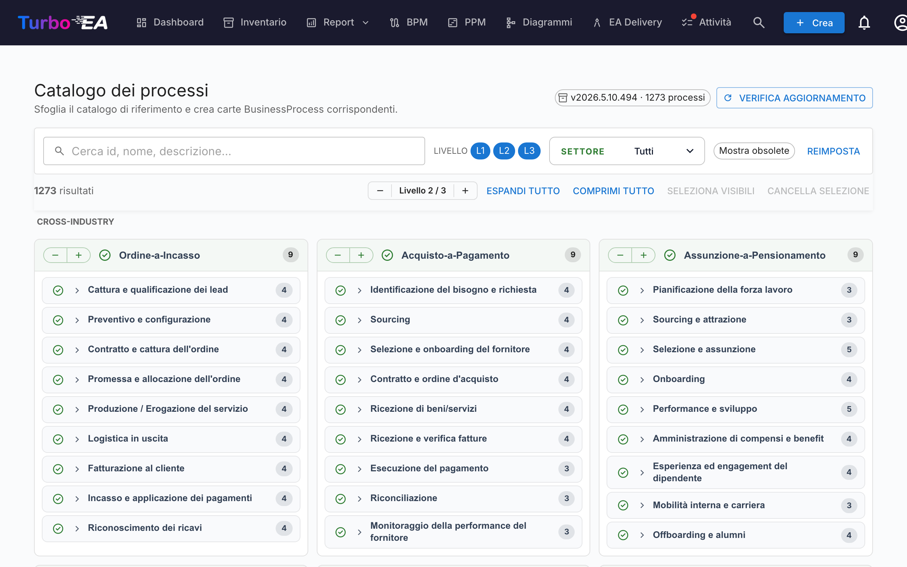

# Catalogo dei processi

Turbo EA include il **Catalogo di riferimento dei processi di business** — un albero di processi ancorato ad APQC-PCF, mantenuto insieme al catalogo delle capacità su [github.com/vincentmakes/turbo-ea-capabilities](https://github.com/vincentmakes/turbo-ea-capabilities). La pagina Catalogo dei processi permette di sfogliare questa raccolta e di creare in massa le carte `BusinessProcess` corrispondenti.

## Aprire la pagina

Cliccate sull'icona utente in alto a destra nell'app, espandete **Cataloghi di riferimento** nel menu (la sezione è chiusa per impostazione predefinita per mantenere il menu compatto) e cliccate su **Catalogo dei processi**. La pagina è accessibile a chiunque disponga del permesso `inventory.view`.

## Cosa vedete

- **Intestazione** — la versione attiva del catalogo, il numero di processi contenuti e (per gli amministratori) i comandi per cercare e scaricare aggiornamenti.
- **Barra dei filtri** — ricerca a testo libero su id, nome, descrizione e alias, oltre a chip di livello (L1 → L4 — Categoria → Gruppo di processi → Processo → Attività, in linea con APQC PCF), una selezione multipla di settore e un interruttore «Mostra obsoleti».
- **Barra delle azioni** — contatori delle corrispondenze, lo stepper globale di livello, espandi/comprimi tutto, seleziona i visibili, pulisci selezione.
- **Griglia L1** — una scheda per ogni categoria di processo L1, raggruppate sotto intestazioni di settore. I processi **trasversali** (Cross-Industry) sono fissati in alto; gli altri settori seguono in ordine alfabetico.

## Selezionare i processi

Spuntate la casella accanto a un processo per aggiungerlo alla selezione. La selezione si propaga nel sottoalbero come nel catalogo delle capacità — spuntare un nodo aggiunge quel nodo e tutti i discendenti selezionabili; togliere la spunta rimuove lo stesso sottoalbero. Gli antenati non vengono mai toccati.

I processi che **esistono già** nel vostro inventario compaiono con un'**icona di spunta verde** al posto della casella. L'abbinamento privilegia il marchio `attributes.catalogueId` lasciato da un import precedente e, in mancanza, ricade su un confronto del nome senza distinzione maiuscole/minuscole.

## Creare carte in massa

Non appena è selezionato almeno un processo, in fondo alla pagina compare un pulsante fisso **Crea N processi**. Utilizza il normale permesso `inventory.create`.

Alla conferma, Turbo EA:

- crea una carta `BusinessProcess` per ogni voce selezionata, con il **sottotipo** derivato dal livello del catalogo: L1 → `Process Category`, L2 → `Process Group`, L3 / L4 → `Process`;
- preserva la gerarchia del catalogo tramite `parent_id`;
- **crea automaticamente relazioni `relProcessToBC` (supporta)** verso ogni carta `BusinessCapability` esistente elencata in `realizes_capability_ids` del processo. Il dialogo di esito indica quante auto-relazioni sono state generate; i target ancora assenti dall'inventario vengono saltati in silenzio. Rieseguire l'import dopo aver aggiunto le capacità mancanti è sicuro — gli id di origine restano sulla carta, così potete ricollegarli manualmente in seguito;
- timbra ogni carta nuova con `catalogueId`, `catalogueVersion`, `catalogueImportedAt`, `processLevel` (`L1`..`L4`) e i `frameworkRefs`, `industry`, `references`, `inScope`, `outOfScope`, `realizesCapabilityIds` provenienti dal catalogo.

I conteggi di saltati, creati e ri-collegati sono riportati come per il catalogo delle capacità. Gli import sono idempotenti — rieseguirli non genera duplicati.

## Vista dettaglio

Cliccate sul nome di un processo per aprire un dialogo di dettaglio con il percorso, la descrizione, il settore, gli alias, le referenze e una vista interamente espansa del suo sottoalbero. Nel catalogo dei processi il pannello mostra inoltre:

- **Referenze di framework** — identificativi APQC-PCF / BIAN / eTOM / ITIL / SCOR portati nel `framework_refs` del catalogo.
- **Realizza capacità** — gli id delle BC che il processo realizza (un chip per id), per individuare a colpo d'occhio le carte di capacità mancanti.

## Aggiornare il catalogo (amministratori)

Il catalogo viene fornito **integrato** come dipendenza Python, perciò la pagina funziona offline / in installazioni isolate dalla rete. Gli amministratori (`admin.metamodel`) possono prelevare a richiesta una versione più recente tramite **Verifica aggiornamenti** → **Scarica v…**. Lo stesso download del wheel reidrata contemporaneamente le cache dei cataloghi di capacità e flussi di valore, perciò aggiornare uno qualunque dei tre cataloghi di riferimento da una qualsiasi delle tre pagine li aggiorna tutti.

L'URL dell'indice PyPI è configurabile tramite la variabile d'ambiente `CAPABILITY_CATALOGUE_PYPI_URL` (il nome è condiviso fra i tre cataloghi — il wheel li copre tutti).
