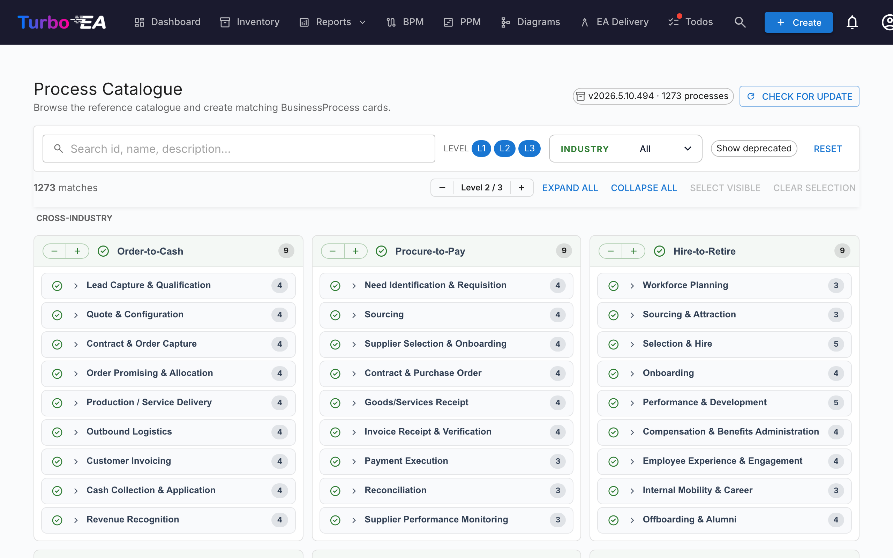

# Process Catalogue

Turbo EA ships with the **Business Process Reference Catalogue** — an APQC-PCF-anchored process tree maintained alongside the capability catalogue at [github.com/vincentmakes/turbo-ea-capabilities](https://github.com/vincentmakes/turbo-ea-capabilities). The Process Catalogue page lets you browse this reference and create matching `BusinessProcess` cards in bulk.

## Opening the page

Click the user icon in the top-right corner of the app, expand **Reference Catalogues** in the menu (the section is collapsed by default to keep the menu compact), then click **Process Catalogue**. The page is available to anyone with the `inventory.view` permission.

## What you see

- **Header** — the active catalogue version, the number of processes it contains, and (for admins) controls to check for and fetch updates.
- **Filter bar** — full-text search across id, name, description and aliases, plus level chips (L1 → L4 — Category → Process Group → Process → Activity, mirroring APQC PCF), an industry multi-select, and a "Show deprecated" toggle.
- **Action bar** — match counters, the global level stepper, expand/collapse all, select-visible, clear selection.
- **L1 grid** — one card per L1 process category, grouped under industry headings. **Cross-Industry** processes pin to the top; other industries follow alphabetically.

## Selecting processes

Tick the checkbox next to any process to add it to the selection. Selection cascades down the subtree the same way as the capability catalogue — ticking a node adds it plus every selectable descendant; unticking removes the same subtree. Ancestors are never touched.

Processes that **already exist** in your inventory appear with a **green check icon** instead of a checkbox. Matching prefers the `attributes.catalogueId` stamp left by a previous import and falls back to a case-insensitive display-name match.

## Mass-creating cards

When you have one or more processes selected, a sticky **Create N processes** button appears at the bottom of the page. It uses the regular `inventory.create` permission.

On confirmation, Turbo EA:

- Creates one `BusinessProcess` card per selected entry, with the **subtype** chosen from the catalogue level: L1 → `Process Category`, L2 → `Process Group`, L3 / L4 → `Process`.
- Preserves the catalogue hierarchy via `parent_id`.
- **Auto-creates `relProcessToBC` (supports) relations** to every existing `BusinessCapability` card listed in the process's `realizes_capability_ids`. The result dialog reports how many auto-relations landed; targets that don't yet exist in your inventory are skipped silently. Re-running the import after later importing the missing capabilities is safe — those source IDs are stored on the card so you can re-link manually if needed.
- Stamps each new card's `attributes` with `catalogueId`, `catalogueVersion`, `catalogueImportedAt`, `processLevel` (`L1`..`L4`), and the source `frameworkRefs`, `industry`, `references`, `inScope`, `outOfScope`, `realizesCapabilityIds` from the catalogue.

Skipped, created, and re-linked counts are reported the same way as for the capability catalogue. Imports are idempotent — re-running won't duplicate cards.

## Detail view

Click any process name to open a detail dialog showing its breadcrumb, description, industry, aliases, references, and a fully-expanded view of its subtree. The Process Catalogue detail panel additionally shows:

- **Framework references** — APQC-PCF / BIAN / eTOM / ITIL / SCOR identifiers carried in the catalogue's `framework_refs`.
- **Realizes capabilities** — the BC IDs the process realises (a chip per id), so you can spot missing capability cards at a glance.

## Updating the catalogue (admins)

The catalogue ships **bundled** as a Python dependency, so the page works offline / in airgapped deployments. Admins (`admin.metamodel`) can pull a newer version on demand via **Check for update** → **Fetch v…**. The same wheel download hydrates the capability and value-stream caches at the same time, so updating any one of the three reference catalogues from any of the three pages refreshes them all.

The PyPI index URL is configurable via the `CAPABILITY_CATALOGUE_PYPI_URL` environment variable (the variable name is shared across all three catalogues — the wheel covers them all).
