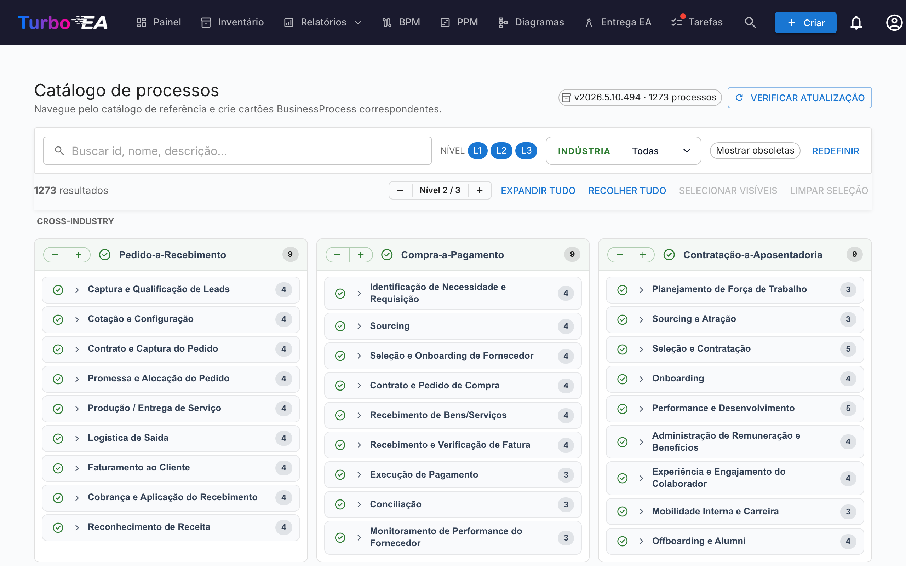

# Catálogo de processos

O Turbo EA inclui o **Catálogo de referência de processos de negócio** — uma árvore de processos ancorada em APQC-PCF, mantida juntamente com o catálogo de capacidades em [github.com/vincentmakes/turbo-ea-capabilities](https://github.com/vincentmakes/turbo-ea-capabilities). A página Catálogo de processos permite percorrer esta referência e criar em massa as cartas `BusinessProcess` correspondentes.

## Abrir a página

Clique no ícone de utilizador no canto superior direito da aplicação, expanda **Catálogos de referência** no menu (a secção começa recolhida para manter o menu compacto) e clique em **Catálogo de processos**. A página está disponível para qualquer pessoa com a permissão `inventory.view`.

## O que vê

- **Cabeçalho** — a versão ativa do catálogo, o número de processos que contém e (para administradores) controlos para verificar e obter atualizações.
- **Barra de filtros** — pesquisa em texto livre por id, nome, descrição e alias, mais chips de nível (L1 → L4 — Categoria → Grupo de processos → Processo → Atividade, em linha com APQC PCF), uma seleção múltipla de indústria e um interruptor «Mostrar obsoletos».
- **Barra de ações** — contadores de correspondências, o seletor global de nível, expandir/recolher tudo, selecionar visíveis, limpar seleção.
- **Grelha L1** — um cartão por categoria de processo L1, agrupados sob cabeçalhos de indústria. Os processos **transversais** (Cross-Industry) ficam fixados no topo; as restantes indústrias seguem por ordem alfabética.

## Selecionar processos

Marque a caixa junto a um processo para o adicionar à seleção. A seleção propaga-se em cascata pelo subárvore como no catálogo de capacidades — marcar um nó adiciona esse nó e todos os descendentes selecionáveis; desmarcar remove a mesma subárvore. Os ascendentes nunca são tocados.

Os processos que **já existem** no seu inventário aparecem com um **visto verde** em vez de uma caixa. A correspondência prefere a marca `attributes.catalogueId` deixada por um import anterior e, na ausência dela, recorre a uma comparação de nome sem distinguir maiúsculas.

## Criar cartas em massa

Assim que tenha um ou mais processos selecionados, surge no fundo da página um botão fixo **Criar N processos**. Utiliza a permissão habitual `inventory.create`.

Ao confirmar, o Turbo EA:

- cria um cartão `BusinessProcess` por cada entrada selecionada, com o **subtipo** derivado do nível do catálogo: L1 → `Process Category`, L2 → `Process Group`, L3 / L4 → `Process`;
- preserva a hierarquia do catálogo via `parent_id`;
- **cria automaticamente relações `relProcessToBC` (suporta)** para cada carta `BusinessCapability` existente listada em `realizes_capability_ids` do processo. O diálogo de resultado indica quantas auto-relações foram criadas; os destinos que ainda não existem no inventário são ignorados em silêncio. Voltar a executar o import depois de adicionar as capacidades em falta é seguro — os ids de origem ficam guardados no cartão, permitindo religar manualmente mais tarde se necessário;
- carimba cada novo cartão com `catalogueId`, `catalogueVersion`, `catalogueImportedAt`, `processLevel` (`L1`..`L4`) e os `frameworkRefs`, `industry`, `references`, `inScope`, `outOfScope`, `realizesCapabilityIds` do catálogo.

Os totais de saltados, criados e religados são reportados tal como para o catálogo de capacidades. Os imports são idempotentes — repeti-los não gera duplicados.

## Vista de detalhe

Clique no nome de um processo para abrir um diálogo de detalhe com o caminho, descrição, indústria, alias, referências e uma vista totalmente expandida da sua subárvore. No catálogo de processos, o painel apresenta ainda:

- **Referências de frameworks** — identificadores APQC-PCF / BIAN / eTOM / ITIL / SCOR vindos de `framework_refs` do catálogo.
- **Realiza capacidades** — os ids das BC que o processo realiza (um chip por id), para identificar de relance os cartões de capacidade em falta.

## Atualizar o catálogo (administradores)

O catálogo é entregue **embutido** como dependência Python, pelo que a página funciona offline / em implementações isoladas da rede. Os administradores (`admin.metamodel`) podem ir buscar uma versão mais recente a pedido através de **Verificar atualizações** → **Obter v…**. O mesmo download do wheel hidrata simultaneamente as caches dos catálogos de capacidades e de cadeias de valor, pelo que atualizar um dos três catálogos de referência a partir de qualquer uma das três páginas refresca todos eles.

O URL de índice PyPI é configurável pela variável de ambiente `CAPABILITY_CATALOGUE_PYPI_URL` (o nome é partilhado pelos três catálogos — o wheel cobre os três).
