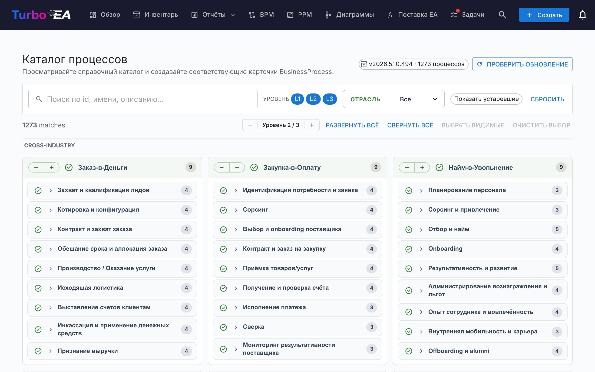

# Каталог процессов

Turbo EA поставляется со **Справочным каталогом бизнес-процессов** — деревом процессов на базе APQC-PCF, которое поддерживается вместе с каталогом способностей на [github.com/vincentmakes/turbo-ea-capabilities](https://github.com/vincentmakes/turbo-ea-capabilities). Страница «Каталог процессов» позволяет просматривать этот справочник и массово создавать соответствующие карточки `BusinessProcess`.

## Как открыть страницу

Нажмите значок пользователя в правом верхнем углу приложения, разверните в меню пункт «Справочные каталоги» (он свёрнут по умолчанию, чтобы меню оставалось компактным) и выберите «Каталог процессов». Страница доступна любому пользователю с разрешением `inventory.view`.

## Что вы видите

- **Заголовок** — индикатор активной версии каталога, количество содержащихся процессов и (для администраторов) кнопки проверки и получения обновлений.
- **Панель фильтров** — полнотекстовый поиск по идентификатору, названию, описанию и алиасам, а также чипы уровней (L1 → L4 — Категория → Группа процессов → Процесс → Действие, в соответствии с APQC PCF), множественный выбор отрасли и переключатель «Показывать устаревшие».
- **Панель действий** — счётчики совпадений, глобальный шаг по уровням, развернуть/свернуть всё, выбрать видимые, очистить выбор.
- **Сетка L1** — по карточке на каждую категорию L1, сгруппированные под заголовками отраслей. **Межотраслевые** (Cross-Industry) процессы закреплены сверху; остальные отрасли идут далее в алфавитном порядке.

## Выбор процессов

Поставьте галочку рядом с процессом, чтобы добавить его в выбор. Выбор каскадируется по поддереву так же, как в каталоге способностей: галочка на узле добавляет его и всех выбираемых потомков; снятие галочки удаляет то же поддерево. Предки никогда не затрагиваются.

Процессы, **уже существующие** в инвентаре, отображаются с **зелёной галочкой** вместо чекбокса. Сопоставление в первую очередь использует метку `attributes.catalogueId`, оставленную предыдущим импортом, и при её отсутствии переходит на сравнение названия без учёта регистра.

## Массовое создание карточек

Как только выбран хотя бы один процесс, внизу страницы появляется закреплённая кнопка «Создать N процессов». Она использует обычное разрешение `inventory.create`.

После подтверждения Turbo EA:

- создаёт по одной карточке `BusinessProcess` на каждую выбранную запись, причём **подтип** выводится из уровня каталога: L1 → `Process Category`, L2 → `Process Group`, L3 / L4 → `Process`;
- сохраняет иерархию каталога через `parent_id`;
- **автоматически создаёт связи `relProcessToBC` («поддерживает»)** к каждой существующей карточке `BusinessCapability`, упомянутой в `realizes_capability_ids` процесса. Диалог результата сообщает, сколько автосвязей получилось; цели, которых ещё нет в инвентаре, тихо пропускаются. Повторный импорт после добавления недостающих способностей безопасен — исходные ID хранятся на карточке, поэтому при необходимости связи можно восстановить вручную;
- ставит на каждой новой карточке метки `catalogueId`, `catalogueVersion`, `catalogueImportedAt`, `processLevel` (`L1`..`L4`) и значения `frameworkRefs`, `industry`, `references`, `inScope`, `outOfScope`, `realizesCapabilityIds` из каталога.

Счётчики пропущенных, созданных и переподвязанных карточек сообщаются так же, как в каталоге способностей. Импорты идемпотентны — повторный запуск не создаёт дубликатов.

## Подробный просмотр

Щёлкните по названию процесса, чтобы открыть диалог детализации с навигационной цепочкой, описанием, отраслью, алиасами, ссылками и полностью развернутым видом поддерева. В каталоге процессов панель дополнительно отображает:

- **Ссылки на фреймворки** — идентификаторы APQC-PCF / BIAN / eTOM / ITIL / SCOR из `framework_refs` каталога.
- **Реализует способности** — идентификаторы BC, которые реализует процесс (по чипу на каждый), чтобы с одного взгляда увидеть отсутствующие карточки способностей.

## Обновление каталога (администраторы)

Каталог поставляется **встроенным** в виде Python-зависимости, поэтому страница работает офлайн и в изолированных от сети развёртываниях. Администраторы (`admin.metamodel`) могут по запросу получить более свежую версию через «Проверить обновления» → «Получить v…». То же скачивание wheel-файла одновременно обновляет кэш каталогов способностей и потоков ценности, поэтому обновление любого из трёх справочных каталогов с любой из трёх страниц обновляет их все.

URL индекса PyPI настраивается через переменную окружения `CAPABILITY_CATALOGUE_PYPI_URL` (имя одно и то же для трёх каталогов — wheel покрывает все три).
