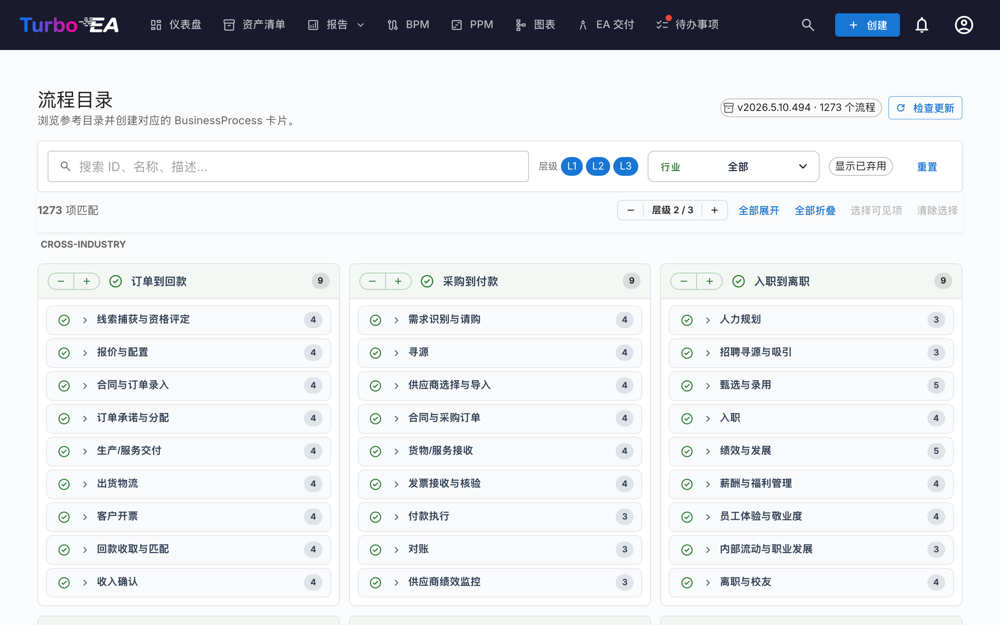

# 流程目录

Turbo EA 内置「**业务流程参考目录**」——一棵以 APQC-PCF 为基准的流程树,与能力目录一同维护在 [github.com/vincentmakes/turbo-ea-capabilities](https://github.com/vincentmakes/turbo-ea-capabilities)。流程目录页面让您浏览这份参考,并据此批量创建 `BusinessProcess` 卡片。

## 打开页面

点击应用右上角的用户图标,在菜单中展开「参考目录」(该分组默认折叠以保持菜单紧凑),然后点击「流程目录」。任何拥有 `inventory.view` 权限的用户都能访问此页面。

## 您会看到

- **标题区** — 当前生效的目录版本、其包含的流程数量,以及(对管理员而言)用于检查和获取更新的控件。
- **过滤栏** — 在 ID、名称、描述和别名之间进行全文搜索;层级筹码(L1 → L4 — 类别 → 流程组 → 流程 → 活动,与 APQC PCF 对齐);行业多选;以及「显示已弃用项」开关。
- **操作栏** — 匹配计数、全局层级步进器、全部展开/收起、选择可见、清除选择。
- **L1 网格** — 每个 L1 流程类别一张卡片,按行业标题分组。**跨行业**(Cross-Industry)流程置顶;其他行业按字母顺序排列。

## 选择流程

勾选流程旁的复选框即可加入选择。选择会沿子树向下级联,与能力目录一致——勾选某一节点会同时纳入该节点及其所有可选后代;取消勾选则移除同一子树。祖先节点不受影响。

库存中**已存在**的流程会以**绿色对勾图标**代替复选框。匹配优先使用以前导入时留下的 `attributes.catalogueId` 印记,否则退回到不区分大小写的显示名比对。

## 批量创建卡片

一旦选中一个或多个流程,页面底部会出现一个固定的「创建 N 个流程」按钮。它使用通常的 `inventory.create` 权限。

确认后,Turbo EA 会:

- 为每个选中的条目创建一张 `BusinessProcess` 卡片,**子类型**由目录层级决定:L1 → `Process Category`,L2 → `Process Group`,L3 / L4 → `Process`;
- 通过 `parent_id` 保留目录的层级结构;
- **自动创建 `relProcessToBC`(支持)关系**,指向流程 `realizes_capability_ids` 中列出的每一张已存在的 `BusinessCapability` 卡片。结果对话框会汇报落地的自动关系数量;尚未存在于库存中的目标会被静默跳过。导入缺失的能力之后再次运行该导入是安全的——源 ID 已记录在卡片上,必要时可手动重新关联;
- 在每张新卡片上加盖 `catalogueId`、`catalogueVersion`、`catalogueImportedAt`、`processLevel`(`L1`..`L4`),以及来自目录的 `frameworkRefs`、`industry`、`references`、`inScope`、`outOfScope`、`realizesCapabilityIds`。

跳过、创建和重新关联的计数与能力目录采用同样的方式汇报。导入是幂等的——重复运行不会生成重复卡片。

## 详情视图

点击任意流程名称即可打开详情对话框,显示其面包屑、描述、行业、别名、参考资料以及完整展开的子树视图。流程目录的详情面板还会额外显示:

- **框架参考** — 来自目录 `framework_refs` 的 APQC-PCF / BIAN / eTOM / ITIL / SCOR 标识。
- **实现的能力** — 流程所实现的 BC ID(每个 ID 一枚标签),便于一眼识别缺失的能力卡片。

## 更新目录(管理员)

目录以 Python 依赖形式**随版本一同发行**,因此该页面在离线 / 内网隔离的部署环境下亦可使用。管理员(`admin.metamodel`)可按需通过「检查更新」→「获取 v…」拉取更新。同一份 wheel 会一并补足能力目录与价值流目录的缓存,因此从这三份参考目录中的任意一页更新,都会同步刷新三者。

PyPI 索引 URL 可通过环境变量 `CAPABILITY_CATALOGUE_PYPI_URL` 配置(该变量名在三个目录之间共享——wheel 同时覆盖三者)。
