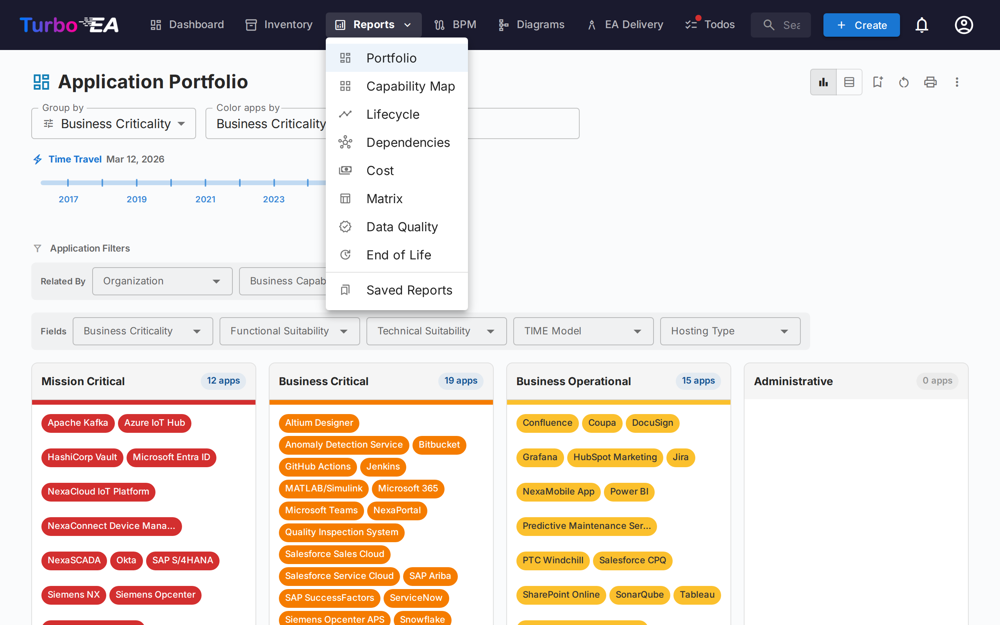
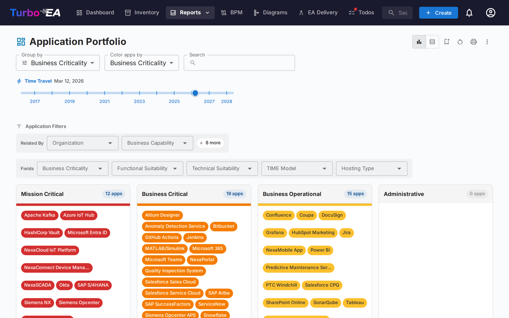
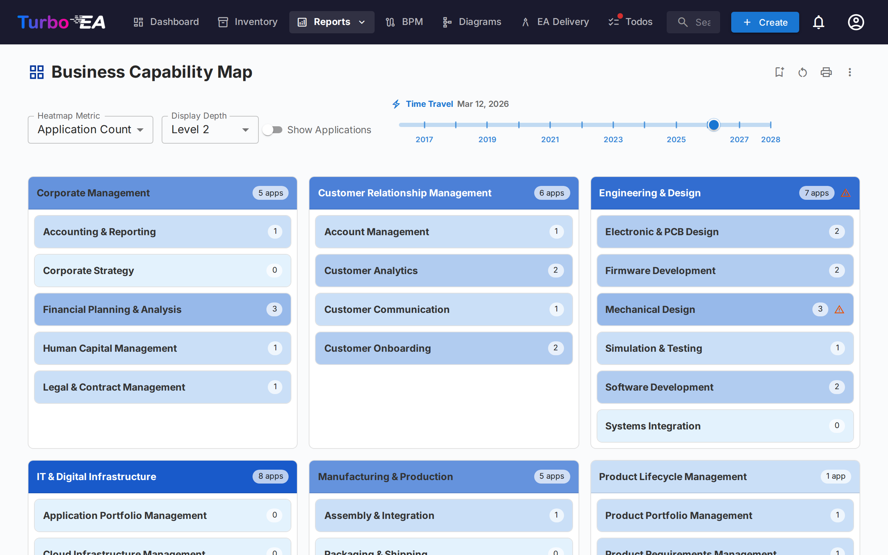
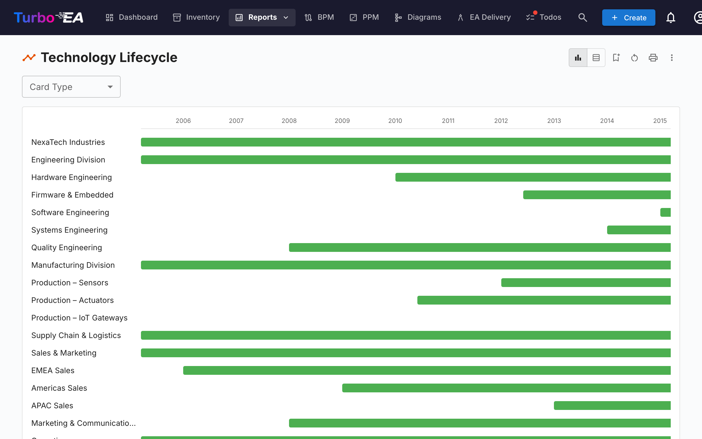
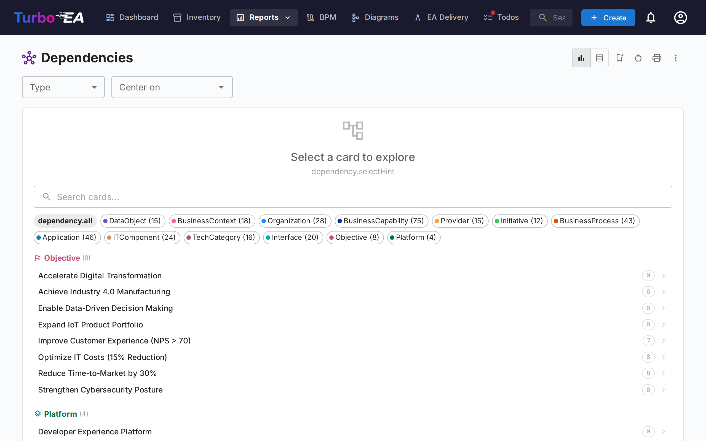
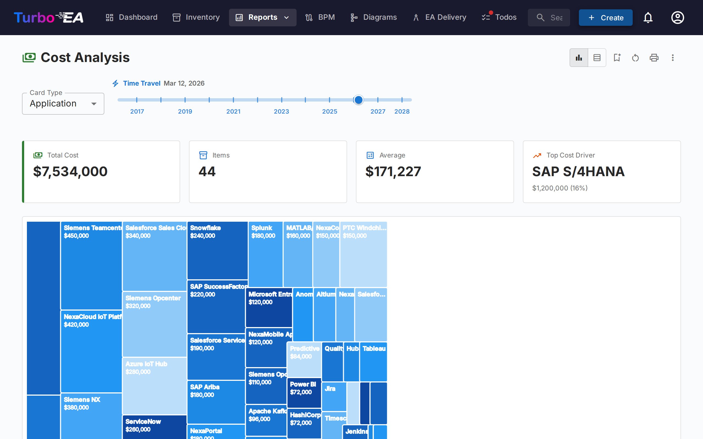
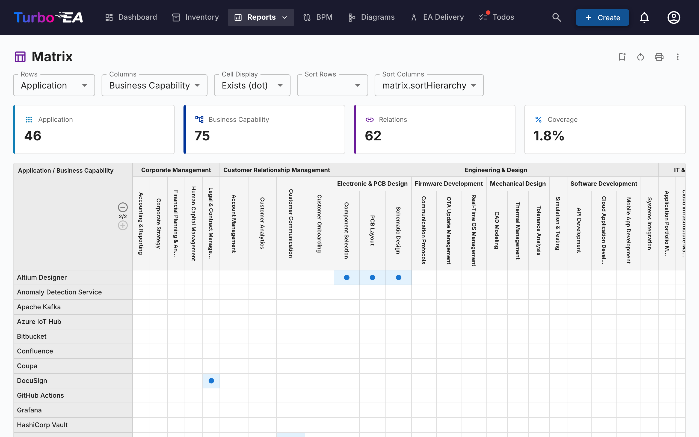
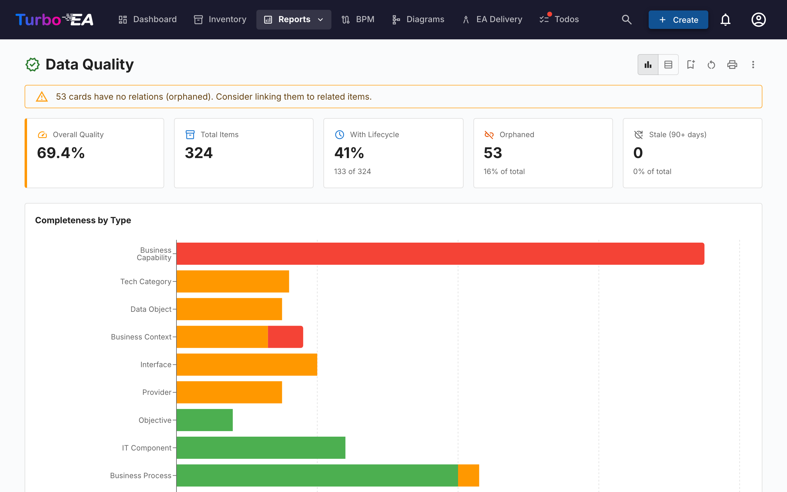
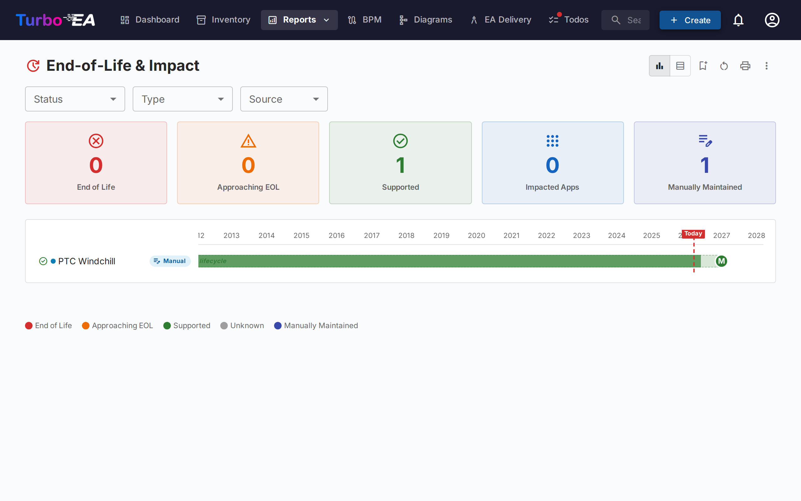
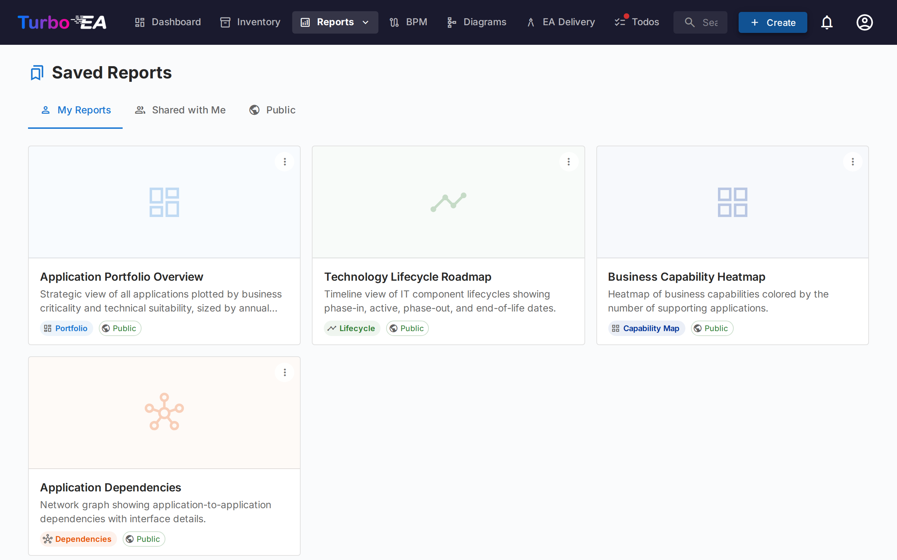

# Rapports

Turbo EA inclut un puissant module de **rapports visuels** permettant d'analyser l'architecture d'entreprise sous differents angles. Tous les rapports peuvent etre [sauvegardes pour reutilisation](saved-reports.md) avec leur configuration actuelle de filtres et d'axes.

## Rapport Portefeuille

Le **Rapport Portefeuille** affiche un **graphique a bulles** (ou nuage de points) configurable de vos fiches. Vous choisissez ce que chaque axe represente :

- **Axe X** -- Selectionnez n'importe quel champ numerique ou de selection (par ex. Adequation Technique)
- **Axe Y** -- Selectionnez n'importe quel champ numerique ou de selection (par ex. Criticite Metier)
- **Taille de la bulle** -- Associer a un champ numerique (par ex. Cout Annuel)
- **Couleur de la bulle** -- Associer a un champ de selection ou a l'etat du cycle de vie

C'est ideal pour l'analyse de portefeuille -- par exemple, positionner les applications par valeur metier vs adequation technique pour identifier les candidats a l'investissement, au remplacement ou au retrait.

## Carte de capacites

La **Carte de capacites** affiche une **carte thermique hierarchique** des capacites metier de l'organisation. Chaque bloc represente une capacite, avec :

- **Hierarchie** -- Les capacites principales contiennent leurs sous-capacites
- **Coloration thermique** -- Les blocs sont colores en fonction d'une metrique selectionnee (par ex. nombre d'applications de support, qualite moyenne des donnees, ou niveau de risque)
- **Cliquer pour explorer** -- Cliquez sur n'importe quelle capacite pour approfondir ses details et ses applications de support

## Rapport Cycle de vie

Le **Rapport Cycle de vie** affiche une **visualisation chronologique** indiquant quand les composants technologiques ont ete introduits et quand leur retrait est prevu. Essentiel pour :

- **Planification du retrait** -- Voir quels composants approchent de la fin de vie
- **Planification des investissements** -- Identifier les lacunes ou une nouvelle technologie est necessaire
- **Coordination des migrations** -- Visualiser les periodes de chevauchement entre mise en service et retrait progressif

Les composants sont affiches sous forme de barres horizontales couvrant leurs phases de cycle de vie : Planification, Mise en service, Actif, Retrait progressif et Fin de vie.

## Rapport Dependances

Le **Rapport Dependances** visualise les **connexions entre composants** sous forme de graphe reseau. Les noeuds representent les fiches et les aretes representent les relations. Fonctionnalites :

- **Controle de profondeur** -- Limiter le nombre de sauts depuis le noeud central a afficher (limitation de profondeur BFS)
- **Filtrage par type** -- Afficher uniquement des types de fiches et types de relations specifiques
- **Exploration interactive** -- Cliquer sur n'importe quel noeud pour recentrer le graphe sur cette fiche
- **Analyse d'impact** -- Comprendre le rayon d'impact des modifications sur un composant specifique

## Rapport Couts

Le **Rapport Couts** fournit une analyse financiere de votre paysage technologique :

- **Vue treemap** -- Rectangles imbriques dimensionnes par cout, avec regroupement optionnel (par ex. par organisation ou capacite)
- **Vue graphique a barres** -- Comparaison des couts entre composants
- **Agregation** -- Les couts peuvent etre additionnes a partir de fiches liees en utilisant des champs calcules

## Rapport Matrice

Le **Rapport Matrice** cree une **grille de references croisees** entre deux types de fiches. Par exemple :

- **Lignes** -- Applications
- **Colonnes** -- Capacites Metier
- **Cellules** -- Indiquent si une relation existe (et combien)

Ceci est utile pour identifier les lacunes de couverture (capacites sans applications de support) ou les redondances (capacites supportees par trop d'applications).

## Rapport Qualite des donnees

Le **Rapport Qualite des donnees** est un **tableau de bord de completude** qui montre a quel point vos donnees d'architecture sont bien renseignees. Base sur les poids des champs configures dans le metamodele :

- **Score global** -- Qualite moyenne des donnees sur toutes les fiches
- **Par type** -- Ventilation montrant quels types de fiches ont la meilleure/pire completude
- **Fiches individuelles** -- Liste des fiches avec la qualite de donnees la plus faible, priorisees pour amelioration

## Rapport Fin de vie (EOL)

Le **Rapport EOL** affiche le statut de support des produits technologiques lies via la fonctionnalite [Administration EOL](../admin/eol.md) :

- **Repartition des statuts** -- Combien de produits sont Supportes, Approchant la fin de vie, ou en Fin de vie
- **Chronologie** -- Quand les produits perdront leur support
- **Priorisation des risques** -- Se concentrer sur les composants critiques approchant la fin de vie

## Rapports sauvegardes

Sauvegardez n'importe quelle configuration de rapport pour un acces rapide ulterieur. Les rapports sauvegardes incluent un apercu en miniature et peuvent etre partages dans toute l'organisation.

## Carte de processus

La **Carte de processus** visualise le paysage des processus metier de l'organisation sous forme de carte structuree, montrant les categories de processus (Management, Coeur de metier, Support) et leurs relations hierarchiques.
