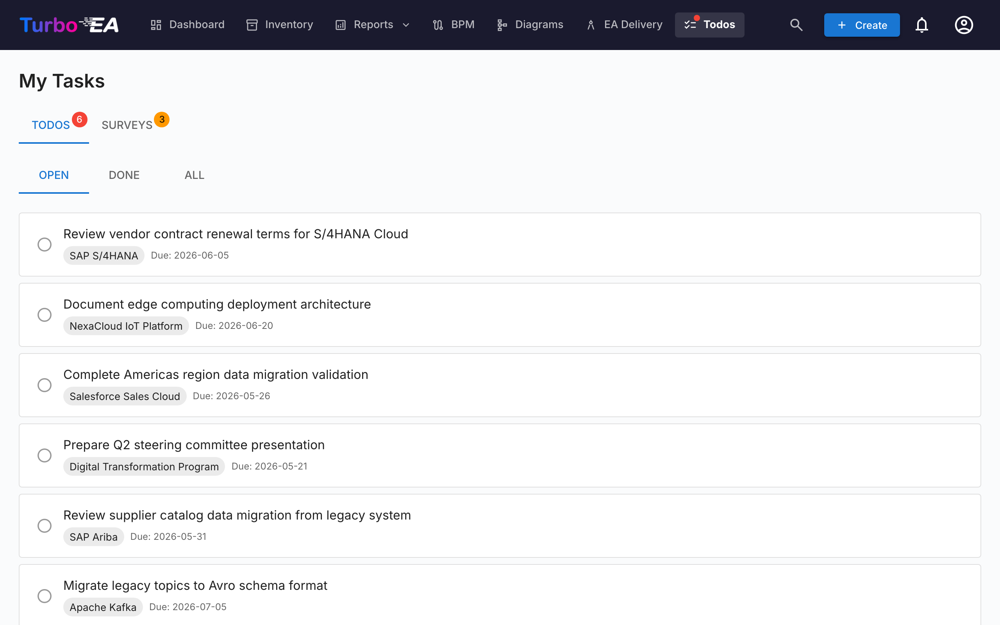

# Taches et enquetes

La page **Taches** centralise tous les elements de travail en attente en un seul endroit. Elle comporte deux onglets : **Mes taches** et **Mes enquetes**.

## Mes taches

Les taches sont des elements qui vous sont assignes ou que vous avez crees. Elles peuvent etre liees a des fiches specifiques ou etre autonomes.

### Filtrage

Utilisez les onglets de statut pour filtrer :

- **Ouvert** -- Taches encore en attente ou en cours
- **Termine** -- Taches terminees
- **Tout** -- Tout afficher

### Gestion des taches

- **Bascule rapide** -- Cliquez sur la case a cocher pour marquer une tache comme terminee (ou la reouvrir)
- **Lien vers la fiche** -- Si une tache est liee a une fiche, cliquez sur le nom de la fiche pour naviguer vers sa page de detail
- **Taches systeme** -- Certaines taches sont generees automatiquement par le systeme (par ex. « Repondre a l'enquete pour la fiche X »). Celles-ci incluent un lien direct vers l'action correspondante

### Creation de taches

Vous pouvez creer des taches depuis deux endroits :

1. **Depuis cette page** -- Cliquez sur **+ Nouvelle tache**, entrez un titre, definissez optionnellement un responsable, une date d'echeance et un lien vers une fiche
2. **Depuis l'onglet Taches d'une fiche** -- Creez une tache automatiquement liee a cette fiche

Chaque tache suit :

| Champ | Description |
|-------|-------------|
| **Titre** | Ce qui doit etre fait |
| **Statut** | Ouvert ou Termine |
| **Responsable** | L'utilisateur responsable |
| **Date d'echeance** | Delai optionnel |
| **Fiche** | La fiche liee (optionnel) |

## Mes enquetes

L'onglet **Enquetes** affiche toutes les enquetes de maintenance de donnees necessitant votre reponse. Les enquetes sont creees par les administrateurs pour collecter des informations aupres des parties prenantes sur des fiches specifiques (voir [Administration des enquetes](../admin/surveys.md)).

Chaque enquete en attente affiche :

- Le nom de l'enquete et la fiche cible
- Un bouton **Repondre** qui redirige vers le formulaire de reponse

Le formulaire de reponse a l'enquete presente les questions configurees par l'administrateur. Vos reponses peuvent automatiquement mettre a jour les attributs de la fiche, selon la configuration de l'enquete.
