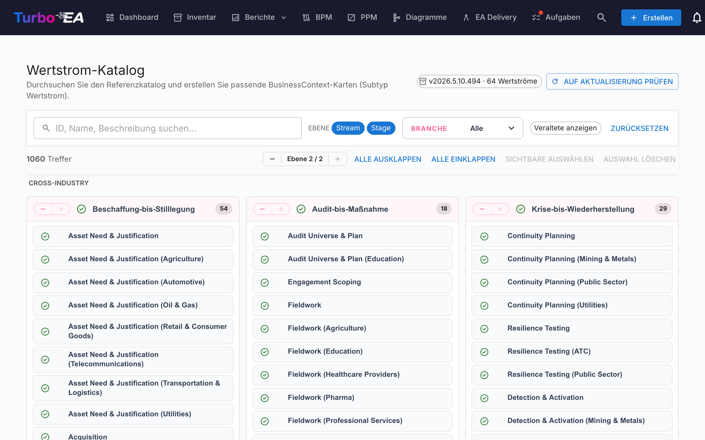

# Wertstrom-Katalog

Turbo EA wird mit dem **Wertstrom-Referenzkatalog** ausgeliefert — einer kuratierten Sammlung durchgängiger Wertströme (Acquire-to-Retire, Order-to-Cash, Hire-to-Retire, …), die zusammen mit den Capability- und Prozess-Katalogen unter [github.com/vincentmakes/turbo-ea-capabilities](https://github.com/vincentmakes/turbo-ea-capabilities) gepflegt wird. Jeder Strom ist in Stages aufgeteilt, die auf die von ihnen genutzten Capabilities und die sie realisierenden Prozesse verweisen — eine fertige Brücke zwischen Business-Architektur (Capabilities) und Prozessarchitektur (Prozesse).

Die Seite Wertstrom-Katalog erlaubt es, diese Referenz zu durchstöbern und passende `BusinessContext`-Karten (Subtyp **Value Stream**) gebündelt anzulegen.

## Seite öffnen

Klicken Sie oben rechts in der App auf das Benutzersymbol, klappen Sie im Menü **Referenzkataloge** auf (der Bereich ist standardmäßig eingeklappt, um das Menü kompakt zu halten) und wählen Sie **Wertstrom-Katalog**. Die Seite ist für alle Nutzer mit der Berechtigung `inventory.view` zugänglich.

## Was Sie sehen

- **Kopfzeile** — die aktive Katalogversion, die Anzahl der enthaltenen Wertströme und (für Administratoren) Schaltflächen, um nach Updates zu suchen und sie zu beziehen.
- **Filterleiste** — Volltextsuche über ID, Name, Beschreibung und Notizen, Ebenen-Chips (Stream / Stage), eine Mehrfachauswahl Branchen sowie ein Schalter „Veraltete anzeigen".
- **L1-Raster** — eine Karte pro Stream, mit den zugehörigen Stages als Kinder. Jede Stage trägt ihre Stage-Reihenfolge, eine optionale Branchenvariante und die IDs der Capabilities und Prozesse, die sie berührt.

## Wertströme auswählen

Setzen Sie das Häkchen neben einem Stream oder einer Stage, um sie zur Auswahl hinzuzufügen. Die Auswahl kaskadiert wie in den anderen Katalogen. **Das Auswählen einer Stage zieht beim Import automatisch ihren übergeordneten Stream mit**, sodass keine verwaisten Stages entstehen — selbst wenn Sie den Stream selbst nicht angekreuzt haben.

Streams und Stages, die **bereits existieren**, erscheinen mit einem **grünen Häkchen** statt einer Checkbox.

## Karten gebündelt anlegen

Sobald mindestens ein Stream oder eine Stage ausgewählt ist, erscheint am unteren Seitenrand eine angeheftete Schaltfläche **N Einträge anlegen**. Sie nutzt die normale Berechtigung `inventory.create`.

Bei der Bestätigung legt Turbo EA:

- pro ausgewähltem Eintrag eine `BusinessContext`-Karte mit Subtyp **Value Stream** an — sowohl für Streams als auch für Stages.
- die `parent_id` jeder Stage-Karte mit ihrem übergeordneten Stream, sodass die Katalog-Hierarchie reproduziert wird.
- **Automatisch `relBizCtxToBC`-Beziehungen (ist verknüpft mit)** von jeder neuen Stage zu jeder existierenden `BusinessCapability`-Karte, die die Stage berührt (`capability_ids`).
- **Automatisch `relProcessToBizCtx`-Beziehungen (nutzt)** von jeder existierenden `BusinessProcess`-Karte zu jeder neuen Stage (`process_ids`). Beachten Sie die Richtung: im Metamodell von Turbo EA ist der Prozess die Quelle, nicht die Stage.
- Querverweise, deren Zielkarte noch nicht existiert, werden übersprungen; die Quell-IDs bleiben in den Stage-Attributen (`capabilityIds`, `processIds`) erhalten, sodass Sie sie später nach dem Import der fehlenden Artefakte verknüpfen können.
- Stage-Karten werden mit `stageOrder`, `stageName`, `industryVariant`, `notes` sowie den ursprünglichen `capabilityIds`- / `processIds`-Listen gestempelt.

Übersprungene, erstellte und neu verknüpfte Anzahlen werden gleich wie im Capability-Katalog gemeldet. Imports sind idempotent.

## Detailansicht

Klicken Sie auf den Namen eines Streams oder einer Stage, um einen Detaildialog zu öffnen. Für **Stages** zeigt das Panel zusätzlich:

- **Stage-Reihenfolge** — die ordinale Position der Stage innerhalb des Streams.
- **Branchenvariante** — gesetzt, wenn die Stage eine branchenspezifische Spezialisierung der Cross-Industry-Basis ist.
- **Notizen** — frei formulierte Zusatzinformationen aus dem Katalog.
- **Capabilities an dieser Stage** und **Prozesse an dieser Stage** — Chips für die BC- und BP-IDs, auf die die Stage verweist. Praktisch, um vor dem Import fehlende Karten zu erkennen.

## Katalog aktualisieren (Administratoren)

Der Katalog wird **gebündelt** als Python-Abhängigkeit ausgeliefert, sodass die Seite offline bzw. in Air-Gap-Umgebungen funktioniert. Administratoren (`admin.metamodel`) können auf Anforderung eine neuere Version per **Nach Update suchen** → **v… holen** ziehen. Derselbe Wheel-Download befüllt die Caches des Capability- und Prozess-Katalogs gleich mit, sodass das Aktualisieren eines der drei Referenzkataloge alle drei auffrischt.
