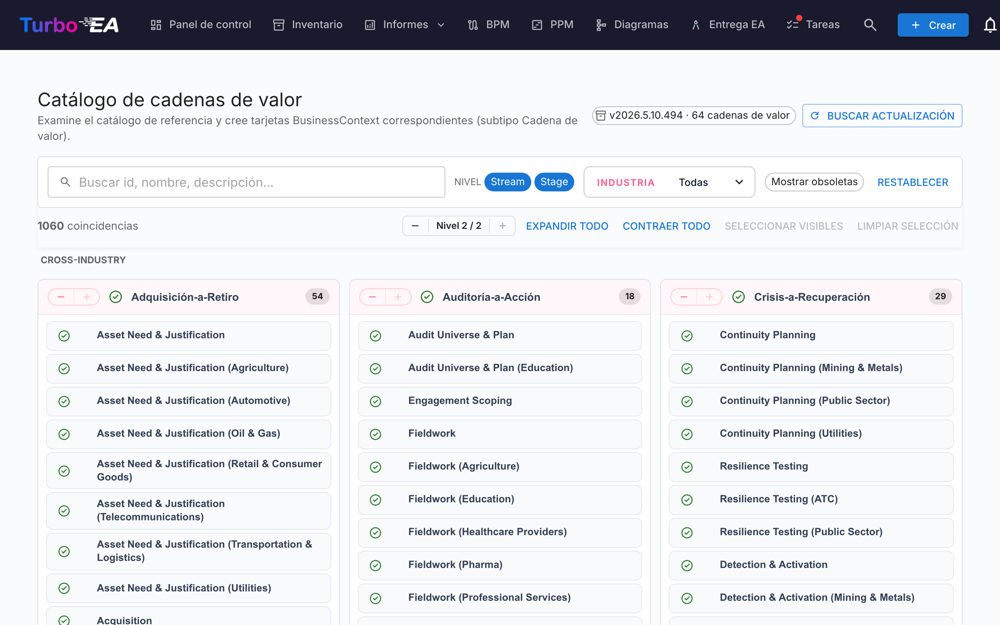

# Catálogo de cadenas de valor

Turbo EA incluye el **Catálogo de referencia de cadenas de valor** — un conjunto curado de cadenas de valor extremo a extremo (Acquire-to-Retire, Order-to-Cash, Hire-to-Retire, …), mantenido junto a los catálogos de capacidades y procesos en [github.com/vincentmakes/turbo-ea-capabilities](https://github.com/vincentmakes/turbo-ea-capabilities). Cada cadena se descompone en etapas que apuntan a las capacidades que ejercitan y a los procesos que las realizan, ofreciendo un puente listo entre arquitectura de negocio (capacidades) y arquitectura de procesos (procesos).

La página Catálogo de cadenas de valor permite recorrer esta referencia y crear de forma masiva las tarjetas `BusinessContext` (subtipo **Value Stream**) correspondientes.

## Abrir la página

Pulse el icono de usuario en la esquina superior derecha de la aplicación, despliegue **Catálogos de referencia** en el menú (la sección está plegada por defecto para mantener el menú compacto) y pulse **Catálogo de cadenas de valor**. La página es accesible para cualquier usuario con el permiso `inventory.view`.

## Qué se ve

- **Cabecera** — la versión activa del catálogo, el número de cadenas de valor que contiene y (para administradores) controles para comprobar y descargar actualizaciones.
- **Barra de filtros** — búsqueda libre sobre identificador, nombre, descripción y notas; chips de nivel (Cadena / Etapa); selector múltiple de industria; e interruptor «Mostrar obsoletos».
- **Cuadrícula L1** — una tarjeta por cadena, con sus etapas listadas como hijos. Cada etapa lleva su orden, una variante de industria opcional y los identificadores de las capacidades y procesos que toca.

## Seleccionar cadenas de valor

Marque la casilla junto a una cadena o etapa para añadirla a la selección. La selección cascadea igual que en los demás catálogos. **Seleccionar una etapa arrastra automáticamente su cadena padre** en el momento del import, así que nunca terminará con etapas huérfanas — aunque no haya marcado la cadena.

Las cadenas y etapas que **ya existen** en su inventario aparecen con un **icono de visto verde** en lugar de casilla.

## Crear tarjetas en masa

En cuanto haya una o más cadenas o etapas seleccionadas, aparece un botón anclado al pie de la página: **Crear N elementos**. Usa el permiso `inventory.create` habitual.

Al confirmar, Turbo EA:

- crea una tarjeta `BusinessContext` por cada entrada seleccionada, con subtipo **Value Stream** tanto para cadenas como para etapas;
- enlaza el `parent_id` de cada tarjeta de etapa con su cadena padre, de modo que la jerarquía del catálogo se reproduce;
- **crea automáticamente relaciones `relBizCtxToBC` («está asociado con»)** desde cada nueva etapa hacia cada tarjeta `BusinessCapability` existente que la etapa ejerce (`capability_ids`);
- **crea automáticamente relaciones `relProcessToBizCtx` («usa»)** desde cada tarjeta `BusinessProcess` existente hacia cada nueva etapa (`process_ids`). Tenga en cuenta el sentido: en el metamodelo de Turbo EA, el proceso es el origen, no la etapa;
- omite las referencias cruzadas cuya tarjeta destino aún no existe; los identificadores de origen quedan guardados en los atributos de la etapa (`capabilityIds`, `processIds`) para que pueda enlazarlos después al importar los artefactos faltantes;
- sella las tarjetas de etapa con `stageOrder`, `stageName`, `industryVariant`, `notes` y las listas originales `capabilityIds` / `processIds`.

Los recuentos de saltadas, creadas y re-vinculadas se reportan igual que en el catálogo de capacidades. Los imports son idempotentes.

## Vista detalle

Pulse el nombre de una cadena o etapa para abrir un diálogo de detalle. Para las **etapas**, el panel muestra además:

- **Orden de etapa** — la posición ordinal de la etapa dentro de la cadena.
- **Variante de industria** — informada cuando la etapa es una especialización sectorial de la base transversal.
- **Notas** — detalles libres complementarios procedentes del catálogo.
- **Capacidades en esta etapa** y **Procesos en esta etapa** — chips para los IDs de BC y BP que la etapa referencia. Útiles para detectar tarjetas que falten antes de importar.

## Actualizar el catálogo (administradores)

El catálogo se entrega **empaquetado** como dependencia de Python, por lo que la página funciona sin conexión / en despliegues aislados. Los administradores (`admin.metamodel`) pueden traer una versión más reciente bajo demanda mediante **Buscar actualización** → **Obtener v…**. La misma descarga del wheel hidrata simultáneamente las cachés de los catálogos de capacidades y de procesos, por lo que actualizar uno de los tres catálogos de referencia refresca los tres.
