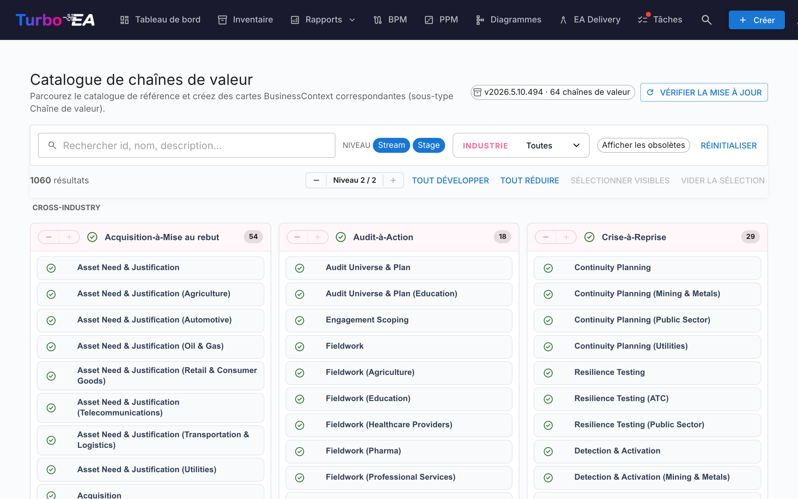

# Catalogue de chaînes de valeur

Turbo EA est livré avec le **Catalogue de référence des chaînes de valeur** — un ensemble curé de chaînes de valeur de bout en bout (Acquire-to-Retire, Order-to-Cash, Hire-to-Retire, …), maintenu aux côtés des catalogues de capacités et de processus sur [github.com/vincentmakes/turbo-ea-capabilities](https://github.com/vincentmakes/turbo-ea-capabilities). Chaque chaîne se décompose en étapes qui pointent sur les capacités qu'elles mobilisent et sur les processus qui les réalisent, offrant ainsi un pont prêt à l'emploi entre architecture métier (capacités) et architecture des processus.

La page Catalogue de chaînes de valeur permet de parcourir cette référence et de créer en masse les cartes `BusinessContext` (sous-type **Value Stream**) correspondantes.

## Ouvrir la page

Cliquez sur l'icône utilisateur en haut à droite de l'application, dépliez **Catalogues de référence** dans le menu (la section est repliée par défaut pour garder le menu compact), puis cliquez sur **Catalogue de chaînes de valeur**. La page est accessible à toute personne disposant de la permission `inventory.view`.

## Ce que vous voyez

- **En-tête** — la version active du catalogue, le nombre de chaînes de valeur qu'il contient et (pour les administrateurs) les commandes pour vérifier et récupérer les mises à jour.
- **Barre de filtres** — recherche plein texte sur l'identifiant, le nom, la description et les notes, des pastilles de niveau (Chaîne / Étape), une sélection multiple par secteur et un interrupteur « Afficher les obsolètes ».
- **Grille L1** — une carte par chaîne, avec ses étapes listées en dessous. Chaque étape porte son ordre, une éventuelle variante sectorielle et les identifiants des capacités et processus qu'elle touche.

## Sélectionner des chaînes de valeur

Cochez la case d'une chaîne ou d'une étape pour l'ajouter à la sélection. La sélection cascade comme dans les autres catalogues. **Sélectionner une étape entraîne automatiquement sa chaîne parente** au moment de l'import, vous ne vous retrouverez donc jamais avec des étapes orphelines — même si vous n'avez pas coché la chaîne elle-même.

Les chaînes et étapes qui **existent déjà** dans votre inventaire apparaissent avec une **coche verte** au lieu d'une case.

## Créer des cartes en masse

Dès qu'une chaîne ou une étape est sélectionnée, un bouton fixé en bas de page **Créer N éléments** apparaît. Il utilise la permission `inventory.create` habituelle.

À la confirmation, Turbo EA :

- crée une carte `BusinessContext` par entrée sélectionnée, avec le sous-type **Value Stream** aussi bien pour les chaînes que pour les étapes ;
- relie le `parent_id` de chaque carte d'étape à sa chaîne parente, reproduisant ainsi la hiérarchie du catalogue ;
- **crée automatiquement des relations `relBizCtxToBC` (« est associé à »)** entre chaque nouvelle étape et chaque carte `BusinessCapability` existante qu'elle mobilise (`capability_ids`) ;
- **crée automatiquement des relations `relProcessToBizCtx` (« utilise »)** depuis chaque carte `BusinessProcess` existante vers chaque nouvelle étape (`process_ids`). Notez le sens : dans le métamodèle de Turbo EA, le processus est la source, pas l'étape ;
- ignore les renvois croisés dont la carte cible n'existe pas encore ; les identifiants source restent stockés dans les attributs de l'étape (`capabilityIds`, `processIds`) afin que vous puissiez les câbler plus tard, en important les artefacts manquants ;
- estampille les cartes d'étape avec `stageOrder`, `stageName`, `industryVariant`, `notes`, ainsi que les listes originales `capabilityIds` / `processIds`.

Les compteurs « ignoré », « créé » et « ré-lié » sont rapportés comme pour le catalogue de capacités. Les imports sont idempotents.

## Vue détail

Cliquez sur le nom d'une chaîne ou d'une étape pour ouvrir une boîte de dialogue détail. Pour les **étapes**, le panneau affiche en plus :

- **Ordre d'étape** — la position ordinale de l'étape dans la chaîne.
- **Variante sectorielle** — renseignée lorsque l'étape est une spécialisation sectorielle de la base inter-secteurs.
- **Notes** — détails libres complémentaires issus du catalogue.
- **Capacités à cette étape** et **Processus à cette étape** — pastilles pour les identifiants de BC et BP référencés par l'étape. Pratiques pour repérer les cartes manquantes avant l'import.

## Mettre à jour le catalogue (administrateurs)

Le catalogue est **embarqué** sous forme de dépendance Python, si bien que la page fonctionne hors ligne / dans des déploiements coupés du réseau. Les administrateurs (`admin.metamodel`) peuvent récupérer à la demande une version plus récente via **Vérifier les mises à jour** → **Récupérer v…**. Le même téléchargement de wheel hydrate en même temps les caches des catalogues de capacités et de processus, donc mettre à jour l'un des trois catalogues de référence rafraîchit les trois.
