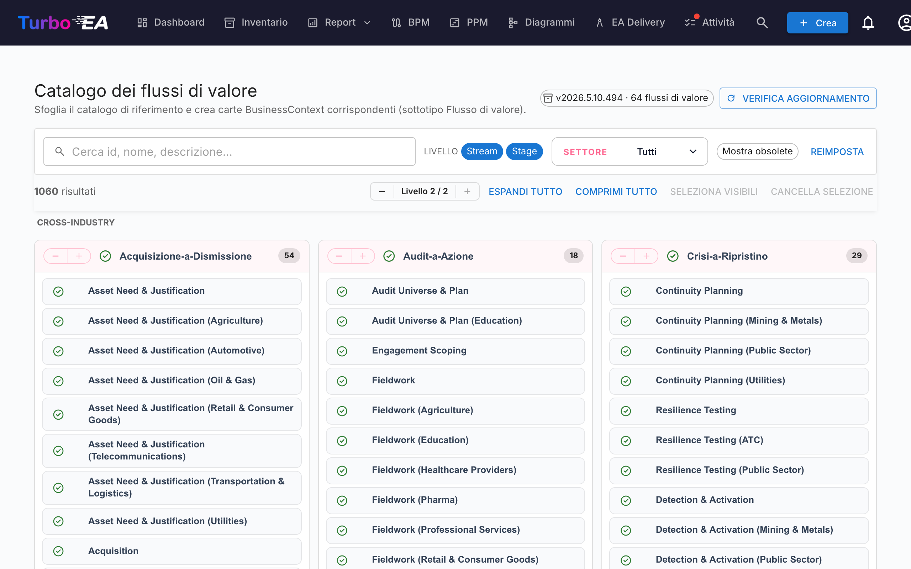

# Catalogo dei flussi di valore

Turbo EA include il **Catalogo di riferimento dei flussi di valore** — un insieme curato di flussi di valore end-to-end (Acquire-to-Retire, Order-to-Cash, Hire-to-Retire, …), mantenuto insieme ai cataloghi di capacità e processi su [github.com/vincentmakes/turbo-ea-capabilities](https://github.com/vincentmakes/turbo-ea-capabilities). Ogni flusso si scompone in fasi che puntano alle capacità che mette in opera e ai processi che lo realizzano, fornendo un ponte già pronto tra architettura di business (capacità) e architettura dei processi (processi).

La pagina Catalogo dei flussi di valore permette di sfogliare questa raccolta e di creare in massa le carte `BusinessContext` (sottotipo **Value Stream**) corrispondenti.

## Aprire la pagina

Cliccate sull'icona utente in alto a destra nell'app, espandete **Cataloghi di riferimento** nel menu (la sezione è chiusa per impostazione predefinita per mantenere il menu compatto) e cliccate su **Catalogo dei flussi di valore**. La pagina è accessibile a chiunque disponga del permesso `inventory.view`.

## Cosa vedete

- **Intestazione** — la versione attiva del catalogo, il numero di flussi di valore contenuti e (per gli amministratori) i comandi per cercare e scaricare aggiornamenti.
- **Barra dei filtri** — ricerca a testo libero su id, nome, descrizione e note, chip di livello (Flusso / Fase), selezione multipla di settore e interruttore «Mostra obsoleti».
- **Griglia L1** — una scheda per flusso, con le sue fasi elencate come figli. Ogni fase porta il proprio ordine, un'eventuale variante di settore e gli id delle capacità e dei processi che tocca.

## Selezionare flussi di valore

Spuntate la casella accanto a un flusso o a una fase per aggiungerli alla selezione. La selezione si propaga come negli altri cataloghi. **Selezionare una fase trascina automaticamente il suo flusso padre** al momento dell'import, in modo da non lasciare fasi orfane — anche se non avete spuntato il flusso.

Flussi e fasi che **esistono già** nel vostro inventario compaiono con un'**icona di spunta verde** al posto della casella.

## Creare carte in massa

Non appena è selezionato almeno un flusso o una fase, in fondo alla pagina compare un pulsante fisso **Crea N elementi**. Utilizza il normale permesso `inventory.create`.

Alla conferma, Turbo EA:

- crea una carta `BusinessContext` per ogni voce selezionata, con sottotipo **Value Stream** sia per i flussi sia per le fasi;
- collega il `parent_id` di ogni carta di fase al suo flusso padre, riproducendo così la gerarchia del catalogo;
- **crea automaticamente relazioni `relBizCtxToBC` («è associato a»)** da ogni nuova fase verso ogni carta `BusinessCapability` esistente che la fase mette in opera (`capability_ids`);
- **crea automaticamente relazioni `relProcessToBizCtx` («utilizza»)** da ogni carta `BusinessProcess` esistente verso ogni nuova fase (`process_ids`). Attenzione al verso: nel metamodello di Turbo EA il processo è la sorgente, non la fase;
- salta i riferimenti incrociati la cui carta di destinazione non esiste ancora; gli id di origine restano salvati negli attributi della fase (`capabilityIds`, `processIds`) così potrete collegarli più tardi importando gli artefatti mancanti;
- timbra le carte di fase con `stageOrder`, `stageName`, `industryVariant`, `notes` e le liste originali `capabilityIds` / `processIds`.

I conteggi di saltati, creati e ri-collegati sono riportati come per il catalogo delle capacità. Gli import sono idempotenti.

## Vista dettaglio

Cliccate sul nome di un flusso o di una fase per aprire un dialogo di dettaglio. Per le **fasi**, il pannello mostra inoltre:

- **Ordine di fase** — la posizione ordinale della fase all'interno del flusso.
- **Variante di settore** — valorizzata quando la fase è una specializzazione settoriale della base trasversale.
- **Note** — dettagli liberi aggiuntivi presi dal catalogo.
- **Capacità in questa fase** e **Processi in questa fase** — chip per gli id di BC e BP referenziati dalla fase. Utili per individuare carte mancanti prima dell'import.

## Aggiornare il catalogo (amministratori)

Il catalogo viene fornito **integrato** come dipendenza Python, perciò la pagina funziona offline / in installazioni isolate dalla rete. Gli amministratori (`admin.metamodel`) possono prelevare a richiesta una versione più recente tramite **Verifica aggiornamenti** → **Scarica v…**. Lo stesso download del wheel reidrata contemporaneamente le cache dei cataloghi di capacità e processi, perciò aggiornare uno qualunque dei tre cataloghi di riferimento li aggiorna tutti.
