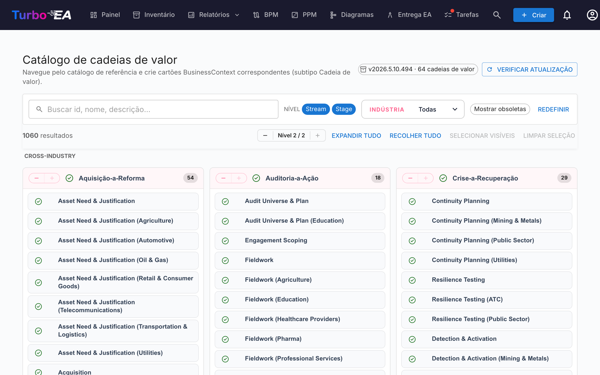

# Catálogo de cadeias de valor

O Turbo EA inclui o **Catálogo de referência de cadeias de valor** — um conjunto curado de cadeias de valor ponta a ponta (Acquire-to-Retire, Order-to-Cash, Hire-to-Retire, …), mantido juntamente com os catálogos de capacidades e de processos em [github.com/vincentmakes/turbo-ea-capabilities](https://github.com/vincentmakes/turbo-ea-capabilities). Cada cadeia decompõe-se em etapas que apontam para as capacidades que mobiliza e para os processos que a realizam, fornecendo uma ponte pronta entre arquitetura de negócio (capacidades) e arquitetura de processos (processos).

A página Catálogo de cadeias de valor permite percorrer esta referência e criar em massa as cartas `BusinessContext` (subtipo **Value Stream**) correspondentes.

## Abrir a página

Clique no ícone de utilizador no canto superior direito da aplicação, expanda **Catálogos de referência** no menu (a secção começa recolhida para manter o menu compacto) e clique em **Catálogo de cadeias de valor**. A página está disponível para qualquer pessoa com a permissão `inventory.view`.

## O que vê

- **Cabeçalho** — a versão ativa do catálogo, o número de cadeias de valor que contém e (para administradores) controlos para verificar e obter atualizações.
- **Barra de filtros** — pesquisa em texto livre por id, nome, descrição e notas, chips de nível (Cadeia / Etapa), seleção múltipla de indústria e interruptor «Mostrar obsoletos».
- **Grelha L1** — um cartão por cadeia, com as suas etapas listadas como filhas. Cada etapa traz a sua ordem, uma variante de indústria opcional e os ids das capacidades e processos que toca.

## Selecionar cadeias de valor

Marque a caixa junto a uma cadeia ou etapa para a adicionar à seleção. A seleção propaga-se em cascata como nos restantes catálogos. **Selecionar uma etapa arrasta automaticamente a cadeia-mãe** no momento da importação, pelo que não ficará com etapas órfãs — mesmo que não tenha marcado a cadeia.

As cadeias e etapas que **já existem** no seu inventário aparecem com um **visto verde** em vez de uma caixa.

## Criar cartas em massa

Assim que tenha uma ou mais cadeias ou etapas selecionadas, surge no fundo da página um botão fixo **Criar N elementos**. Utiliza a permissão habitual `inventory.create`.

Ao confirmar, o Turbo EA:

- cria um cartão `BusinessContext` por cada entrada selecionada, com subtipo **Value Stream** tanto para cadeias como para etapas;
- liga o `parent_id` de cada cartão de etapa à sua cadeia-mãe, reproduzindo a hierarquia do catálogo;
- **cria automaticamente relações `relBizCtxToBC` («está associado a»)** desde cada nova etapa para cada carta `BusinessCapability` existente que a etapa mobiliza (`capability_ids`);
- **cria automaticamente relações `relProcessToBizCtx` («utiliza»)** desde cada carta `BusinessProcess` existente para cada nova etapa (`process_ids`). Atenção ao sentido: no metamodelo do Turbo EA, o processo é a origem, não a etapa;
- ignora referências cruzadas cuja carta-alvo ainda não exista; os ids de origem ficam guardados nos atributos da etapa (`capabilityIds`, `processIds`) para que possa ligá-los depois ao importar os artefactos em falta;
- carimba as cartas de etapa com `stageOrder`, `stageName`, `industryVariant`, `notes` e as listas originais `capabilityIds` / `processIds`.

Os totais de saltados, criados e religados são reportados como para o catálogo de capacidades. As importações são idempotentes.

## Vista de detalhe

Clique no nome de uma cadeia ou etapa para abrir um diálogo de detalhe. Para as **etapas**, o painel apresenta ainda:

- **Ordem de etapa** — a posição ordinal da etapa dentro da cadeia.
- **Variante de indústria** — preenchida quando a etapa é uma especialização setorial da base transversal.
- **Notas** — detalhes livres complementares vindos do catálogo.
- **Capacidades nesta etapa** e **Processos nesta etapa** — chips para os ids de BC e BP que a etapa referencia. Úteis para detetar cartas em falta antes de importar.

## Atualizar o catálogo (administradores)

O catálogo é entregue **embutido** como dependência Python, pelo que a página funciona offline / em implementações isoladas da rede. Os administradores (`admin.metamodel`) podem ir buscar uma versão mais recente a pedido através de **Verificar atualizações** → **Obter v…**. O mesmo download do wheel hidrata simultaneamente as caches dos catálogos de capacidades e de processos, pelo que atualizar um dos três catálogos de referência refresca todos eles.
