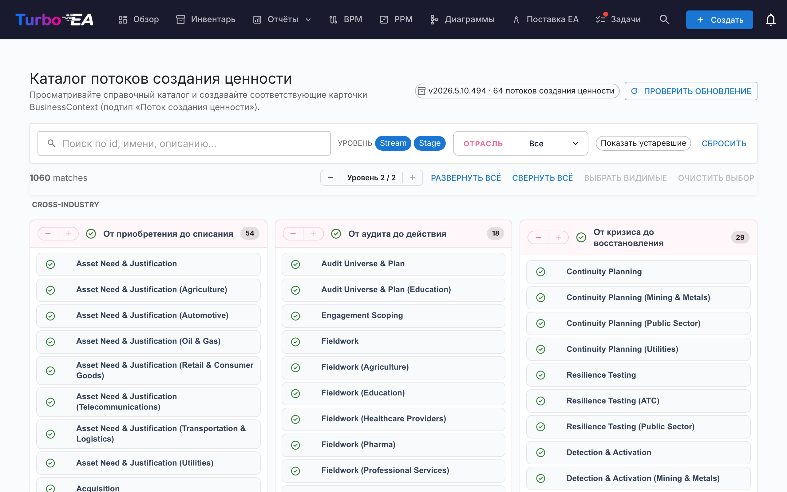

# Каталог потоков создания ценности

Turbo EA поставляется со **Справочным каталогом потоков создания ценности** — кураторской подборкой сквозных потоков (Acquire-to-Retire, Order-to-Cash, Hire-to-Retire и т. д.), которая поддерживается вместе с каталогами способностей и процессов на [github.com/vincentmakes/turbo-ea-capabilities](https://github.com/vincentmakes/turbo-ea-capabilities). Каждый поток разбит на этапы, которые ссылаются на способности, задействованные на этапе, и на процессы, его реализующие, образуя готовый мост между бизнес-архитектурой (способности) и архитектурой процессов (процессы).

Страница «Каталог потоков создания ценности» позволяет просматривать этот справочник и массово создавать соответствующие карточки `BusinessContext` (подтип **Value Stream**).

## Как открыть страницу

Нажмите значок пользователя в правом верхнем углу приложения, разверните в меню пункт «Справочные каталоги» (он свёрнут по умолчанию, чтобы меню оставалось компактным) и выберите «Каталог потоков создания ценности». Страница доступна любому пользователю с разрешением `inventory.view`.

## Что вы видите

- **Заголовок** — индикатор активной версии каталога, количество потоков и (для администраторов) кнопки проверки и получения обновлений.
- **Панель фильтров** — полнотекстовый поиск по идентификатору, названию, описанию и заметкам, чипы уровня (Поток / Этап), множественный выбор отрасли и переключатель «Показывать устаревшие».
- **Сетка L1** — по карточке на каждый поток, под ним перечислены его этапы. Каждый этап несёт свой порядковый номер, возможный отраслевой вариант, а также идентификаторы задействованных способностей и процессов.

## Выбор потоков

Поставьте галочку рядом с потоком или этапом, чтобы добавить его в выбор. Выбор каскадируется так же, как в других каталогах. **Выбор этапа автоматически подтягивает его родительский поток** при импорте, поэтому «осиротевших» этапов никогда не возникает — даже если поток вы не отмечали.

Потоки и этапы, **уже существующие** в инвентаре, отображаются с **зелёной галочкой** вместо чекбокса.

## Массовое создание карточек

Как только выбран хотя бы один поток или этап, внизу страницы появляется закреплённая кнопка «Создать N элементов». Она использует обычное разрешение `inventory.create`.

После подтверждения Turbo EA:

- создаёт по карточке `BusinessContext` на каждую выбранную запись, причём подтип **Value Stream** используется и для потоков, и для этапов;
- связывает `parent_id` каждой карточки этапа с её родительским потоком, воспроизводя иерархию каталога;
- **автоматически создаёт связи `relBizCtxToBC` («ассоциирован с»)** от каждого нового этапа к каждой существующей карточке `BusinessCapability`, которую этап задействует (`capability_ids`);
- **автоматически создаёт связи `relProcessToBizCtx` («использует»)** от каждой существующей карточки `BusinessProcess` к каждому новому этапу (`process_ids`). Обратите внимание на направление: в метамодели Turbo EA источник — процесс, а не этап;
- пропускает перекрёстные ссылки, для которых целевая карточка ещё не существует; исходные идентификаторы сохраняются в атрибутах этапа (`capabilityIds`, `processIds`), чтобы позднее, после импорта недостающих артефактов, их можно было привязать;
- ставит на карточках этапов метки `stageOrder`, `stageName`, `industryVariant`, `notes`, а также исходные списки `capabilityIds` / `processIds`.

Счётчики пропущенных, созданных и переподвязанных элементов сообщаются так же, как в каталоге способностей. Импорты идемпотентны.

## Подробный просмотр

Щёлкните по названию потока или этапа, чтобы открыть диалог детализации. Для **этапов** панель дополнительно показывает:

- **Порядковый номер этапа** — позицию этапа в потоке.
- **Отраслевой вариант** — задаётся, когда этап представляет собой отраслевую специализацию межотраслевой базы.
- **Заметки** — свободные дополнительные сведения из каталога.
- **Способности на этом этапе** и **Процессы на этом этапе** — чипы для идентификаторов BC и BP, на которые ссылается этап. Удобно, чтобы заранее увидеть отсутствующие карточки.

## Обновление каталога (администраторы)

Каталог поставляется **встроенным** в виде Python-зависимости, поэтому страница работает офлайн и в изолированных от сети развёртываниях. Администраторы (`admin.metamodel`) могут по запросу получить более свежую версию через «Проверить обновления» → «Получить v…». То же скачивание wheel-файла одновременно обновляет кэш каталогов способностей и процессов, поэтому обновление любого из трёх справочных каталогов обновляет их все.
