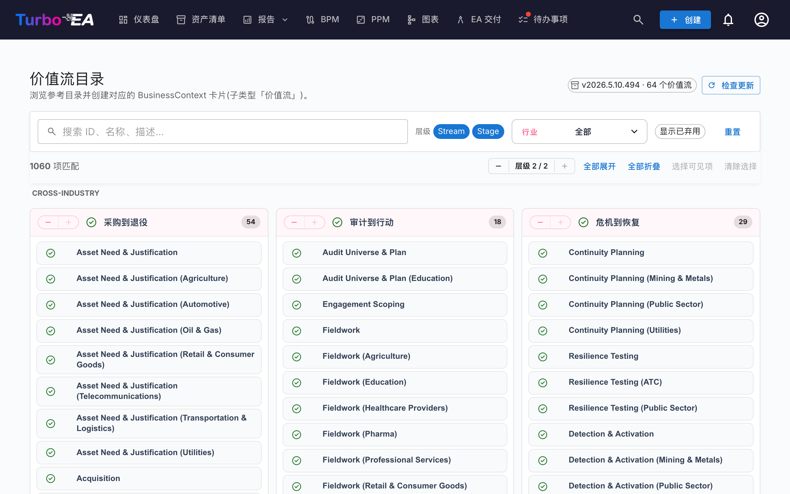

# 价值流目录

Turbo EA 内置「**价值流参考目录**」——一份精选的端到端价值流集合(Acquire-to-Retire、Order-to-Cash、Hire-to-Retire 等),与能力目录和流程目录一同维护在 [github.com/vincentmakes/turbo-ea-capabilities](https://github.com/vincentmakes/turbo-ea-capabilities)。每条价值流被拆解为若干阶段,各阶段链接到它所运用的能力以及实现它的流程,在业务架构(能力)与流程架构(流程)之间提供了一座现成的桥梁。

价值流目录页面让您浏览这份参考,并据此批量创建对应的 `BusinessContext` 卡片(子类型 **Value Stream**)。

## 打开页面

点击应用右上角的用户图标,在菜单中展开「参考目录」(该分组默认折叠以保持菜单紧凑),然后点击「价值流目录」。任何拥有 `inventory.view` 权限的用户都能访问此页面。

## 您会看到

- **标题区** — 当前生效的目录版本、其包含的价值流数量,以及(对管理员而言)用于检查和获取更新的控件。
- **过滤栏** — 在 ID、名称、描述和备注之间进行全文搜索;层级筹码(价值流 / 阶段);行业多选;以及「显示已弃用项」开关。
- **L1 网格** — 每条价值流一张卡片,其阶段以子项形式列于其下。每个阶段携带其阶段顺序、可选的行业变体,以及它涉及的能力和流程的 ID。

## 选择价值流

勾选某条价值流或阶段旁的复选框即可加入选择。选择以与其他目录相同的方式级联。**选中某个阶段会在导入时自动带上其父级价值流**,这样就不会出现孤立阶段——即使您没有亲自勾选父级价值流。

库存中**已存在**的价值流和阶段会以**绿色对勾图标**代替复选框。

## 批量创建卡片

一旦选中一条或多条价值流或阶段,页面底部会出现一个固定的「创建 N 项」按钮。它使用通常的 `inventory.create` 权限。

确认后,Turbo EA 会:

- 为每个选中的条目创建一张 `BusinessContext` 卡片,价值流和阶段都使用子类型 **Value Stream**;
- 将每张阶段卡的 `parent_id` 连接到其父级价值流,从而保留目录的层级结构;
- **自动创建 `relBizCtxToBC`(关联到)关系**,从每个新阶段指向阶段所运用的每张已存在的 `BusinessCapability` 卡片(`capability_ids`);
- **自动创建 `relProcessToBizCtx`(使用)关系**,从每张已存在的 `BusinessProcess` 卡片指向每个新阶段(`process_ids`)。请注意方向:在 Turbo EA 的元模型中,流程是来源,而不是阶段;
- 跳过目标卡片尚不存在的交叉引用;源 ID 仍保存在阶段属性(`capabilityIds`、`processIds`)中,这样在以后导入缺失的工件后,您仍可手动建立连接;
- 在阶段卡上加盖 `stageOrder`、`stageName`、`industryVariant`、`notes`,以及原始的 `capabilityIds` / `processIds` 列表。

跳过、创建和重新关联的计数与能力目录采用同样的方式汇报。导入是幂等的。

## 详情视图

点击任意价值流或阶段名称即可打开详情对话框。对于**阶段**,详情面板还会额外显示:

- **阶段顺序** — 该阶段在价值流中的位置序号。
- **行业变体** — 当该阶段是跨行业基线的某个行业特化版本时填写。
- **备注** — 来自目录的自由格式补充说明。
- **本阶段的能力**与**本阶段的流程** — 阶段引用的 BC 与 BP ID(每个 ID 一枚标签)。便于在导入前发现缺失的卡片。

## 更新目录(管理员)

目录以 Python 依赖形式**随版本一同发行**,因此该页面在离线 / 内网隔离的部署环境下亦可使用。管理员(`admin.metamodel`)可按需通过「检查更新」→「获取 v…」拉取更新。同一份 wheel 会同时补足能力目录与流程目录的缓存,因此更新这三份参考目录中的任意一份都会同步刷新三者。
