# User Manual - Turbo EA

## Enterprise Architecture Management Platform

**Guide for Executives and Decision Makers** | February 2026

---

## Table of Contents

1. [Introduction to Turbo EA](#1-introduction-to-turbo-ea)
2. [Accessing the Platform](#2-accessing-the-platform)
3. [Dashboard](#3-dashboard)
4. [Inventory](#4-inventory)
5. [Card Details](#5-card-details)
6. [Reports](#6-reports)
7. [Business Process Management (BPM)](#7-business-process-management-bpm)
8. [Diagrams](#8-diagrams)
9. [EA Delivery](#9-ea-delivery)
10. [Tasks and Surveys](#10-tasks-and-surveys)
11. [Administration](#11-administration)
    - [Metamodel](#111-metamodel)
    - [Users & Roles](#112-users--roles)
    - [Authentication & SSO](#113-authentication--sso)
12. [Glossary of Terms](#12-glossary-of-terms)

---

## 1. Introduction to Turbo EA

### What is Turbo EA?

**Turbo EA** is a modern, self-hosted platform for **Enterprise Architecture Management**. It enables organizations to document, visualize, and manage all components of their business and technology architecture in one place.

### Who is this guide for?

This guide is designed for **executives and decision makers** who need to evaluate and understand the capabilities of Turbo EA before adopting the platform in their organization. No advanced technical knowledge is required to use the tool.

### Key Benefits

- **Comprehensive visibility**: View all applications, processes, capabilities, and technologies across the organization in a single platform.
- **Informed decision-making**: Visual reports that facilitate evaluation of the current state of technology infrastructure.
- **Lifecycle management**: Track the status of every technology component, from implementation through retirement.
- **Collaboration**: Multiple users can work simultaneously, with configurable roles and permissions.
- **AI-powered descriptions**: Generate card descriptions with a single click using web search and a local LLM — type-aware, privacy-first, and fully admin-controlled.
- **Multi-language**: Available in English, Spanish, French, German, Italian, Portuguese, and Chinese.

### Key Concepts

| Term | Meaning |
|------|---------|
| **Card** | The basic element of the platform. Represents any architecture component: an application, a process, a business capability, etc. |
| **Card Type** | The category a card belongs to (Application, Business Process, Organization, etc.) |
| **Relationship** | A connection between two cards that describes how they relate (e.g., "uses", "depends on", "is part of") |
| **Metamodel** | The structure that defines what card types exist, what fields they have, and how they relate to each other |
| **Lifecycle** | The temporal state of a component (Active, In Development, Retired, etc.) |
| **BPM** | Business Process Management |

---

## 2. Accessing the Platform

### Logging In

When accessing the platform, the login screen is displayed where you must enter your email address and password.

**Steps to log in:**

1. Open your web browser and enter the platform URL
2. In the **Email** field, type your registered email address
3. In the **Password** field, type your password
4. Click the **Log In** button

**Important note:** The first user to register on the platform automatically receives the **Administrator** role, which allows them to configure the entire system.

### Logging In with SSO (Single Sign-On)

If your organization has configured SSO, a **Sign in with [Provider]** button appears on the login page below the password form. The button label shows the configured provider name (e.g., "Sign in with Microsoft", "Sign in with Okta", "Sign in with SSO").

**Steps to log in with SSO:**

1. Open your web browser and enter the platform URL
2. Click the **Sign in with [Provider]** button
3. You will be redirected to your identity provider's login page (e.g., Microsoft Entra ID, Google Workspace, Okta, or your organization's OIDC provider)
4. Authenticate with your corporate credentials
5. After successful authentication, you are redirected back to Turbo EA and logged in automatically

**Notes:**
- If your account does not yet exist in Turbo EA, it will be created automatically on first SSO login (if self-registration is enabled) or matched to a pre-created invitation
- If an administrator has already invited you by email, your SSO login will be linked to that account and you will inherit the pre-assigned role
- SSO users can still have a local password set as a fallback, if configured by the administrator

### Registering New Users

If this is your first time accessing the platform, you can register by clicking "Sign Up". Administrators can also invite users from the administration panel (see [Users & Roles](#112-users--roles)).

### Changing Language

The platform supports multiple languages. To change the language:

1. Click on your profile icon (top right corner)
2. Select **Language**
3. Choose the desired language (English, Espanol, Francais, Deutsch, Italiano, Portugues, Chinese)

---

## 3. Dashboard

The Dashboard is the first screen you see after logging in. It provides a **quick overview** of the entire enterprise architecture status.

### Dashboard Elements

#### Top Navigation Bar

At the top of the screen, you will find the **main navigation bar** with the following elements:

- **Turbo EA** (logo): Click to return to the Dashboard from any section
- **Dashboard**: Overview of the architecture status
- **Inventory**: Complete listing of all cards (components)
- **Reports**: Visual and analytical reports
- **BPM**: Business Process Management
- **Diagrams**: Visual architecture diagram editor
- **Delivery**: Architecture project and initiative management
- **Todos**: Pending tasks and assigned surveys
- **Search cards**: Quick search bar
- **+ Create**: Button to quickly create new cards
- **Notification bell**: System alerts and notifications
- **Profile icon**: Personal settings and administration

#### Summary Cards

The main section of the Dashboard displays **summary cards** indicating:

- **Total number of cards**: Total count of components registered in the platform (e.g., 324 items)
- **Distribution by type**: How many elements of each type exist (Applications, Organizations, Objectives, Capabilities, etc.)
- **Status charts**: Quick visualizations of the overall status

#### Charts and Statistics

In the bottom section of the Dashboard you will find:

- **Distribution by type chart**: Shows the proportion of each card type
- **Approval status**: Indicates how many cards are approved, pending, or rejected
- **Data quality**: Overall percentage of information completeness

---

## 4. Inventory

The **Inventory** is the heart of Turbo EA. Here all **cards** (components) of the enterprise architecture are listed: applications, processes, business capabilities, organizations, providers, interfaces, and more.

### Inventory Screen Structure

#### Left Filter Panel

The left sidebar panel allows you to **filter** cards by different criteria:

- **Search**: Free text search field
- **Types**: Filter by card type: Objective, Platform, Initiative, Organization, Business Capability, Business Context, Business Process, Application, Interface, Data Object, IT Component, Tech Category, Provider
- **Approval Status**: Filter by approved, pending, or rejected cards
- **Lifecycle**: Filter by lifecycle state (Active, In Development, Retired, etc.)
- **Data Quality**: Filter by data completeness level
- **Show archived only**: Option to view archived cards
- **Save view**: Save filter configurations for reuse

#### Main Table (Center)

| Column | Description |
|--------|-------------|
| **Type** | Card category (color-coded) |
| **Name** | Component name |
| **Description** | Brief description of the component |
| **Lifecycle** | Current state (active, retired, etc.) |
| **Approval Status** | Whether it has been approved by responsible parties |
| **Data Quality** | Completeness percentage (progress bar) |

#### Toolbar (Top Right)

- **Grid Edit**: Edit multiple cards simultaneously in table mode
- **Export**: Download data to Excel format
- **Import**: Bulk upload data from Excel files
- **+ Create**: Create a new card

### How to Create a New Card

1. Click the **+ Create** button (blue, top right corner)
2. In the dialog that appears:
   - Select the **Type** of card (Application, Process, Objective, etc.)
   - Enter the **Name** of the component
   - Optionally, add a **Description**
3. Optionally, click **Suggest with AI** to generate a description automatically (see [AI Description Suggestions](#ai-description-suggestions) below)
4. Click **CREATE**

### AI Description Suggestions

Turbo EA can use **AI to generate a description** for any card. This works on both the Create Card dialog and existing card detail pages.

**How it works:**

1. Enter a card name and select a type
2. Click the **sparkle icon** (✨) in the card header, or the **Suggest with AI** button in the Create Card dialog
3. The system performs a **web search** for the item name (using type-aware context — e.g., "SAP S/4HANA software application"), then sends the results to a **local LLM** (Ollama) to generate a concise, factual description
4. A suggestion panel appears with:
   - **Editable description** — review and modify the text before applying
   - **Confidence score** — indicates how certain the AI is (High / Medium / Low)
   - **Clickable source links** — the web pages the description was derived from
   - **Model name** — which LLM generated the suggestion
5. Click **Apply description** to save, or **Dismiss** to discard

**Key characteristics:**

- **Type-aware**: The AI understands the card type context. An "Application" search adds "software application", a "Provider" search adds "technology vendor", an "Organization" search adds "company", etc.
- **Privacy-first**: The LLM runs locally via Ollama — your data never leaves your infrastructure
- **Admin-controlled**: AI suggestions must be enabled by an administrator in Settings → AI Cards. Admins can choose which card types show the suggestion button, configure the LLM provider URL and model, and select the web search provider (DuckDuckGo, Google Custom Search, or SearXNG)
- **Permission-based**: Only users with the `ai.suggest` permission can use this feature (enabled by default for Admin, BPM Admin, and Member roles)
6. Click **CREATE**

---

## 5. Card Details

Clicking on any card in the inventory opens the **detail view** where you can view and edit all information about the component.

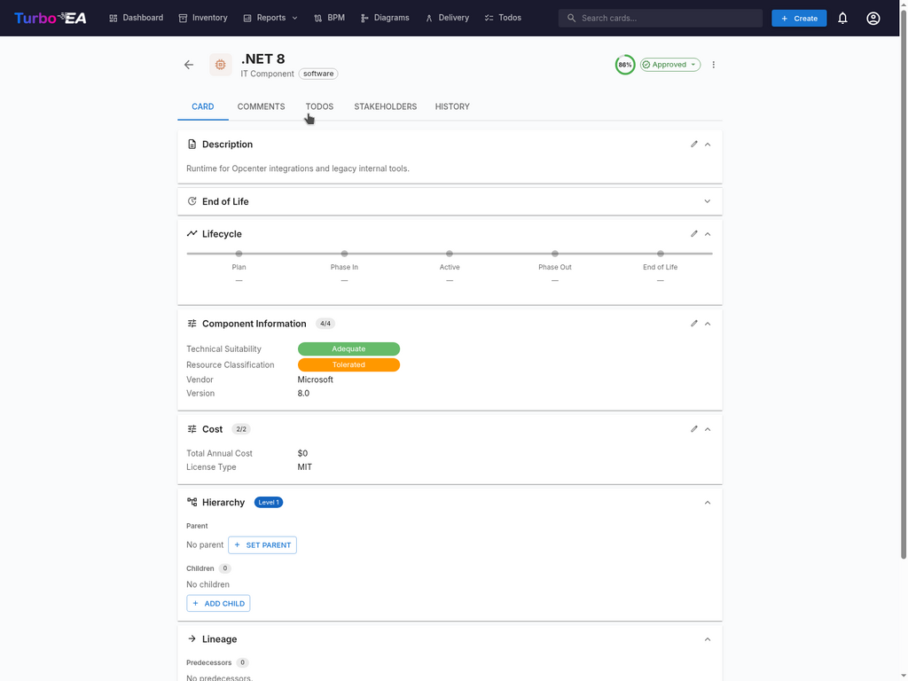

### Available Tabs in Card Detail

#### "Detail" Tab (Main)

- **Name and type** of the card (top left corner)
- **AI suggest button** (✨): Click to generate a description with AI (visible when AI is enabled and user has edit permission)
- **Approval status**: Green "Approved" badge or pending status
- **Description**: Descriptive text about the component
- **Custom attributes**: Specific fields depending on the card type
- **Relationships**: List of connections to other cards
- **Lifecycle**: Temporal state of the component
- **Tags**: Additional classifications assigned

#### "Comments" Tab

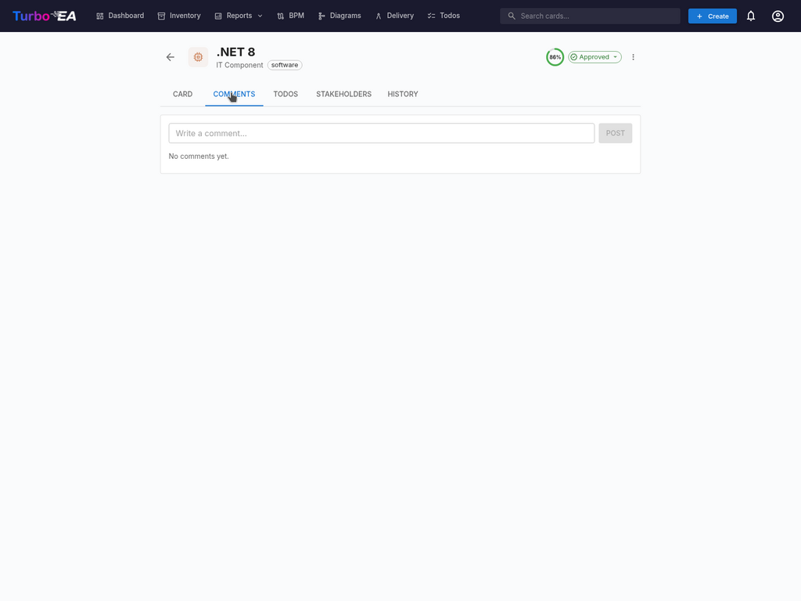

- **Add comments**: Any user can leave notes or questions about the component
- **Team discussion**: Comments create a conversation thread
- **Decision history**: Document the reasoning behind important changes

#### "Todos" Tab

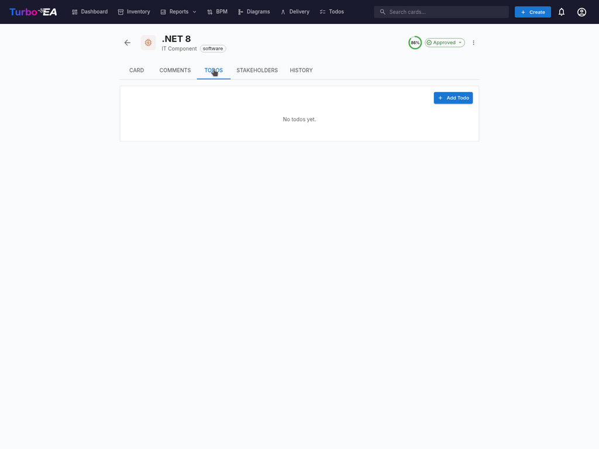

- **Create new todo**: Assign tasks to team members
- **Task status**: Pending, In Progress, Completed
- **Assignee**: Person assigned to complete the task
- **Due date**: Deadline for completing the task

#### "Stakeholders" Tab

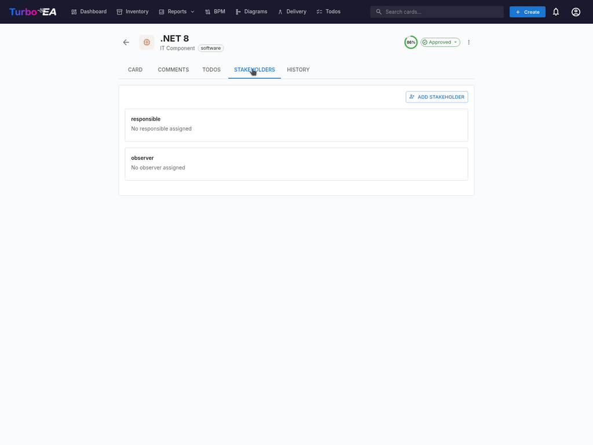

- **Business Owner**: Responsible for business decisions
- **Technical Owner**: Responsible for technical decisions
- **Other roles**: According to metamodel configuration

#### "History" Tab

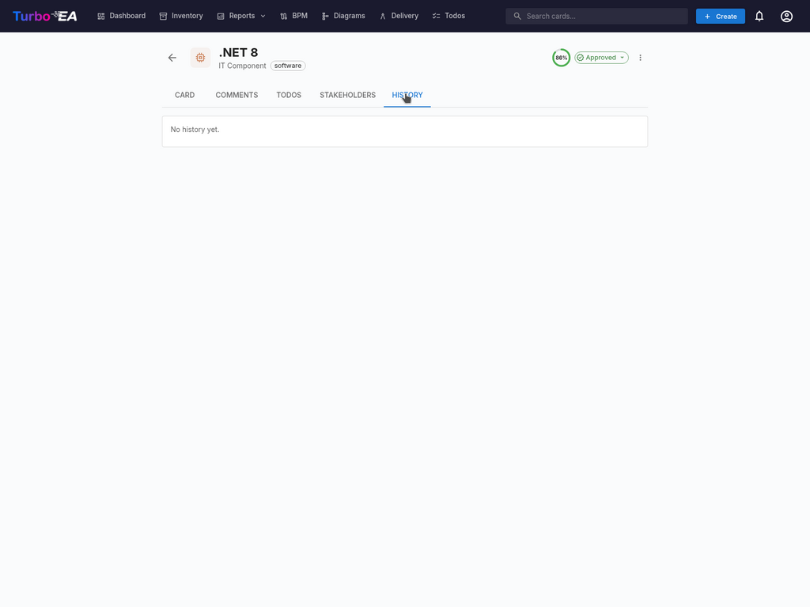

Shows the **complete record of changes** made to the card: **Who** made the change, **When** it was made, **What** was modified (previous value vs. new value). This enables a **complete audit** of all modifications.

---

## 6. Reports

Turbo EA includes a powerful **visual reporting** module that allows analyzing the enterprise architecture from different perspectives. Reports are designed to facilitate **decision-making** by executives.

### 6.1 Portfolio Report

The **Portfolio Report** provides an **overview of all architecture components** grouped by type. It is ideal for evaluating the size of the technology portfolio, identifying areas of concentration, comparing categories, and filtering by different criteria.

### 6.2 Capability Map

The **Capability Map** shows a hierarchical view of the organization's **business capabilities**. Each block represents a business capability, colors may indicate the maturity level or status, and the hierarchy shows main capabilities and their sub-capabilities.

### 6.3 Lifecycle

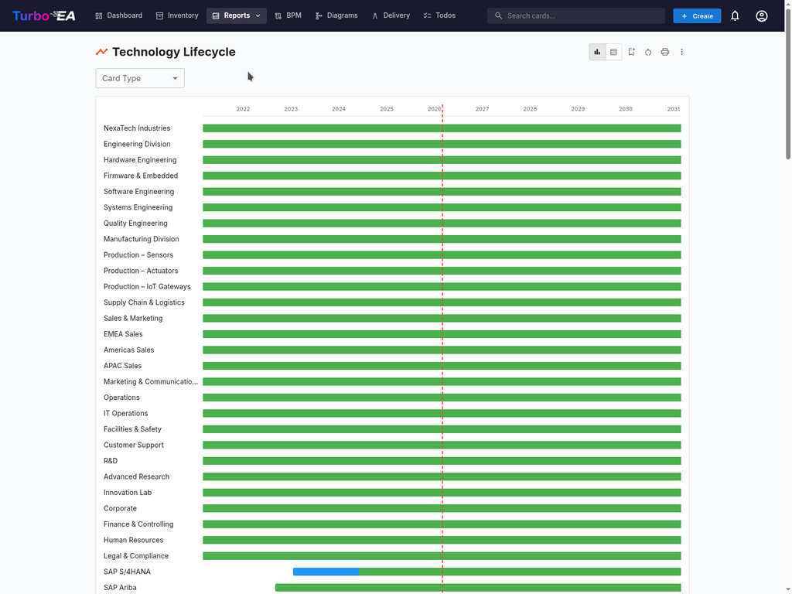

The **Lifecycle Report** shows the temporal state of technology components. It is critical for retirement planning, obsolescence management, and budget planning. States: **Active**, **In Development**, **Phasing Out**, **Retired**.

### 6.4 Dependencies

The **Dependencies Report** visualizes **connections between components**. Fundamental for impact analysis, identifying critical points, planning migrations, and reducing risks.

### 6.5 Other Available Reports

- **Cost Report**: Analysis of licensing, maintenance, and operation costs
- **Matrix Report**: Cross-view comparing two dimensions of the architecture
- **Data Quality**: Shows which cards have incomplete information
- **Process Map**: Visualization of the business process chain
- **End of Life (EOL)**: End-of-support dates for technology products

---

## 7. Business Process Management (BPM)

The **BPM** module allows documenting and analyzing the organization's **business processes**.

### 7.1 Process Navigator

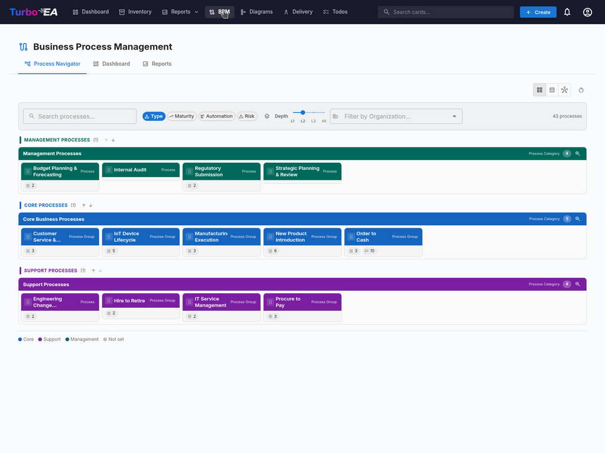

The **Process Navigator** organizes processes into three main categories: **Management Processes** (planning and control), **Core Business Processes** (main business activity), and **Support Processes** (supporting main activities).

**Available Filters:** Type, Maturity (Initial/Defined/Managed/Optimized), Automation, Risk (Low/Medium/High/Critical), Depth (L1/L2/L3).

### 7.2 BPM Dashboard

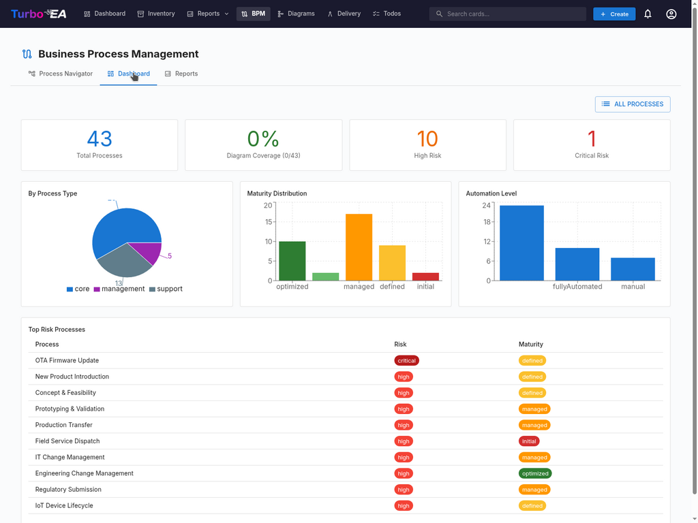

The **BPM Dashboard** provides an **executive view** of process status:

| Indicator | Description |
|-----------|-------------|
| **Total Processes** | Total number of documented processes |
| **Diagram Coverage** | Percentage of processes with associated diagrams |
| **High Risk** | Number of processes with high risk level |
| **Critical Risk** | Number of processes with critical risk level |

Includes charts showing distribution by process type, maturity, and automation level, plus a top risk processes table for **prioritizing investments**.

---

## 8. Diagrams

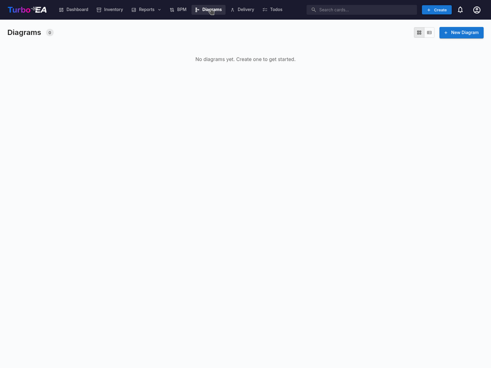

The **Diagrams** module allows creating **visual representations** of the enterprise architecture. Features: drag and drop components, automatic connections between cards, customizable colors and shapes, export as image, and data synchronization.

---

## 9. EA Delivery

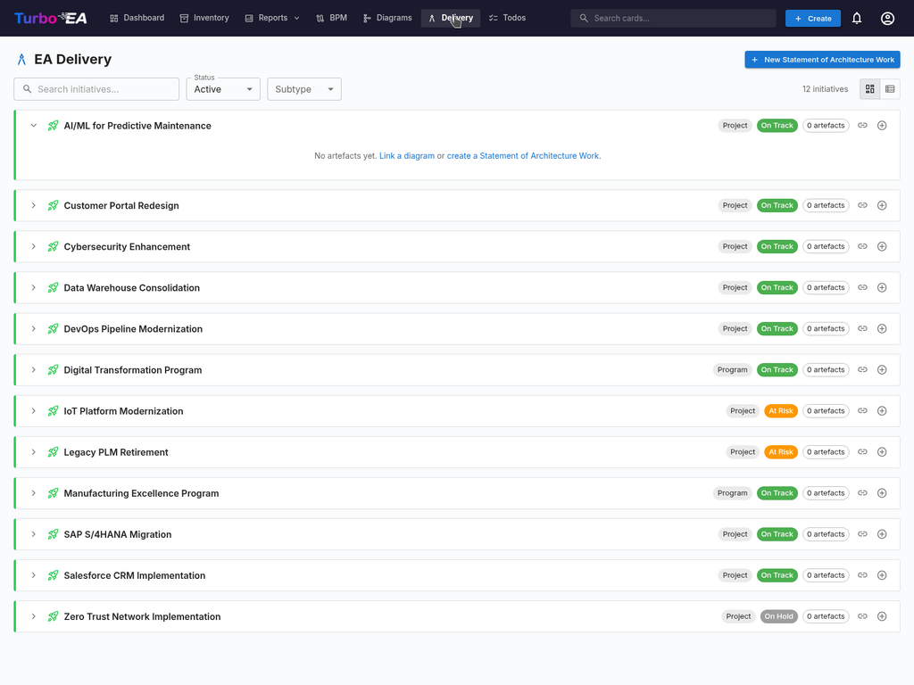

The **Delivery** module manages **initiatives and projects** related to enterprise architecture.

| Field | Description |
|-------|-------------|
| **Name** | Descriptive name of the project or program |
| **Type** | Project or Program |
| **Status** | On Track (green), At Risk (orange), Completed, etc. |
| **Artefacts** | Number of associated documents and diagrams |

Includes the ability to create a **Statement of Architecture Work (SoAW)** for each initiative.

---

## 10. Tasks and Surveys

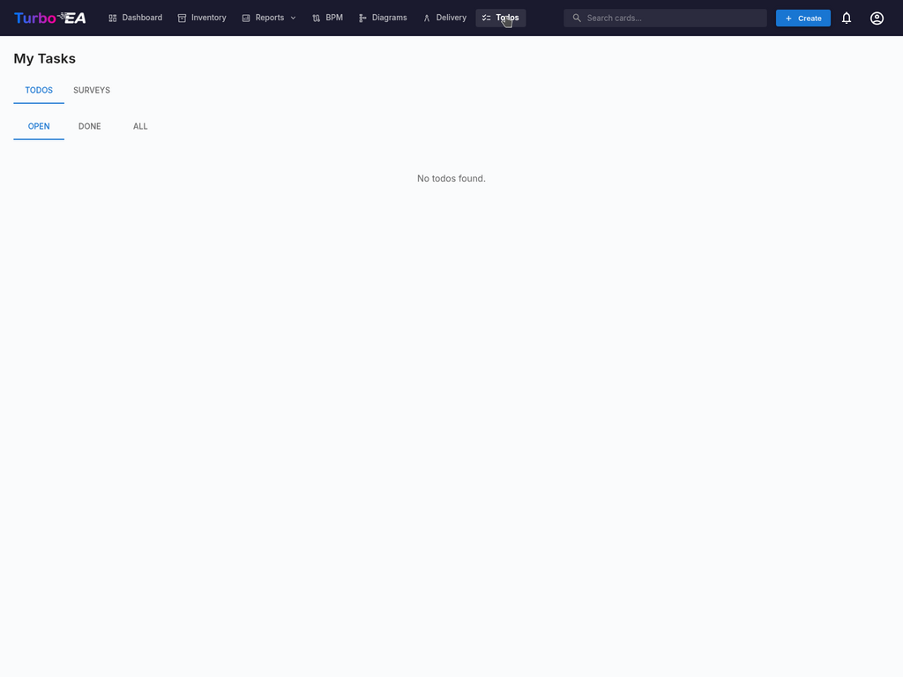

The **Tasks** module centralizes all pending activities. Filters: **OPEN**, **DONE**, **ALL**. The **Surveys** tab allows collecting information from different stakeholders.

---

## 11. Administration

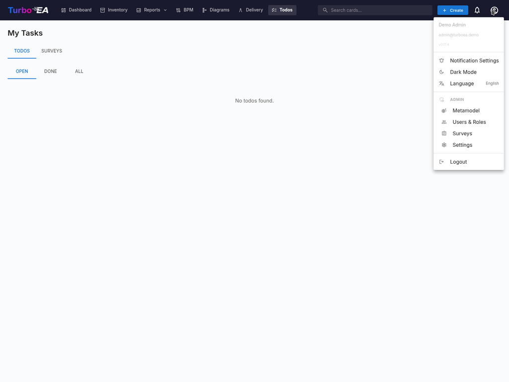

### 11.1 Metamodel

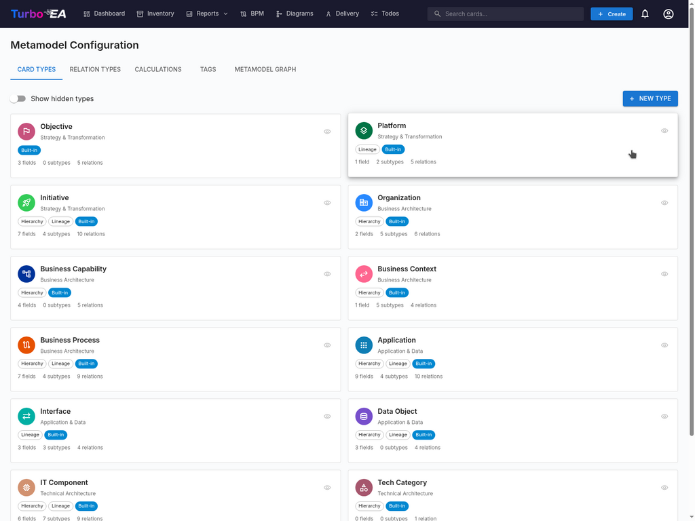

The **Metamodel** defines the platform's structure. Tabs: **Card Types**, **Relation Types**, **Calculations**, **Tags**, **Metamodel Graph**. Included types: Objective, Platform, Initiative, Organization, Business Capability, Business Context, Business Process, Application, Interface, Data Object, IT Component, Technology Category, Vendor/Provider.

### 11.2 Users & Roles

The **Users & Roles** page has two tabs: **Users** (manage accounts) and **Roles** (manage permissions).

#### User Table

The user list displays all registered accounts with the following columns:

| Column | Description |
|--------|-------------|
| **Name** | User's display name |
| **Email** | Email address (used for login) |
| **Role** | Assigned role (selectable inline via dropdown) |
| **Auth** | Authentication method: "Local", "SSO", "SSO + Password", or "Pending Setup" |
| **Status** | Active or Disabled |
| **Actions** | Edit, activate/deactivate, or delete the user |

#### Inviting a New User

1. Click the **Invite User** button (top right)
2. Fill in the form:
   - **Display Name** (required): The user's full name
   - **Email** (required): The email address they will use to log in
   - **Password** (optional): If left blank and SSO is disabled, the user receives an email with a password setup link. If SSO is enabled, the user can sign in via their SSO provider without a password
   - **Role**: Select the role to assign (Admin, Member, Viewer, or any custom role)
   - **Send invitation email**: Check this to send an email notification to the user with login instructions
3. Click **Invite User** to create the account

**What happens behind the scenes:**
- A user account is created in the system
- An SSO invitation record is also created, so if the user logs in via SSO, they automatically receive the pre-assigned role
- If no password is set and SSO is disabled, a password setup token is generated. The user can set their password by following the link in the invitation email

#### Editing a User

Click the **edit icon** on any user row to open the Edit User dialog. You can change:

- **Display Name** and **Email**
- **Authentication Method** (visible only when SSO is enabled): Switch between "Local" and "SSO". This allows administrators to convert an existing local account to SSO, or vice versa. When switching to SSO, the account will be automatically linked when the user next logs in via their SSO provider
- **Password** (only for Local users): Set a new password. Leave blank to keep the current password
- **Role**: Change the user's application-level role

#### Linking an Existing Local Account to SSO

If a user already has a local account and your organization enables SSO, the user will see the error "A local account with this email already exists" when they try to log in via SSO. To resolve this:

1. Go to **Admin > Users**
2. Click the **edit icon** next to the user
3. Change the **Authentication Method** from "Local" to "SSO"
4. Click **Save Changes**
5. The user can now log in via SSO. Their account will be automatically linked on first SSO login

#### Pending Invitations

Below the user table, a **Pending Invitations** section shows all invitations that have not yet been accepted. Each invitation shows the email, pre-assigned role, and invitation date. You can revoke an invitation by clicking the delete icon.

#### Roles

The **Roles** tab allows managing application-level roles. Each role defines a set of permissions that control what users with that role can do. Default roles:

| Role | Description |
|------|-------------|
| **Admin** | Full access to all features and administration |
| **BPM Admin** | Full BPM permissions plus inventory access, no admin settings |
| **Member** | Create, edit, and manage cards, relations, and comments. No admin access |
| **Viewer** | Read-only access across all areas |

Custom roles can be created with granular permission control over inventory, relations, stakeholders, comments, documents, diagrams, BPM, reports, and more.

### 11.3 Authentication & SSO

The **Authentication** tab in Settings allows administrators to configure how users sign in to the platform.

#### Self-Registration

- **Allow self-registration**: When enabled, new users can create accounts by clicking "Sign Up" on the login page. When disabled, only administrators can create accounts via the Invite User flow.

#### SSO (Single Sign-On) Configuration

SSO allows users to sign in using their corporate identity provider instead of a local password. Turbo EA supports four SSO providers:

| Provider | Description |
|----------|-------------|
| **Microsoft Entra ID** | For organizations using Microsoft 365 / Azure AD |
| **Google Workspace** | For organizations using Google Workspace |
| **Okta** | For organizations using Okta as their identity platform |
| **Generic OIDC** | For any OpenID Connect-compatible provider (e.g., Authentik, Keycloak, Auth0) |

**Steps to configure SSO:**

1. Go to **Admin > Settings > Authentication**
2. Toggle **Enable SSO** to on
3. Select your **SSO Provider** from the dropdown
4. Enter the required credentials from your identity provider:
   - **Client ID**: The application/client ID from your identity provider
   - **Client Secret**: The application secret (stored encrypted in the database)
   - Provider-specific fields:
     - **Microsoft**: Tenant ID (e.g., `your-tenant-id` or `common` for multi-tenant)
     - **Google**: Hosted Domain (optional, restricts login to a specific Google Workspace domain)
     - **Okta**: Okta Domain (e.g., `your-org.okta.com`)
     - **Generic OIDC**: Issuer URL (e.g., `https://auth.example.com/application/o/my-app/`). For Generic OIDC, the system attempts auto-discovery via the `.well-known/openid-configuration` endpoint
5. Click **Save**

**Manual OIDC Endpoints (Advanced):**

If the backend cannot reach your identity provider's discovery document (e.g., due to Docker networking or self-signed certificates), you can manually specify the OIDC endpoints:

- **Authorization Endpoint**: The URL where users are redirected to authenticate
- **Token Endpoint**: The URL used to exchange the authorization code for tokens
- **JWKS URI**: The URL for the JSON Web Key Set used to verify token signatures

These fields are optional. If left blank, the system uses auto-discovery. When filled in, they override the auto-discovered values.

**Testing SSO:**

After saving, open a new browser tab (or incognito window) and verify that the SSO login button appears on the login page and that authentication works end-to-end.

**Important notes:**
- The **Client Secret** is stored encrypted in the database and never exposed in API responses
- When SSO is enabled, local password login remains available as a fallback
- You can configure the redirect URI in your identity provider as: `https://your-turbo-ea-domain/auth/callback`

---

## 12. Glossary of Terms

| Term | Definition |
|------|------------|
| **Enterprise Architecture (EA)** | The discipline that organizes and documents an organization's structure |
| **BPM** | Business Process Management |
| **Business Capability** | What an organization can do, regardless of how it does it |
| **Lifecycle** | Phases a component goes through: from creation to retirement |
| **Card** | The basic unit of information in Turbo EA representing a component |
| **Initiative** | A project or program involving changes to the architecture |
| **Metamodel** | The model that defines the platform's data structure |
| **Portfolio** | A collection of applications or technologies managed as a group |
| **SoAW** | Statement of Architecture Work |
| **Stakeholder** | A person with interest in or responsibility for a component |
| **SSO** | Single Sign-On - Login using corporate credentials |

---

**Turbo EA v0.22.1** | Enterprise Architecture Management Platform

*This manual was generated for platform evaluation by executives.*
